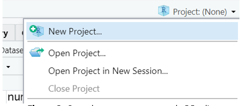

```{r setup, include=FALSE}
knitr::opts_chunk$set(echo = TRUE, dpi = 300)
```

Una vez instalado el software (R + RStudio + Rtools) tenemos todo lo necesario para comenzar a trabajar con el lenguaje R.

En este documento vamos a explicar algunos procedimientos que vamos a llevar a cabo muchas veces en practicas a lo largo del curso.

En principio, aunque instalamos tres programas, el único que debemos ejecutar para ponernos a trabajar es **RStudio**. Éste se encarga de utilizar a **R** como *motor/interprete* y a *Rtools* si llegamos a necesitar instalar algún paquete desarrollado en C, C++ o Fortran.


## Scripts


Un script es un archivo de código que contiene un listado secuencial de funciones para ser ejecutadas en R. Estos archivos permiten guardar el código que vamos  creando y volver a utilizarlo tantas veces como se quiera, además de poder compartirlo con otras personas.

La propuesta para utilizar estos scripts como recurso educativo tiene la siguiente secuencia:

1.	Descargamos el script del aula virtual
2.	Abrimos el script en RStudio
3.	Ejecutamos el script línea a línea leyendo la documentación y salida en cada caso

### Cómo abrimos el script en RStudio?

Los scripts que descarguemos desde el aula virtual tendrán extensión .R y podemos guardarlos en la carpeta que definamos dentro de nuestra computadora.

Es conveniente ser ordenados y crear alguna carpeta específica para el curso y no tener todos los archivos sueltos en carpetas generales como Mis Documentos o Escritorio.

Luego para abrir el archivo script .R podemos hacer doble click sobre el propio archivo (cuando se instala RStudio se asocian automáticamente estas extensiones con el programa) o bien desde dentro de RStudio pulsamos *File > Open file...* (también se puede utilizar el atajo de teclado Ctrl+O)

Visualizaremos el script en el editor de código listo para leerlo y ejecutarlo.

### Cómo ejecutamos un script en RStudio?

La forma de ejecutar habitualmente estos script, es línea por línea mediante el uso de la combinación de teclas **_Ctrl+Enter_** o el **botón Run** del editor de código de RStudio. Para esto tenemos que tener el cursor activo en la línea que queremos correr (puede ser en cualquier parte de la línea) y luego de ser ejecutada el cursor saltará automáticamente a la siguiente línea que tenga código.

Mientras ejecutamos cada línea debemos ir observando la salida en la consola y también los cambios que se dan en el bloque Environment (Entorno) donde aparecerán los objetos que vayamos creando y manipulando.

### Cómo editamos un script en RStudio?

Si queremos modificar o incorporar alguna línea al script que estamos ejecutando podemos hacerlo de forma directa en el editor de código.

Cada vez que hacemos un cambio debemos volver a ejecutar esa o esas líneas para que se realice la modificación.

Podemos probar y volver a modificar tantas veces queramos pero debemos tener presente que cada manipulación en los objetos se mantiene hasta que se vuelvan a cambiar y a veces, cuando los objetos están vinculados con otras líneas de código posteriores tenemos que tener cuidado que se mantenga la coherencia.

Por ejemplo, si tenemos un objeto vector con contenido numérico para posteriormente realizar cálculos matemáticos y nosotros cambiamos el contenido del vector por un valor caracter, ya no vamos a poder hacer los cálculos posteriores y RStudio nos informará el error en consola.

Allí es importante tener presente el bloque Environment que nos va a mostrar siempre el contenido de cada objeto definido en memoria, para evitar operaciones incoherentes y errores.

### Cómo guardamos un script en RStudio?

Cualquier agregado o modificación que hayamos realizado al script que nos interese mantener nos obligará a guardar el archivo de código editado.

Basta con pulsar sobre el ícono del diskette celeste del editor de código para guardar el script, o bien hacerlo desde el menú principal *File > Save* o presionando **Ctrl+S**.

Si en cambio quisiera guardarlo como otro archivo para mantener el script original, podemos guardarlo con diferente nombre o en otra ubicación mediante *File > Save As...*

## Proyectos de RStudio

Los proyectos de RStudio se utilizan para organizar todo el código, los informes, las fuentes de datos y cualquier otro archivo utilizado en un análisis. 

La organización del trabajo en proyectos es muy útil para asegurarnos que cada vez que necesitemos importar datos, RStudio los buscará dentro de la carpeta asociada al proyecto.

### Crear un nuevo proyecto de RStudio

Creamos un nuevo proyecto de RStudio seleccionando la opción **File** y luego **New Project ...** de la barra de menú en la parte superior de la pantalla de RStudio como se muestra en la siguiente figura.

```{r,echo=F,  fig.align='center', out.width = "40%", dpi=300}
knitr::include_graphics("Proy1.PNG")
```


También accedemos a generar un proyecto nuevo a partir de pulsar sobre **New Project...** del menú desplegado en el extremo derecho superior de la interface de RStudio.

```{r,echo=F,  fig.align='center', out.width = "40%", dpi=300}

```

En cualquiera de los dos casos aparecerá un cuadro de diálogo que presenta algunas opciones para crear el **nuevo proyecto de RStudio**.

```{r,echo=F,  fig.align='center', out.width = "40%", dpi=300}
knitr::include_graphics("Proy3.PNG")
```

Por lo general, seleccionaremos la primera opción, **New Directory**, que crea una nueva carpeta a la que deberemos colocarle un nombre. Todos los archivos de configuración aparecerán asociados a esta nueva carpeta.

Sin embargo, si ya tenemos algunos archivos de código o archivos de datos con los que deseamos trabajar, podemos elegir la segunda opción, **Existing Directory**. El proyecto tomará el nombre de la carpeta que seleccionemos en forma predeterminada.

Finalmente, si ya tenemos un sistema de control de versiones como *git* configurado para un proyecto que ya existe, podemos elegir la tercera opción, **Version Control**.


### Tipos de proyectos

Para este ejemplo, hicimos clic en **New Directory** para crear un proyecto nuevo. 

La pantalla que aparece nos mostrará una lista de tipos de proyectos de RStudio.

```{r,echo=F,  fig.align='center', out.width = "40%", dpi=300}

```

El primero es el que usaremos con mayor frecuencia dado que los siguientes incluyen código específico utilizado para casos de uso especial. 

Como ejemplo mencionamos dos de ellos:

Los proyectos usando **Rcpp** se utilizan para integrarse con las bibliotecas de códigos de lenguaje C++. 

Los proyectos **R package** se configuran para crear un conjunto de objetos R reutilizables. Esto es un poco más avanzado que lo aprenderemos en este curso. Solo tenga en cuenta que puede crear paquetes de proyectos de RStudio cuando tenga un código que pueda aplicarse en todos sus proyectos. 

Para continuar con este ejemplo, pulsamos sobre **New Project** accediendo a la ventana emergente.

```{r,echo=F,  fig.align='center', out.width = "40%", dpi=300}
knitr::include_graphics("Proy5.PNG")
```
Debemos completar dos campos de la nueva ventana. 

En **Directory name** hay que escribir el nombre de la nueva carpeta que también será el nombre de nuestro proyecto.

En **Create Project as subdirectory of:** podemos pulsar sobre el botón *Browse...* y navegar por nuestro *Explorador de Archivos* hasta ubicar la carpeta donde queremos que se ubique el nuevo proyecto con su nueva carpeta asociada.

Finalmente hacemos click en el botón **Create Project**.

Supongamos que nombremos a nuestro nuevo proyecto como *“Practica R”* y que lo generamos dentro de la carpeta *Mis Documentos*.

```{r,echo=F,  fig.align='center', out.width = "40%", dpi=300}
knitr::include_graphics("Proy6.PNG")
```

Este nuevo proyecto de RStudio se almacenará en la carpeta **Practica R** que encontraremos en *Mis Documentos*. 

Los proyectos de RStudio tienen sus propios entornos, por lo que si cerramos o cambiamos de proyecto, nuestra configuración se mantendrá inalterable.

Esto es cierto para los scripts y cualquier otra cosa que pueda necesitar para un análisis. 

Echemos un vistazo a lo que RStudio realizó.

```{r,echo=F,  fig.align='center', out.width = "40%", dpi=300}

```

En la figura anterior podemos ver dos cambios en la pantalla de inicio.  

En primer lugar el panel Files (pantalla inferior derecha) apunta a la nueva carpeta Practica R y dentro de ella vemos un nuevo archivo el nombre del proyecto y la extensión **Rproj**. Este archivo contiene todas las configuraciones para su proyecto. 

El otro cambio se observa en la parte superior derecha, que muestra el nombre del proyecto. Si hacemos click en él, se desplegará una lista de atajos útiles.

```{r,echo=F,  fig.align='center', out.width = "40%", dpi=300}
knitr::include_graphics("Proy8.PNG")
```

Desde aquí se puede abrir y cerrar proyectos, navegar rápidamente a proyectos que se han abierto recientemente y configurar las opciones de RStudio específicamente para este proyecto. 


### Directorio de trabajo

La recomendación por experiencia de trabajo es que se utilicen los proyectos por sobre el uso de directorios de trabajo.

De todas formas, si se desea gestionar los directorios en los que tenemos nuestros archivos de datos y/o los propios de R (**.R**, **.RData** y **.Rhistory**) podemos hacerlo desde el menú de RStudio.

El directorio de trabajo predeterminado mientras no tengamos un proyecto activo es la carpeta **Mis Documentos** de *Windows* (generalmente referenciado en R con el símbolo **~**).

#### Cambiar el directorio de trabajo

El directorio de trabajo actual se muestra en RStudio dentro de la barra de título del bloque Consola. (por defecto **~/** que apunta a *Mis Documentos*) 

Hay varias formas de cambiar el directorio de trabajo actual, aunque para simplificar mostraremos el camino por medio del menú principal.

>Importante: Tengamos en cuenta que si estamos dentro de un proyecto de RStudio no debemos utilizar el cambio de directorio de trabajo, es decir los modos son excluyentes: o utilizamos Proyectos o gestionamos directorios de trabajo.

Desde el menú y con el mouse podemos realizar el cambio de directorio de trabajo a través de **Session > Set Working Directory > Choose Directory...** o bien mediante el atajo de teclado **Ctrl+Shift+H**.

```{r,echo=F,  fig.align='center', out.width = "40%", dpi=300}

```

Luego de abrirse la ventana con todas las carpetas de nuestro equipo de trabajo sólo debemos seleccionar cual será nuestro directorio de trabajo y pulsar el botón **Open**.


## Herramientas de RStudio

Algunas de las ventajas de utilizar Rstudio son las herramientas especiales de la interfaz del editor de código

### Asistente de código

Cuando escribimos desde el teclado en el editor de código o en la consola de RStudio tenemos una tecla que nos autocompleta el nombre de las funciones que vamos tipeando.

Esta herramienta de autocompletado se ejecuta pulsando la **tecla de tabulación** (**Tab**) y nos muestra las posibilidades de finalizar las palabras que vamos escribiendo junto al esquema de argumentos obligatorios que tiene asociado dicha función.

```{r,echo=F,  fig.align='center', out.width = "50%", dpi=300}
knitr::include_graphics("RS1.PNG")
```

Al sistematizar la escritura de código apoyandonos en el uso del autocompletado vamos a reducir la tasa de error de sintaxis, dado que las funciones, los argumentos y los nombres de las tablas y variables de nuestros datos van a estar correctamente escritos.

### Ayuda en línea

Si necesitamos acceder a una ayuda adicional en línea bastará que presionemos la **tecla F1** con el cursor situado sobre el nombre de la función escrita en el editor de código para que aparezca la información relacionada en el **bloque Help** de Rstudio (generalmente panel abajo a la derecha).

```{r,echo=F,  fig.align='center', out.width = "50%", dpi=300}
knitr::include_graphics("RS2.PNG")
```

> Lea el material Uso de la Ayuda que puede descargar dentro del aula virtual del curso para profundizar sobre métodos de ayuda en R.

### Historial de funciones

Otra característica de utilidad dentro de la **Consola** de RStudio es que si nos  situamos en el prompt activo, y pulsamos las teclas flecha hacia arriba o abajo, veremos pasar la lista completa de código ejecutado en la sesion de trabajo.

Esto nos ayuda a la hora de volver a ejecutar una función o bien cuando debemos hacer alguna corrección de la o las líneas anteriores, puesto que nos ahorra tiempo y trabajo evitando volver a tener que tipear lo que ya escribimos.

Este historial de funciones también lo encontramos en el bloque superior derecho de RStudio, dentro de la pestaña **History**.

History almacena todos las funciones ejecutados en consola de forma acumulativa, incluso anidando sesión tras sesión.

Los comandos que aparecen en ese panel se pueden copiar y pegar en la Consola o, de forma más directa, puedes seleccionar uno de ellos con el mouse, y pulsar en el **botón To Console** (Enter) para insertarlo en consola o **To Source**  (Shitft+Enter) para insertarlo en el script activo en el que estemos trabajando.

```{r,echo=F,  fig.align='center', out.width = "50%", dpi=300}
knitr::include_graphics("RS3.PNG")
```


### Atajos de teclados relevantes (para Windows)

|**Menú Archivo (File)**     |                             |
|:---------------------------|:----------------------------|
|Ctrl+Shift+N                |Crea un nuevo script         |
|Ctrl+O                      |Abre un script guardado      |
|Ctrl+S                      |Guarda el script activo      |
|Ctrl+W                      |Cierra el script activo      |
|Ctrl+Q                      |Sale del programa RStudio    |
|**Menú Edición (Edit)**     |                             |
|Ctrl+F                      |Abre la ventana de búsqueda (para buscar palabras dentro de un script)    |
|Ctrl+L                      |Limpia la consola                                                          |
|**Menú Código (Code)**      |                             |
|Ctrl+Enter            |Ejecuta la línea de código donde está situado el cursor    |
|Ctrl+Alt+R            |Ejecuta todo el código del script activo                   |
|**Menú Sesión (Session)**    |                            |
|Ctrl+Shift+H                 |Abre la ventana para establecer directorio de trabajo    |
|**Menú Herramientas (Tools)**|                            |
|Alt+Shift+K                  |Abre la lista de ayuda de atajos de teclado     |


## Paquetes (librerías)

R consta de un sistema base y de librerías adicionales, llamados paquetes (packages) que extienden su funcionalidad.

Siendo **open source** cualquier persona puede construir paquetes con nuevas funciones, aunque no todos se publican en el repositorio CRAN (Comprehensive R Archive Network).

Un grupo de paquetes conforman el sistema base que quedan activos cuando instalamos el software R.

Otro grupo de paquetes recomendados forman parte de la distribución, y si bien no quedan activos automáticamente, si se pueden activar en forma manual por el usuario.

Por último existe otro grupo de paquetes que se encuentran publicados en el repositorio para ser descargados cuando sea necesario. Actualmente existen más de 17000 paquetes para múltiples aplicaciones.

Una de las fortalezas de R es justamente que el listado de paquetes se va ampliando constantemente mes a mes y esto incrementa las capacidades del programa.

Existen dos formas de descargar estos paquetes, directamente desde RStudio/R y por medio del sitio web, descargándolos como archivos comprimidos .zip 

Si el equipo se encuentra conectado a Internet es más cómodo realizar las descargas desde RStudio, pero en el caso de no tener acceso permanente a la red, se pueden descargar desde la web en otro equipo y luego guardar en el equipo donde tenemos el programa R.

El sitio web para las descargas de los paquetes publicados es https://cran.r-project.org/web/packages/

Allí se encuentran los enlaces para ver el listado de paquetes ordenados alfabéticamente o por fecha de publicación.

Una vez que ingresamos al link del paquete que nos interesa veremos en la página algunos datos relacionados como un breve texto de que trata el paquete, el numero de versión, la fecha de publicación, el autor, el archivo de documentación, y por supuesto los archivos a descargar para cada sistema operativo.

Afortunadamente en la actualidad la mayoría de las computadoras cuentan con acceso a Internet por lo cual explicaremos como se puede descargar, instalar y activar los paquetes desde RStudio.

RStudio tiene una pestaña específica para gestionar los paquetes ubicada de forma predeterminada en el bloque inferior derecho de la interfaz (**Packages**)

```{r,echo=F,  fig.align='center', out.width = "100%", dpi=300}
knitr::include_graphics("RS4.PNG")
```

Prácticamente todos las acciones que nos facilita la interfaz de RStudio se traduce internamente en ejecuciones de funciones de R que podemos ver en la consola. 

La secuencia para instalar un paquete que no tengamos previamente instalado inicia a partir de pulsar el **botón Install** y la ventana emergente que visualizaremos es la siguiente:

```{r,echo=F,  fig.align='center', out.width = "80%", dpi=300}

```

### Dependencias

La gran mayoría de las funciones que integran los paquetes que podemos descargar y utilizar están construidas en el mismo lenguaje R y para su elaboración se usan muchas veces funciones pertenecientes a otros paquetes.

Que pasa cuando queremos ejecutar una función que necesita de otra que no tenemos instalada? Sucede que no es posible ejecutarla dado que no puede encontrar la o las funciones que están siendo llamadas en su propio código y no existen en la actual instalación de R; por lo tanto nos devolverá un mensaje de error alertando por la función desconocida.

Esta relación de funciones que llaman a otras funciones se denomina **_dependencia_**. Es decir, que un paquete puede depender de otro u otros que tienen funciones que son llamadas y por ende, debe asegurarse su previa instalación para evitar el error.

Hay una forma de asegurarnos cuando instalamos un paquete que a su vez se instalen los paquetes del cual depende y es marcando la opción **Install dependencies**  en la ventana anterior (**Install Packages**).


## Lectura de archivos de datos

Las versiones actualizadas de RStudio van incorporando nuevas funcionalidades que facilitan y aceleran el trabajo en R.

Entre ellas hay una que nos brinda la posibilidad de hacer lectura de archivos de datos externos a través de menú.

El botón que debemos pulsar para iniciar este proceso se encuentra en el panel de entorno (**Environment**) y tiene la leyenda **Import Dataset**  

Al pulsarlo nos despliega un listado de formatos de importación:

```{r,echo=F,  fig.align='center', out.width = "20%", dpi=300}

```

Las dos primeras opciones (**From Text**) se relacionan con el formato de datos  nativo (texto plano delimitado), usualmente archivos de extensión **csv**. La primera de ellas **Text (base)** no hace uso de ningún paquete especial, mientras que la segunda **Text (readr)** necesita del paquete **readr**.

Si hacemos click con el mouse en **Text (base)** nos abrirá una ventana de Windows para buscar archivos de datos tipo texto para importar.

La carpeta por defecto será la del proyecto de RStudio (si es que tenemos un proyecto activo) o el directorio de trabajo activo seleccionado (Mis Documentos de forma predeterminada)

Una vez que seleccionamos el archivo de datos requerido, pulsamos en el botón **Open**. Eso nos lleva a la siguiente ventana (**Import Dataset**)

```{r,echo=F,  fig.align='center', out.width = "60%", dpi=300}

```

Aquí tenemos varias opciones para configurar, aunque el software hace una primera aproximación mostrando una configuración adaptada al formato del archivo.

Algunas de las opciones más útiles de configuración son: 

**Name**: escribimos el nombre del **_dataframe_** que recibe los datos (por defecto es el propio nombre del archivo que estamos leyendo)

**Heading**: define si la primera línea del archivo (cabecera) contiene los nombres de las variables.

**Separator**: sirve para seleccionar cual es el caracter separador del archivo. Entre ellos se encuentra coma (Comma), punto y coma (Semicolon), tabulación (Tab) y espacio en blanco (Whitespace).


Finalmente, en la ventana titulada **Data Frame** nos previsualiza el resultado de la importación según vayamos configurando las opciones.

Cuando vemos que el dataframe tiene la forma correcta presionamos en el botón **Import** y la lectura del archivo se ejecuta.

Encontraremos los datos dentro del dataframe con nombre elegido en **Environment**.
 
Otros formato de archivos factibles de ser leídos por este método son: **Excel**, **SPSS**, **SAS** y **Stata**. (aunque se necesitan paquetes específicos instalados)


## Consejo de buenas prácticas de trabajo

- Utilizar preferentemente proyectos de RStudio (Rproj)
- Se sugiere no guardar los archivos **.RData** cuando trabajamos en proyectos de RStudio.
- Iniciar los scripts con las líneas de activación de paquetes necesarios para ejecutar las funciones incluídas en el código. ( función **library()** )
- Documentar el código por medio de comentarios (iniciados con **#**) 
- Utilizar espacios e identación adecuada para que el código sea de fácil lectura.
