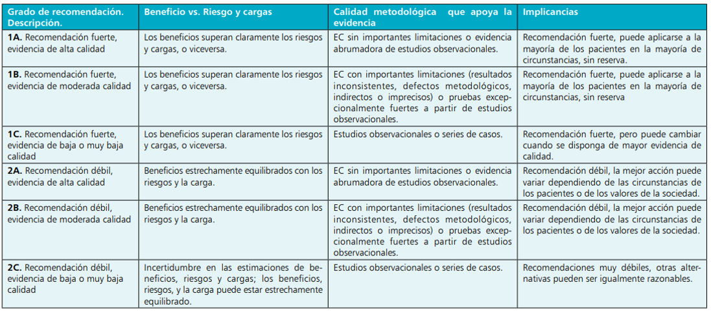

```{r, message=FALSE, echo=F}
knitr::opts_chunk$set(comment=NA, dpi = 300)
```

<br>

<center>

*Este material es parte de la* ***Unidad 2 del Curso de Epidemiología - Nivel Avanzado del Instituto Nacional de Epidemiología "Dr. Juan H. Jara" - ANLIS***

</center>

<br>

<center><p xmlns:cc="http://creativecommons.org/ns#" xmlns:dct="http://purl.org/dc/terms/"><a property="dct:title" rel="cc:attributionURL" href="https://cballejo.github.io/R_Epi_Avanzada/Unidad2/Intro/">Diseño de estudios epidemiológicos</a> by <a rel="cc:attributionURL dct:creator" property="cc:attributionName" href="http://www.ine.gov.ar">Andrea Silva</a> is licensed under <a href="http://creativecommons.org/licenses/by-nc/4.0/?ref=chooser-v1" target="_blank" rel="license noopener noreferrer" style="display:inline-block;">CC BY-NC 4.0</a></p></center>


<br> 

### Introducción

Un estudio epidemiológico es un proceso que consta de varias fases: definición del problema  de investigación, elección de la estrategia o diseño del estudio y planificación de las actividades. Básicamente, el diseño es la estrategia que elegimos para cumplir los objetivos planteados. 

Existen distintos criterios de clasificación, recordemos esta tabla que seguramente ya han visto en cursos previos:

<center><style type="text/css">
.tg  {border-collapse:collapse;border-spacing:0;}
.tg td{border-bottom-width:1px;border-color:black;border-style:solid;border-top-width:1px;border-width:0px;
  font-family:Arial, sans-serif;font-size:14px;overflow:hidden;padding:10px 5px;word-break:normal;}
.tg th{border-bottom-width:1px;border-color:black;border-style:solid;border-top-width:1px;border-width:0px;
  font-family:Arial, sans-serif;font-size:14px;font-weight:normal;overflow:hidden;padding:10px 5px;word-break:normal;}
.tg .tg-snbs{border-color:#000000;font-weight:bold;text-align:left;vertical-align:top}
.tg .tg-tuei{background-color:#c0c0c0;border-color:#000000;font-family:Arial, Helvetica, sans-serif !important;;font-weight:bold;
  text-align:left;vertical-align:top}
.tg .tg-vqzh{border-color:#000000;text-align:left;vertical-align:top}
.tg .tg-73oq{border-color:#000000;text-align:left;vertical-align:top}
.tg .tg-ruvv{background-color:#c0c0c0;border-color:#000000;color:#000000;font-weight:bold;text-align:left;vertical-align:top}
</style>
<table class="tg">
<thead>
  <tr>
    <th class="tg-tuei" colspan="2">Estudios descriptivos</th>
  </tr>
</thead>
<tbody>
  <tr>
    <td class="tg-snbs">Poblacionales</td>
    <td class="tg-vqzh">Estudios ecológicos</td>
  </tr>
  <tr>
    <td class="tg-73oq"></td>
    <td class="tg-73oq">Análisis de Situación</td>
  </tr>
  <tr>
    <td class="tg-snbs">Individuales</td>
    <td class="tg-vqzh">Reporte de casos</td>
  </tr>
  <tr>
    <td class="tg-73oq"></td>
    <td class="tg-73oq">Serie de casos</td>
  </tr>
  <tr>
    <td class="tg-vqzh"></td>
    <td class="tg-vqzh">Estudio de corte transversal</td>
  </tr>
  <tr>
    <td class="tg-ruvv" colspan="2">Estudios analíticos</td>
  </tr>
  <tr>
    <td class="tg-snbs">Observacionales</td>
    <td class="tg-vqzh">Estudio de casos y controles</td>
  </tr>
  <tr>
    <td class="tg-73oq"></td>
    <td class="tg-73oq">Estudio de cohorte</td>
  </tr>
  <tr>
    <td class="tg-snbs">Experimentales</td>
    <td class="tg-vqzh">Ensayos clínicos</td>
  </tr>
  <tr>
    <td class="tg-73oq"></td>
    <td class="tg-73oq">Ensayos comunitarios o de campo <br>(estudios de efectividad)</td>
  </tr>
</tbody>
</table></center>


Toda investigación debe partir del conocimiento actualizado del tema que va a  ser objeto de estudio: definir el problema a investigar (objetivos, propósito, justificación, hipótesis).  Una vez definido el tema, se deberá decidir diseño que se va a emplear para dar respuesta a los objetivos. Para ello es necesario conocer las características y ventajas de los distintos tipos de estudios epidemiológicos, cuál es el más adecuado de acuerdo al objetivo, pero también cuál es el que más se adecúa a los recursos humanos, económicos y de tiempo con los que se cuenta.

Existen muchas propuestas para jerarquizar y clasificar los niveles de evidencia que los distintos diseños aportan al conocimiento de una problemática. En general, las clasificaciones se basan en los diseños de los estudios de donde proviene la evidencia, asumiendo que algunos de ellos están sujetos a más sesgos que otros; y por ende, justifican más débilmente las decisiones clínicas. Por otro lado, el análisis constante de la evidencia permite establecer grados de recomendación para el ejercicio de procedimientos diagnósticos, terapéuticos, preventivos, económicos en salud, etc. GRADE (*The Grading of Recommendations Assessment, Development and Evaluation*), es un sistema para clasificar la calidad de la evidencia y fuerza de recomendación aplicable a una amplia gama de intervenciones y contextos. Fue elaborado en base a la experiencia previa con otras herramientas existentes. Se destaca en esta propuesta, la elaboración de una tabla de síntesis que se obtiene de forma sistemática y que se basa en la evaluación de la calidad de la evidencia según el tipo de diseño: Ensayos Clínicos (EC) con asignación aleatoria: calidad alta; estudios observacionales: calidad baja; y cualquier otra evidencia: calidad muy baja. 

```{r,echo=F,  fig.align='center', out.width = "100%"}

```

Una vez decidido el objetivo y el diseño se han de planificar las distintas actividades del  estudio, que incluyen la definición de la población de estudio, la determinación del tamaño  muestral, el método de selección de la muestra, los criterios de inclusión y exclusión, el periodo de estudio, la selección y definición de las variables, las fuentes de información que se van a utilizar, y cómo se van a desarrollar el procesamiento y análisis de los datos.

Todo lo que hace a la definición del problema y a la elección del diseño, son aspectos que fueron abordados en los cursos anteriores. Este nuevo curso de epidemiología que hoy están comenzando, se centra fundamentalmente en este último párrafo, poniendo el foco en el análisis de datos que derivan de los diferentes diseños.

Comenzaremos abordando los estudios observacionales, dado que gran parte de la investigación biomédica es de tipo observacional: los estudios de cohortes, de casos y controles, o los estudios transversales, son generadores de conocimiento sobre el proceso salud- enfermedad. Es importante tener presente que la investigación se debe comunicar de manera transparente y de forma que los lectores puedan seguir todo el proceso de la investigación: cómo fue planificada, cómo se realizó, qué se encontró y cuáles fueron las conclusiones que se derivaron del estudio. La realización de recomendaciones sobre la comunicación de la investigación puede ayudar a mejorar la calidad de dicha comunicación.

En ese sentido, la **Declaración STROBE** (*STrengthening the Reporting of OBservational studies in Epidemiology*)  representa una iniciativa internacional de colaboración de epidemiólogos, metodólogos, estadísticos, investigadores y editores de revistas involucrados en la realización y difusión de estudios observacionales, con el objetivo común de fortalecer la presentación de informes de estudios observacionales en epidemiología. La Declaración STROBE está siendo respaldada por un número creciente de revistas biomédicas. Para los investigadores resulta muy útil, porque establece una lista de verificación de elementos que deberían incluirse en los artículos que informan sobre una investigación de tipo observacional.

En el mismo sentido, y más recientemente, The Lancet Infectious Diseases publicó una nueva extensión de la declaración STROBE: **STROME-ID** (*Strengthening the Reporting of Molecular Epidemiology for Infectious Diseases*). El objetivo es establecer recomendaciones para respaldar un buen informe científico de estudios epidemiológicos moleculares para alentar a los autores a considerar amenazas específicas a la inferencia válida. 

En el caso de los diseños experimentales, la declaración **CONSORT** (*Consolidated Standards of Reporting Trials*) se desarrolló en 1996 y fue revisada 5 años después. Muchas revistas médicas se adhirieron a esta iniciativa, que permitió mejorar la calidad de la comunicación de los ensayos clínicos aleatorizados. El producto principal de CONSORT es la Declaración CONSORT, que es un conjunto mínimo de recomendaciones basadas en la evidencia para informar ensayos aleatorios. Ofrece una forma estándar para que los autores preparen informes de los resultados de los ensayos, facilitando su informe completo y transparente, y ayudando a su evaluación e interpretación críticas.

Tanto en la iniciativa STROBE como en la CONSORT, se encuentra una exhaustiva lista de verificación para el apartado *“Métodos”*. En este curso nos centraremos en este ítem, con especial énfasis en cómo se analizan los datos de cada tipo de estudio. 

Necesitaremos valernos de alguna herramienta, y en ese sentido, hemos decidido utilizar el **lenguaje R**, ya que es un entorno con un enfoque al análisis estadístico. 

Partiremos de cada diseño, y discutiremos algún posible camino de análisis, sabiendo que este camino no siempre es único y que algunos elementos del análisis, pueden ser comunes a varios diseños. 

### Bibliografía

http://www.strobe-statement.org/

http://www.consort-statement.org/

https://www.thelancet.com/journals/laninf/article/PIIS1473-3099(13)70324-4/fulltext

Epidemiología. Diseño y análisis de estudios. Mauricio Hernández Ávila. 2007, Editorial Médica Panamericana
https://scielo.conicyt.cl/pdf/rci/v31n6/art11.pdf

