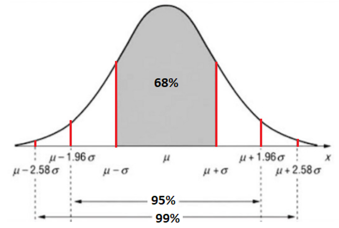
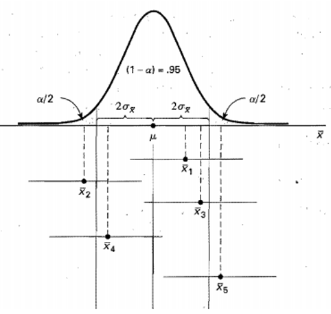
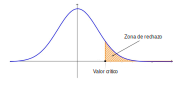
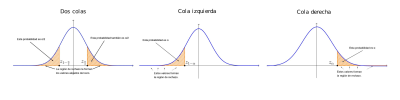
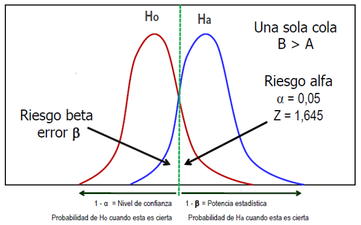
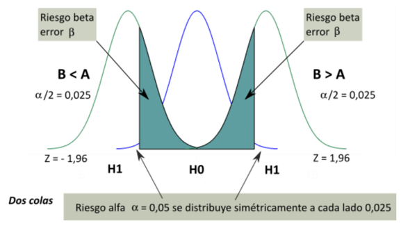
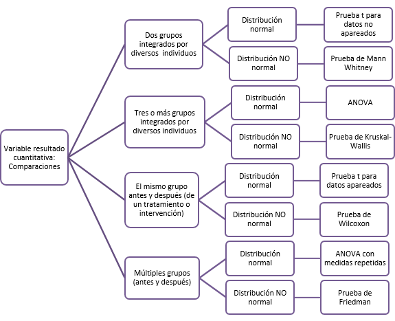
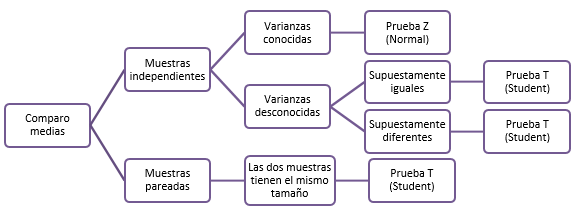
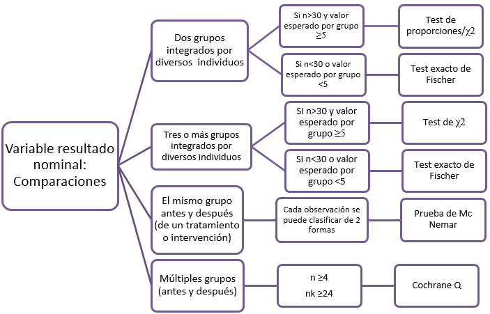

```{r, message=FALSE, echo=F}
knitr::opts_chunk$set(comment=NA, dpi = 300)
```

<br>

<center>

*Este material es parte de la* ***Unidad 2 del Curso de Epidemiología - Nivel Avanzado del Instituto Nacional de Epidemiología "Dr. Juan H. Jara" - ANLIS***

</center>

<br>

INSERTAR LICENCIA

<br> <br>

## Introducción

En esta segunda unidad, intentaremos recorrer metodologías que pueden emplearse en el análisis de un estudio de corte transversal.

Comencemos recordando que los estudios transversales se caracterizan por tener *un único momento de medición*, no hay una idea de seguimiento en este tipo de diseño: el investigador mide el resultado y las exposiciones en los participantes del estudio al mismo tiempo. Los participantes solo se seleccionan según los criterios de inclusión y exclusión establecidos para el estudio.

El diseño de corte transversal se clasifica como un *estudio observacional de base individual* que suele tener un doble propósito: **descriptivo** y **analítico**.

También es conocido como estudio de prevalencia o encuesta transversal. Los que llamamos de "**tipo descriptivo**", se dirigen al estudio de la frecuencia y distribución de eventos de salud y enfermedad. Tienen como fin medir una o más características (variables) o enfermedades en un momento dado de tiempo. Los que llamamos de "**tipo analítico**", se utilizan para explorar y generar hipótesis de investigación.

Algunos autores los consideran en el límite entre los estudios descriptivos y los analíticos.

Se estiman la frecuencia (prevalencia) de cada categoría. Las medidas de asociación que pueden calcularse en este tipo de diseño son dos: la **razón de prevalencia** (aproximación al riesgo relativo de los estudios de cohortes) o la **odds ratio de prevalencia** (aproximación a la odds ratio de los estudios de casos y controles)

Repasemos las ventajas y desventajas de este diseño

+-------------------------------------------------------------------------+---------------------------------------------------------------------------------------------------------------------+
| Ventajas                                                                | Desventajas                                                                                                         |
+=========================================================================+=====================================================================================================================+
| Eficientes para estudiar la prevalencia de enfermedades en la población | Problemas para definir y medir exposición                                                                           |
+-------------------------------------------------------------------------+---------------------------------------------------------------------------------------------------------------------+
| Se pueden estudiar varias exposiciones                                  | Sesgos de selección                                                                                                 |
+-------------------------------------------------------------------------+---------------------------------------------------------------------------------------------------------------------+
| Son poco costosos y se pueden realizar en poco tiempo                   | Sesgos por casos prevalentes                                                                                        |
+-------------------------------------------------------------------------+---------------------------------------------------------------------------------------------------------------------+
| Se puede estimar la prevalencia del evento                              | La relación causa efecto no siempre es verificable                                                                  |
+-------------------------------------------------------------------------+---------------------------------------------------------------------------------------------------------------------+
|                                                                         | Sobrerrepresentación de enfermos con tiempos prolongados de sobrevida o con manifestaciones con mejor curso clínico |
+-------------------------------------------------------------------------+---------------------------------------------------------------------------------------------------------------------+
|                                                                         | Se puede presentar causalidad débil                                                                                 |
+-------------------------------------------------------------------------+---------------------------------------------------------------------------------------------------------------------+

Para ponernos en tema, veamos el [check-list](https://www.strobe-statement.org/fileadmin/Strobe/uploads/checklists/STROBE_checklist_v4_cross-sectional.pdf) que propone la iniciativa **STROBE** para estudios de corte transversal, en el tópico *Métodos*

En un diseño de este tipo, son muchos los retos que debe enfrentar el investigador.

Uno de los principales, es definir claramente la población. Cuáles son los sujetos que se deben incluir en el estudio depende estrictamente de la pregunta y los objetivos de investigación, pero es importante identificar correctamente a los mismos con el fin de que los resultados puedan generalizarse.

Únicamente las muestras representativas de la población, permiten desarrollar el componente analítico exploratorio del diseño transversal.

Generalmente, una encuesta transversal no obtiene información de todos los sujetos que integran la población bajo estudio, sino que trabaja sobre una muestra. La muestra seleccionada debe reflejar las características de la población base que se busca estudiar.

Cuando un epidemiólogo realiza mediciones sobre una muestra de la población, dichas mediciones pueden representarse gráficamente, ser resumidas mediante los estadísticos de tendencia central y dispersión, e incluso plantear alguna función que vincule las variables.

Si el único propósito del investigador es describir los resultados de un experimento concreto, es decir de esa muestra particular, dichos métodos pueden considerarse suficientes. No obstante, si lo que se pretende es utilizar la información obtenida para extraer conclusiones sobre la población en general, entonces estos métodos constituyen sólo el principio del análisis, y debe recurrirse a métodos de **inferencia estadística**, los cuales implican el uso inteligente de la teoría de la probabilidad.

El cálculo de probabilidades nos suministra las reglas para el estudio de los experimentos aleatorios o de azar, constituyendo la base para la estadística inductiva o inferencial. Debido a que las inferencias de una muestra a la población pueden resultar no ciertas, debemos siempre utilizar el lenguaje de la probabilidad en nuestras conclusiones.

Las dos actividades principales de la estadística inferencial, son el uso de datos para:

-   Estimar un parámetro poblacional

-   Probar una hipótesis respecto de un parámetro poblacional

Volvamos nuevamente en los estudios transversales: *"Estimar un parámetro poblacional"* podría consistir por ejemplo en *"Estimar la prevalencia de una enfermedad X en la población"*.

El segundo ítem, *"Probar una hipótesis respecto de un parámetro poblacional"*, podría traducirse, en términos de un estudio transversal, en *"Probar que la prevalencia de la enfermedad X en Argentina es menor que en Uruguay"* o *"Probar que la prevalencia de la enfermedad X en Argentina en el año 2010 es menor que en el año 2000"*

Antes de comenzar con el primero de los ítems, será necesario que hablemos el mismo lenguaje y comprendamos cómo la teoría de la probabilidad nos ayuda a encontrar el camino que va de la muestra a la población.

Al hablar de población y muestra, hay un tema que queda implícito y es todo lo que hace a la teoría de muestreo. Es un tema que no abordaremos aquí en profundidad, pero es importante aclarar que la teoría del muestreo tiene por objetivo, el estudio de las relaciones existentes entre la distribución de un caracter (o variable) en una población y las distribuciones de dicho caracter en todas sus muestras.

Los matemáticos llaman a las medidas de descripción de variables o de asociación que hayamos obtenido a partir de los sujetos de nuestra muestra como **"estimadores"** o **"estadísticos muestrales"**, en algunos casos, simplemente "estadísticos". Por otra parte, se denomina **"parámetros"** a los correlatos de esos estimadores en la población de la que hemos obtenido esa muestra.

Supongamos que queremos conocer el valor medio de colesterol total de la población de Mar del Plata y tomamos una muestra de tamaño $n$. La media de colesterol total de toda la población es lo que en lenguaje matemático se denomina parámetro y se representa con la letra griega $\mu$ y la media de colesterol total en la muestra que haya tomado es lo que se denomina estadístico muestral o estimador y se lo representa como $\overline{x}$

La distribución de todos los valores posibles que puede asumir un estadístico muestral, calculados a partir de muestras del mismo tamaño, seleccionadas aleatoriamente de la misma población, se llama **distribución muestral** de ese estadístico y constituye el concepto central de la inferencia estadística.

### Distribuciones muestrales y estimación

Para comprender lo que es una distribución muestral, y cómo se elabora, ingrese a la clase de [Distribuciones Muestrales](https://youtu.be/UgWW88s5vYQ)

Como hemos visto en la presentación, elaborar la distribución muestral es una tarea dificultosa si la población es de un tamaño muy grande, e imposible si la población es infinita. En último caso, es posible obtener aproximaciones de las distribuciones muestrales tomando un gran número de muestras de un tamaño dado.

Veremos ahora como se vinculan las distribuciones muestrales con el proceso de estimación.

## Intervalos de Confianza (IC)

Una buena forma de abordar la Inferencia estadística es hacerlo mediante los Intervalos de confianza, porque aunque sean procedimientos inferenciales, mantienen una importante conexión con la estadística descriptiva.

Antes de adentrarnos en cuestiones de cálculo, intentaremos pensar cuál es el concepto de un **intervalo de confianza**.

Supongamos que queremos estimar la media de colesterol de la población de Mar del Plata. Como resultaría inviable realizar la determinación en todos y cada uno de los habitantes, pensamos que lo más acertado sería realizar la determinación sobre una muestra de 100? 200? 300? individuos (después veremos cómo calcular este número), realizar el cálculo de la media de colesterol en dicha muestra y decir que ese es el valor de la población, fijando un cierto margen de seguridad.

Habiendo discutido ya los fundamentos de las distribuciones muestrales, aprenderemos en esta sección a calcular intervalos de confianza.

Estimamos, por ejemplo la media, a partir de una muestra. Como ya discutimos, muestras diferentes presentan en general, medias diferentes: existe un grado de incertidumbre involucrado. Si se hiciese una estimación puntual, ésta no brinda información sobre la variabilidad inherente al estimador, ya que no sabemos qué tan próxima de $\mu$ está $\overline{x}$.

La estimación por intervalo de confianza brinda un intervalo de valores que presenta cierta probabilidad de contener al verdadero valor del parámetro poblacional.

Recordemos que: Una estimación puntual es un solo valor numérico utilizado para estimar el parámetro correspondiente de la población. Una estimación por intervalos consta de dos valores numéricos que definen un intervalo que, con un grado especifico de confianza, se considera que incluye al parámetro por estimar.

En general, la construcción de un **IC**, requiere de *3 componentes*:

-   Un estimador puntual
-   Un coeficiente de confiabilidad
-   Error estándar

El IC se construirá, en líneas generales de la siguiente forma:

$$IC = estimador \pm (coeficiente \: de  \: confiabilidad) * (error \: estandar)     $$

Como estimador, se utiliza el **estimador puntual** más probable:

-   Para la media de una población ($\mu$), se toma la media de la muestra: $\overline{x}$
-   Para una proporción de la población ($p$), se toma la proporción muestral: $\hat{p}$

**Coeficiente de confiabilidad**: el nivel de significación ($\alpha$) es la probabilidad del parámetro estimado de NO estar contenido en el intervalo de confianza.

El nivel de significación es un valor comprendido entre 0 y 1, usualmente muy pequeño (0,1; 0,05 o 0,01 informado como probabilidad, 10, 5 o 1% expresado como porcentaje).

El grado de confianza deseado debe ser prefijado por el investigador (habitualmente se utilizan valores como 0,90; 0,95 o 0,99); este se expresa como (1- $\alpha$) y se denomina nivel de confianza o coeficiente de confiabilidad. Expresa la probabilidad de que el parámetro pertenezca al IC.

Para obtener dicha estimación por intervalos, se debe aprovechar el conocimiento acerca de las distribuciones muestrales.

Si consideramos un IC para la media, recordemos que el TCL dice que, independientemente de la distribución de la variable original, la distribución de las medias muestrales es aproximadamente normal con media μ y varianza $\sigma^2/n$, cuando $n$ es suficientemente grande.

A la raíz cuadrada de la varianza de la distribución muestral se la llama **error estándar de la media**, o simplemente error estándar (**EE**). Entonces, para este caso:

$$  EE =  \frac{\sigma}{\sqrt{n}}  $$ Con base en el conocimiento adquirido acerca de la distribución normal, en general, se sabe aún más sobre la distribución de $\overline{x}$ para este caso, dado que sabemos cómo calcular probabilidades asociados a una distribución normal.

::: {.b--gray .ba .bw2 .ma2 .pa4 .shadow-1}
Para el que no recuerda: Repaso sobre **distribución normal**

¿Cómo calcular probabilidades asociados a una distribución normal?

Dado que tanto $\mu$ como $\sigma$ pueden asumir infinitos valores lo que hace impracticable tabular las probabilidades para todas las posibles distribuciones normales, se utiliza la distribución normal reducida o tipificada.

Se define una nueva variable $Z = (\bar{x} - \mu)/\sigma$

Esto genera una traslación, y un cambio de escala de la variable original.

La nueva variable $Z$ se distribuye como una **NORMAL con media** $\mu$ = 0 y DS $\sigma$ = 1.

En cualquier distribución normal las probabilidades delimitadas entre $\mu$ $\pm$ $1\sigma$= 68%; $\mu$ $\pm$ $2\sigma$ = 95%; $\mu$ $\pm$ $3\sigma$ = 99%.

```{r,echo=F,  fig.align='center', out.width = "60%"}

```
:::

Entonces, sabemos que sin importar dónde se localizan, aproximadamente el 95% de los valores posibles de $\overline{x}$ que constituyen la distribución, están a dos desviaciones estándar respecto a la media. Es decir, que el intervalo $\mu$ $\pm$ $2\sigma$ contendrá el 95% de los valores posibles de $\overline{x}$. Supongamos que se forman intervalos a partir de todos los valores posibles de $\overline{x}$ calculados a partir de todas las muestras posibles de tamaño $n$ de la población de interés. De esa forma se tendrá un gran número de intervalos de la forma $\overline{x}$$\pm$ $2\sigma$ con amplitudes todas iguales a la del intervalo en torno a la $\mu$ desconocida. 

Aproximadamente 95 por ciento de estos intervalos tendría centros que caen dentro del intervalo $\pm$ $2\sigma$ en torno a $\mu$. Cada uno de estos intervalos que caen dentro de $2\sigma$, en torno a $\mu$ pueden contener a la misma $\mu$.


```{r,echo=F,  fig.align='center', out.width = "60%"}

```

Finalmente, y basándonos en las propiedades de la distribución Normal, se puede deducir la expresión del IC:

P(Zα/2 < Z < Z1-α/2) = 1-α

$$P(Z_{\alpha/2} < Z_{1-\alpha/2)} = 1 - \alpha$$
Reemplazando Z: 

$$P(Z_{\alpha/2} < \frac{\bar{x} - \mu}{\frac{\sigma}{\sqrt{n}}} < Z_{(1-\alpha/2)}) = 1-\alpha  $$

Reordenando, la expresión del IC para la media queda:   

$$\bar{x} - Z_{\alpha/2}\sqrt{\frac{\sigma^2}{n}} < \mu < \bar{x} + Z_{\alpha/2}\frac{\sigma^2}{n}  $$
¿Y cómo se interpreta un IC? 

Si hubiésemos tomado muestras del mismo tamaño en una gran cantidad de ocasiones, hubiésemos acertado por lo menos en un  $100 * (1 − \alpha)$ % de las ocasiones al decir que el parámetro estaba en el intervalo que cada muestra suministra.

El producto de  *(coeficiente de confiabilidad) x (error estándar)*   se lo denomina precisión de la estimación.  

Cuando planteamos anteriormente los componentes de un IC (IC = estimador ± (coeficiente de confiabilidad) x (error estándar)), nos damos cuenta que el término (coeficiente de confiabilidad) x (error estándar)  será el responsable de la amplitud de dicho IC. 

Al analizar este término vemos que, en el caso de la media:

-	Si aumentamos la confiabilidad, la amplitud del intervalo aumenta

- Si fijamos la confiabilidad, por ejemplo en 95 %, para disminuir la amplitud del IC, deberíamos disminuir el error estándar. Dado que éste es igual a $\frac{\sigma}{\sqrt{n}}$; y como $\sigma$ es constante, la única forma de disminuir el error estándar es aumentando $n$.

La pregunta que siempre ronda es: ¿qué tan grande debe ser $n$? 

Dependerá entonces del valor de $\sigma$; de $\alpha$ y de la amplitud deseada para el IC.

Amplitud = (coeficiente de confiabilidad) x (error estándar)

Amplitud = $Z\frac{\sigma}{\sqrt{n}} \to n = \frac{Z^2\sigma^2}{amplitud^2} \qquad Z = 1,96 \quad si \quad \alpha = 0,05$

($\sigma$ generalmente no se conoce, así que habitualmente se usa el estimado con la muestra)

La expresión para el **error estándar**, dependerá del parámetro a ser estimado. 
Recién comentamos el caso de estimación de una media poblacional. Si por el contrario, lo que queremos calcular es un IC para la *proporción*, recordemos que cuando la muestra es grande, la distribución de las proporciones de la muestra es aproximadamente  normal de acuerdo con el TCL. 

La media de la distribución (que es el promedio de todas las proporciones posibles de las muestras) es igual a la proporción real de la población $p$ y la varianza de la distribución es $p(1-p)/n$, por lo que en este caso, la expresión para el IC, resulta:


$$EE = \sqrt{\frac{p(1-p)}{n}}     $$

$$p - Z_{1-\alpha/2}\sqrt{\frac{p(1-p)}{n}} < \hat{p} < p + Z_{1-\alpha/2}\sqrt{\frac{p(1-p)}{n}} $$

Dado que un IC implica una declaración probabilística, para su cálculo deberemos necesariamente, tratar con las distribuciones de las variables aleatorias que surgen del muestreo. Es decir que dependiendo del parámetro que quiera estimar, deberé conocer o aproximar una distribución muestral y conocer su EE. 

No deberán preocuparse por las expresiones matemáticas, veremos que los paquetes estadísticos son capaces de calcularlos por nosotros. Pero lo importante aquí es entender de qué magnitudes depende y en qué forma.

### Selección de la muestra en estudios transversales

En reglas generales,  toda investigación epidemiológica exige la selección de una muestra de la población que se estudia. Esto implica:

- Decidir el *tamaño de la muestra*

- Decidir cómo se seleccionarán los sujetos para la investigación (*unidades de análisis*)

- Calcular qué *incertidumbre* le imprime este “**muestreo**” a nuestra estimación

El tamaño de la muestra se decide en la fase de diseño del estudio, habitualmente cuando se escribe lo que llamamos el protocolo de la investigación. Este tamaño de muestra que calculemos pretende ser orientador, dado que para su cálculo intervienen factores que pueden ser subjetivos muchas veces, y la información disponible, que puede ser escasa en algunos casos. Otras cuestiones dependen del objetivo de la investigación: se acepta que en un estudio transversal, donde uno estima una prevalencia, la precisión puede ser baja; en tanto que si hablamos de un diseño experimental, donde se contrasta un fármaco contra un placebo, el tamaño de muestra tendrá que permitir establecer una “diferencia significativa” entre ambos grupos.

Cuando el objetivo de nuestra investigación incluye la estimación de un IC para alguna variable de interés, desearemos que dicho IC sea de alta confiabilidad y lo más estrecho posible.

Volvamos nuevamente a los estudios de corte transversal: debemos pensarlos como estudios cuyo objetivo es estimar una proporción. Son estudios que intentan responder preguntas como ¿cuáles la prevalencia, proporción o porcentaje del fenómeno en estudio?

Al tomar una muestra para estimar lo que sucede en la realidad, es necesario aceptar que la medición realizada en la muestra nos dará una apreciación de la población de la cual se tomó, pero con cierto grado de variabilidad (o error). 

La variabilidad que estamos dispuestos a aceptar en dicha estimación es lo que llamamos precisión y puede manejare a través de los intervalos de confianza (es decir, los límites superior e inferior dentro de los cuales se encontrará el verdadero valor del parámetro estimado).

Como se mencionó en la sección anterior, se requiere conocer algunos datos para el cálculo del tamaño de muestra requerido, entre los que destacan:

a. La proporción que se desea poder detectar: Esto pareciera un contrasentido, dado que es el parámetro objeto de la estimación, pero el investigador generalmente no está totalmente “a ciegas”, sino que cuenta con cierta información previa que le permitirá al menos circunscribir las posibilidades. 
No obstante, si no fuera el caso, considerar una proporción del 50% es la situación que exige el tamaño de muestra más grande (es el valor de $p$ que hace que el producto $p(1-p)$ sea máximo).De esta forma, muchas veces se recurre a esto para tener al menos una idea del “límite superior” que estaríamos manejando.

b. El nivel de confianza deseado: Usualmente 95%, que corresponde a un valor $\alpha = 0,05$. Este valor indica el grado de confianza que se tendrá de que el verdadero valor del parámetro en la población caiga dentro del intervalo obtenido. Cuanta más confianza se desee, menor será el valor de $\alpha$, mayor el valor de $Z\alpha$ y más elevado el número de sujetos necesarios.

c. La precisión ($\delta$) con que se desea obtener la estimación, es decir, la amplitud que se acepte del intervalo de confianza. Cuanta más precisión se desee, más estrecho deberá ser este intervalo y más sujetos deberán ser estudiados

La fórmula para el cálculo es la siguiente:

$$N = \frac{p.q.(Z\alpha)^2}{\delta^2}   $$
En donde:

- $N$ = Tamaño de la muestra que se requiere.
-	$p$ = Proporción de sujetos portadores del evento en estudio.
-	$q$ = $1 – p$ (complementario, sujetos que no tienen la variable en estudio).
-	$\delta$ = Precisión o magnitud del error que estamos dispuestos a aceptar.
-	$Z\alpha$ = Distancia de la media del valor de significación propuesto. Se obtiene de tablas de distribución normal de probabilidades y habitualmente se utiliza un valor $\alpha$ de 0.05, al que le corresponde un valor $Z$ de 1.96

Cuando el tamaño de la población es menor a 5000, se debe hacer una corrección de la fórmula (ajuste por población finita)

$$N =\frac{n^1}{1+\frac{n^1}{Población}}   $$
(donde $n^1$ es el $N$ calculado con la ecuación previa)

No deberán preocuparse por la ecuación., es sólo para no perder de vista de qué dependerá el tamaño de la muestra. 

Varios son los paquetes estadísticos que calculan tamaños de muestra. Algunos se dedican específicamente a esta tarea mientras que otros la incluyen entre  sus opciones. 

Entre los gratuitos podemos mencionar: **EpiDat**, **EpiInfo (StatCalc)**,**OpenEpi**, etc. 

Veremos a continuación, una de los paquetes que existen en R


INSERTAR CALCULO DE LA MUESTRA CON pwr


Ya hemos discutido lo concerniente al tamaño de la muestra en procesos de estimación. Ahora diremos algunas palabras sobre cómo seleccionar a los individuos que constituirán la muestra. Debe llevarse a cabo un muestreo probabilístico,  dado que en los estudios de corte transversal  los métodos de muestreo son importantes. Si bien la parte de muestreo no está incluida en los contenidos del curso, es vital tenerlo en cuenta porque determinará los factores de expansión que deberán aplicarse a la muestra, al momento de generalizar los resultados a la población.

### Conceptos generales sobre muestreo

Un muestreo es probabilístico cuando se cumplen dos condiciones: es posible conocer la probabilidad de selección que tiene cada elemento de la población de antemano  y que tal probabilidad no sea nula para elemento alguno.

Sólo cuando el método de muestreo es probabilístico se podrá medir el grado de precisión con que se realizan las estimaciones.

Algunos de los métodos más usados que repasaremos a continuación, son: Muestreo simple aleatorio, muestreo sistemático en fases, Muestreo aleatorio estratificado, muestreo por conglomerados, etc

**Muestreo aleatorio simple (MAS)** en el que cada elemento de la población tiene la misma probabilidad (P) de ser seleccionado (equiprobabilístico).

$$P = \frac{n}{N} $$
Requiere un listado de la población. Por eso,  se usa principalmente cuando la población objeto del estudio es una población cerrada (escuelas, cárceles, hospitales, muestras de laboratorio, etc.).

Estas poblaciones se caracterizan porque sus elementos se pueden identificar y numerar fácilmente.

**Muestreo sistemático (MS)** es un procedimiento alternativo al muestreo simple aleatorio, que se usa para la selección de muestras equiprobabilísticas de una población organizada según cierto orden conocido. 

Una importante ventaja del MS sobre el MAS consiste en que no es estrictamente necesario contar con un listado de todas las unidades de análisis de la población (podría aplicarse, por ejemplo, a los usuarios de un servicio hospitalario en la medida que van arribando a éste a lo largo de cierto período). ¿Cómo lo haríamos?

1.	Se asigna un número de 1 a N a cada elemento de la población
2.	Se calcula el intervalo de selección $k$  ($k=N/n$)
3.	Se selecciona el arranque aleatorio $r$ entre 1 y $k$,
4.	Los elementos seleccionados son los de la secuencia: $r$, $r+jk$ ($j$=0,1,2…)

La probabilidad de ser seleccionado es igual que en el MAS

$$P = \frac{n}{N} $$

**Muestreo aleatorio estratificado (MAE)**. Este diseño muestral se utiliza cuando la población se puede dividir en diferentes grupos de elementos (estratos) cuya representación en la muestra quisiera asegurarse. Se define como estrato a los subgrupos de unidades de análisis que difieren en las características que van a ser analizadas. Se basa en variables como edad, sexo, nivel socioeconómico, etc. La manera  natural de lograrlo es construir listas separadas para cada uno de los estratos y proceder a  seleccionar submuestras en cada uno de ellos. 

Con este diseño lo que se procura es obtener una muestra que tenga en sí una variabilidad similar a la de la población; lo ideal sería conseguir que los subconjuntos que se definen como estratos fuesen internamente homogéneos y diferentes entre sí. 

La probabilidad de selección en cada estrato es:

$$P \ estrato = \frac{n \ estrato}{N \ estrato} $$

Si el reparto es proporcional:

$$n \ estrato = n\frac{N \ estrato}{N} $$

**Muestreo por conglomerados monoetápico**: Es el ideal cuando la población no puede ser delimitada fácilmente o cuando es muy dispersa. Se trata de dividir la población en cierto número de partes o conglomerados, que se consideran como “unidades de primera etapa” (UPE), es importante que no exista solapamiento entre los conglomerados.  

La población se divide en conjuntos como servicios, áreas geográficas, instituciones por ejemplo. A continuación, se selecciona una muestra de $n$ conglomerados e incluir en la muestra a todas las unidades de análisis  pertenecientes a los conglomerados que se elijan. 

El número de unidades elementales de un conglomerado se denomina tamaño del mismo. 

Los conglomerados pueden ser de igual o distinto tamaño, y deberían ser lo más heterogéneos dentro de ellos y lo más homogéneos entre ellos

**Muestreo por conglomerados bietápico**: Este procedimiento de selección muestral se utiliza cuando hay gran variabilidad entre los tamaños de los conglomerados, o cuando el tamaño poblacional es demasiado grande. La población se divide inicialmente en conglomerados, que constituyen las unidades de primera etapa (UPE), parte de las cuales son seleccionadas para ser entonces objeto de subselección (cada una de ellas).

Existen más posibilidades, que no abordaremos aquí, pero sí nos detendremos en discutir qué implicaciones tiene el muestreo en el proceso de estimación.

Cuando realizamos un MAS, un MS, las muestras son equiprobabilísticas. Cuando se realizan muestreos más complejos, las probabilidades de selección de los individuos son diferentes. 

En este proceso, a cada individuo de la muestra le corresponde cierta probabilidad de selección, que depende, naturalmente, de la forma en que se haya llevado adelante la selección de la UPE y la que se empleó para el propio sujeto dentro de dicha UPE. 

En cualquier caso, la probabilidad de selección de un individuo es el producto de las probabilidades de selección en las distintas etapas que conducen a su inclusión en la muestra. Una vez que se conoce dicha probabilidad, la ponderación se calcula, generalmente, como su inverso, y se interpreta como el número de individuos de la población que representa uno de la muestra

La expansión se utiliza cuando se desea conocer el valor en la población de un resultado obtenido en la muestra efectiva. 

> El factor de expansión se interpreta como *la cantidad de personas en la población, que representa una persona en la muestra*.

La estimación de un total dado para una variable se obtiene, primero, ponderando el valor de la variable en cada persona por su factor de expansión y luego, sumando todas las personas de la muestra.

Veamos un ejemplo para ver cómo el diseño muestral afecta las ponderaciones:

**Ejemplo de muestreo**

Supongamos que queremos obtener la prevalencia de sobrepeso/obesidad en estudiantes de enseñanza media de una localidad que tiene 966 alumnos registrados (de enseñanza media) y que dichos alumnos están distribuidos en 21 escuelas de tamaños variables (usted cuenta con esta información). 

Ya realizó el cálculo del tamaño del tamaño de la muestra, que deberá ser de 120 alumnos.

Podría realizar un **MAS**: para ello debería contar con el listado de los 966 alumnos y realizar un sorteo entre ellos de los 120 alumnos necesarios para construir la muestra. 

La probabilidad de selección de cada individuo será: 

$$P = \frac{n}{N} = \frac{120}{966}=0,124$$

Supongamos ahora que decide realizar un muestreo por conglomerados biétapico: cada escuela sería un conglomerado; los conglomerados se seleccionarán por MAS y dentro de cada escuela se seleccionarían los estudiantes participantes por MAS.

La decisión de cuántos conglomerados forman parte de la muestra, es una decisión del investigador: a veces puede ser necesario fijar un número, a veces puede ser más conveniente fijar el tamaño de la muestra en cada conglomerado. Por otra parte, puede que decidamos que el número de sujetos seleccionados en cada conglomerado sea igual para todos; que sea una fracción fija o algo a definir.

Tomemos entonces algunas decisiones: seleccionaremos 10 conglomerados de los 21 posibles, y consideremos que la muestra sea igual para cada conglomerado. 

Al hacerlo, obtenemos estos resultados:

|                                |**Población**    |**Muestra**    |
|--------------------------------|-----------------:|---------------:|
|     Tamaño                     |     966          |     120        |
|     Número de conglomerados    |     21           |     10         |


|     **Conglomerado**    |    **Tamaño**    |    **Muestra**   |
|:--------------------|--------------:|---------------:|
|     5.1             |     48        |     12         |
|     1.3             |     28        |     12         |
|     2.3             |     64        |     12         |
|     2.2             |     43        |     12         |
|     3.1             |     37        |     12         |
|     5.3             |     86        |     12         |
|     1.4             |     37        |     12         |
|     3.3             |     56        |     12         |
|     2.4             |     48        |     12         |
|     1.5             |     33        |     12         |
|     Total:          |     480       |     120        |


¿Cuáles son las probabilidades de selección y las ponderaciones correspondientes?

Recordemos que para que un individuo sea seleccionado, primeramente debe ser seleccionado su conglomerado; es decir que la probabilidad de selección de un individuo, será el producto de dos probabilidades: la de que su conglomerado sea seleccionado y la de que él, como miembro del conglomerado, sea seleccionado.

La teoría de la Probabilidad nos dice: *“Dos sucesos son independientes si la probabilidad de que ocurran ambos simultáneamente es igual al producto de las probabilidades de que ocurra cada uno de ellos”*.

Hagamos el cálculo para los individuos del conglomerado 5.1; la probabilidad de selección será:

$$P = \frac{10}{21}*\frac{12}{48} = 0,1190$$

La ponderación correspondiente es la inversa de la probabilidad, es decir $8,4$. Esto significa que cada individuo de seleccionado del conglomerado 5.1, representa a aproximadamente 8 individuos de la población. 

Si realizamos los cálculos para todos los conglomerados, obtenemos:


|     **Conglomerado**    |     **Probabilidad**    |     **Ponderación**    |
|:--------------------|--------------------:|-------------------:|
|     5.1             |     11,9048         |     8,4000         |
|     1.3             |     20,4082         |     4,9000         |
|     2.3             |     8,9286          |     11,2000        |
|     2.2             |     13,2890         |     7,5250         |
|     3.1             |     15,4440         |     6,4750         |
|     5.3             |     6,6445          |     15,0500        |
|     1.4             |     15,4440         |     6,4750         |
|     3.3             |     10,2041         |     9,8000         |
|     2.4             |     11,9048         |     8,4000         |
|     1.5             |     17,3160         |     5,7750         |


### La comparación en los diseños transversales


Si bien los estudios de corte transversal no son diseños que desde su inicio posean grupos de comparación, es habitual que en los que son de corte más analítico, se establezcan algunas comparaciones. Preguntas tales como ¿la prevalencia de la enfermedad es mayor en mujeres/ en un determinado grupo etario/ en una determinada provincia?; pueden surgir en el marco de estos estudios.

Con esto en mente recorreremos a continuación las herramientas que nos permiten comparar grupos. Para la comparación nos valdremos de los **test de hipótesis** o **contrastes de hipótesis**. El propósito de los test de hipótesis es brindar al investigador una herramienta para ayudar a tomar una decisión respecto de la población a partir de una muestra. Antes de comenzar con la parte estadística en sí, será necesario hacer una distinción entre dos tipos de hipótesis: la hipótesis de investigación y la hipótesis estadística.

- Hipótesis de investigación: Es la conjetura o suposición que motiva la investigación
- Hipótesis estadística: Es aquella que puede ser evaluada mediante técnicas estadísticas apropiadas

En este texto aclararemos aspectos sobre las hipótesis estadísticas, dado que se supone que en este punto, las hipótesis de investigación, ya fueron discutidas previamente por el investigador. Describiremos ahora brevemente el razonamiento que subyace a estos test.

Estos test parten de una **hipótesis nula**: afirmar que los dos grupos que se comparan son iguales, o dicho de otra forma, que las diferencias encontradas pueden ser atribuidas al azar. De acuerdo a lo que discutimos previamente, la variabilidad nunca permitirá que la diferencia entre los grupos sea estrictamente cero. 

El método estadístico nos permite calcular cuánto es esta diferencia, asumiendo que repetimos el experimento infinitas veces, lo que en nuestro caso equivale a decir que obtenemos todas las posibles muestras del tamaño indicado a partir de nuestras poblaciones (*distribución muestral*). Si hiciéramos esto veríamos que las sucesivas diferencias entre grupos “iguales” se ajustan a una curva de distribución, por ejemplo la distribución *Normal*, en el caso de la diferencia de medias. Basándonos en las propiedades de esta distribución, podríamos calcular aquel valor que comprende el 95% de las diferencias o el 99%, según el caso. Bastará entonces con verificar si la diferencia entre las muestras que nosotros tomamos, supera este valor límite, ya que de ser así, consideraremos que es excesiva para ser explicada por el azar, y nos veremos obligados a rechazar la hipótesis nula. Si, por el contrario, la diferencia real entre las muestras, cae dentro del área del 95%, la diferencia encontrada podría atribuirse al azar y no habría evidencia que nos permita rechazar la hipótesis nula, lo que nos lleva a decir que los grupos no son diferentes. Siempre decimos que “no son diferentes”, pero no que son iguales, dado que la variabilidad nunca nos permitirá probar la igualdad.

Los contrastes de hipótesis se realizan:

- Suponiendo a priori que la ley de distribución de la población es conocida.
- Se extrae una muestra aleatoria de dicha población.

El conjunto de estas técnicas de inferencia se denominan **técnicas paramétricas**. 

Existen sin embargo otros métodos paralelos cuyos procedimientos no precisan la estimación de parámetros ni suponer conocida ninguna ley de probabilidad subyacente en la población de la que se extrae la muestra. Estas son las denominadas técnicas **no paramétrica**s o contrastes de distribuciones libres, algunos de los cuales desarrollaremos más adelante en este módulo. 

Antes de avanzar, es necesario aclarar que los contrastes de hipótesis son utilizados no solo en el marco de estudios transversales, sino que más frecuentemente, en aquellos casos donde a priori existen grupos de comparación: diseño de casos y controles, cohortes, ensayos clínicos y similares.

Desarrollaremos aquí la teoría que los sustenta y los utilizaremos a lo largo de todo el curso.


## Test de hipótesis o Contrastes de hipótesis

Para cualquier test de contraste de hipótesis, los componentes de una prueba de hipótesis son:

- Hipótesis nula ($H_0$)
-	Hipótesis alternativa ($H_1$)
-	Estadístico de prueba
-	Valor crítico/Región crítica
-	Nivel de significación ($\alpha$)

**Hipótesis nula ($H_0$)**: Expresa que no hay diferencia entre los grupos que se comparan.

**Hipótesis alternativa ($H_1$)**: Es la que maneja el investigador: que existe diferencia entre los grupos, generalmente es complementaria de la $H_0$.

**Estadístico de prueba**: Es un valor que se utiliza para tomar la decisión sobre la $H_0$. Debemos conocer cuál es el estadístico adecuado para evaluar la hipótesis, cada tipo de problema tiene un estadístico adecuado, que se puede calcular a partir de los datos de la muestra. Como regla, existen muchos valores posibles que puede asumir el estadístico de prueba, y el valor particular observado depende de la muestra que se haya seleccionado. La magnitud del mismo nos permitirá tomar la decisión de rechazar o no $H_0$. 

Como vimos previamente, la clave para la inferencia estadística es la distribución muestral. 

El estadístico muestral tiene una distribución de probabilidad específica. Por ejemplo, la distribución del estadístico de prueba $Z$ sigue una distribución *normal estandar* si la hipótesis nula es verdadera y si satisface las suposiciones.

**Valor crítico/Región crítica**: La región crítica se establece en base al nivel de significación considerado. 

Todos los valores que el estadístico de prueba puede asumir son puntos en el eje horizontal de la gráfica de distribución para ese estadístico.

```{r,echo=F,  fig.align='center', out.width = "60%"}

```

La regla de decisión indica que, si el valor del estadístico  calculado a partir de los datos muestrales  cae en la región de rechazo, se debe rechazar la $H_0$, es decir que las diferencias respecto de lo esperado, son **significativas**. En caso contrario, no se rechaza $H_0$, concluyendo que la diferencia entre las observaciones y lo esperado según la $H_0$, no son significativas.

Nivel de significación ($\alpha$): La decisión en cuanto a que valores van hacia la región de rechazo y cuáles van hacia la región de no rechazo se toma con base en el nivel de significación deseado, designado por $\alpha$. 

El nivel de significación es la probabilidad de que el estadístico de prueba caiga en la región crítica cuando $H_0$ es verdadera, dicho de otra manera es la probabilidad de rechazar una  $H_0$ verdadera. 

El límite de significación para aceptar o rechazar la hipótesis propuesta lo fija el investigador, generalmente se toma el 5% ó 1%, depende de la gravedad de la decisión.

Vamos a aclarar otro elemento de los test de hipótesis que es el **valor $p$**.

El valor de $p$ es una cantidad que indica qué tan probable son los resultados de la muestra, considerando que la hipótesis nula sea verdadera. 

Un valor de $p$ muy pequeño, indica que es muy poco probable el valor hallado para el estadístico muestral, si la hipótesis nula fuese cierta. Por lo tanto nos vemos obligados a rechazarla. 

¿Qué tan pequeño debe ser $p$ para considerarlo “pequeño”? 

La respuesta es: **menor que $\alpha$**.  Por eso, el valor de $p$ para una prueba puede definirse también como el valor más pequeño de $\alpha$ por el cual la hipótesis nula se puede rechazar.

> Si el valor $p$ es menor o igual que $\alpha$, es posible rechazar la hipótesis nula; si el valor $p$ es mayor que $\alpha$ no es posible rechazar la hipótesis nula.

Nuevamente los paquetes estadísticos harán los cálculos por nosotros, pero tendremos que aprender a interpretar los resultados que nos brindan. 

Supongamos que realizamos un test de contraste de 2 proporciones, y el resultado nos informa que el estadístico $Z$= 3,034, en tanto que el valor de $p$= 0,0024.

¿Cómo se interpreta la salida anterior?

La probabilidad de hallar un valor de $Z$= 3,034 siendo cierta la $H_0$ es muy baja, menor del 1% (exactamente 0,24%), por lo que las diferencias halladas son estadísticamente significativas. Otra forma de entenderlo es decir que la probabilidad de que las diferencias halladas sean producto del azar es menor al 1%. Esto se basa en una regla de la estadística, pero que tiene mucho de sentido común que es la *Regla del suceso infrecuente*. La misma dice que si, bajo un supuesto dado, la probabilidad de un suceso observado particular es excepcionalmente pequeña, concluimos que el supuesto probablemente es incorrecto. En general cuando la probabilidad de que un evento sea explicado por el azar es menor de 0,05 (5%), decimos que la diferencia es *estadísticamente significativa*.

### Contrastes bilaterales vs unilaterales

La hipótesis alternativa ($H_1$), determina de qué tipo de contraste se trata:

si es bilateral o unilateral, también podemos encontrarlo  como prueba de dos colas, de cola derecha o izquierda.

Las colas en una distribución son las regiones extremas limitadas por los valores críticos. Se conocen:

-	Contraste bilateral (Pruebas de dos colas): La hipótesis alternativa es de desigualdad, por ejemplo $\mu_1 \neq \mu_2$. La región crítica se encuentra en los dos extremos de la distribución. El nivel de significación ($\alpha$) se divide equitativamente ($\alpha/2$) en las dos colas que constituyen la región crítica.
-	Contraste unilateral izquierdo (Pruebas de cola izquierda): La hipótesis alternativa sería del tipo $\mu_1 < \mu_2$. La región crítica se encuentra en la región extrema izquierda de la distribución. El área de la región crítica es $\alpha$.
-	Contraste unilateral derecho (Pruebas de cola derecha): La hipótesis alternativa sería del tipo $\mu_1 > \mu_2$.La región crítica se encuentra en la región extrema derecha de la distribución. El área de la región crítica es $\alpha$.

```{r,echo=F,  fig.align='center', out.width = "100%"}

```

### Errores

Analizaremos a continuación, qué tipos de errores podemos cometer haciendo uso de este razonamiento:

**Error tipo I (alfa)**: El investigador rechaza la $H_0$ siendo esta verdadera en la población (el investigador concluye que existe diferencia cuando en realidad no la hay).

**Error tipo II (beta)**: El investigador no rechaza la $H_0$ siendo esta falsa en la población (el investigador concluye que ha sido incapaz de encontrar una diferencia que existe en la realidad).

Dado que rechazar una hipótesis nula verdadera sería un error, parece razonable que se deba hacer pequeña la probabilidad de cometerlo y, de hecho, esto es lo que se hace. Se elige un valor pequeño de $\alpha$ para hacer que la probabilidad de rechazo para una hipótesis nula sea pequeña. Los valores que se encuentran con más frecuencia son 0.01, 0.05 y 0.10.

Nunca se sabe si se ha cometido o no uno de estos errores cuando se rechaza o no se rechaza  una hipótesis nula, ya que se desconoce el verdadero estado de las cosas. 

Si el procedimiento de prueba conduce al rechazo de la hipótesis nula, puede ser un consuelo el hecho de que al dar un valor pequeño a la probabilidad de cometer un error del tipo I también es pequeña. Si no se rechaza la hipótesis nula, no se conoce el riesgo concurrente de cometer un error del tipo II, ya que por lo general $\beta$ se desconoce, pero como se ha señalado, en la mayoría de situaciones prácticas, se sabe que es mayor que $\alpha$. 

La tabla que se presenta a continuación resume las posibles situaciones a las que nos enfrentamos con los test de hipótesis

|                     |     No rechazar $H_0$                         |     Rechazar $H_0$                           |
|---------------------|--------------------------------------------|-------------------------------------------|
|     $H_0$ es cierta    |     Correcto     Probabilidad: (1-$\alpha$)       |     Error tipo I     Probabilidad: ($\alpha$)    |
|     $H_0$ es falsa     |     Error tipo II     Probabilidad: ($\beta$)    |     Correcto     Probabilidad: (1-$\beta$)      |

Para quienes están familiarizados con el mundo del diagnóstico, podrán reconocer una analogía entre los falsos positivos y falsos negativos de las pruebas diagnósticas con el error tipo I y el error tipo II respectivamente.

Hemos hablado sobre $\alpha$, veremos ahora qué significa $\beta$. 

Dijimos que el error tipo II presenta una analogía con los falsos negativos de las pruebas diagnósticas. Entonces: ¿qué probabilidad hay de inferir una conclusión falsa negativa es decir NO informar una diferencia cuando ésta existe en realidad?

Como vimos, existe un único valor de $\alpha$ asociado a una prueba de hipótesis y es fijado por el investigador. Sin embargo, existen muchos valores de $\beta$, uno para cada posible valor del parámetro que se testea en la $H_0$. Es decir, que si por ejemplo, la $H_0$: $\mu_1 - \mu_2 = 0$, habrá un valor de $\beta$ para cada valor posible de la diferencia, si cero no es el valor real para dicha diferencia.

Como dijimos, $\beta$ es la probabilidad de no rechazar una $H_0$ falsa. Entonces, la probabilidad de identificar una diferencia positiva verdadera, es decir, una diferencia estadística significativa cuando dicha diferencia existe en realidad, es de $1-\beta$ y se lo conoce como potencia estadística. 

Como dijimos previamente, los contrastes de hipótesis no son privativos de los estudios transversales, por el contrario, su uso está más difundido en estudios analíticos, donde existen grupos de comparación: casos y controles, cohortes, ensayos clínicos, etc. Si pensamos en el contexto de un ensayo clínico que evalúa dos tratamientos por ejemplo, la probabilidad de identificar una diferencia positiva verdadera, se traduce en una diferencia estadística significativa cuando el tratamiento en verdad genera determinado efecto.

La potencia estadística es la capacidad del estudio para detectar una diferencia si ésta existe realmente. Obviamente, que el deseo del investigador será que la potencia sea lo mayor posible. 

Ya vimos que minimizar $\alpha$ es muy fácil: lo decide el investigador. Pero: ¿qué es lo que determina el valor de $\beta$? 

Los errores de tipos I y II se entrecruzan, no se pueden minimizar ambos al mismo tiempo. 

Existe una interrelación entre los errores tipo I y II, que, en parte, depende del valor que se escoja para la significación estadística. Cuando $\alpha$ crece, $\beta$ decrece y viceversa. Por tanto no es posible encontrar tests que minimicen ambos errores simultáneamente. De este modo es siempre necesario privilegiar a una de las hipótesis.

En los contrastes, la hipótesis privilegiada es $H_0$ que solo será rechazada cuando la evidencia de su falsedad supere el umbral del ($1-\alpha$) %. Al tomar un $\alpha$ muy pequeño, $\beta$ se aproximará a 1. Lo ideal a la hora de definir un test es encontrar un compromiso entre $\beta$ y $\alpha$. 

Además deberá tenerse en cuenta la gravedad de las consecuencias que para la situación clínica en particular que se está analizando, acarrearía el incurrir en un  error de tipo I o en un error del tipo II. 

Hay que elegir siempre la hipótesis $H_0$ a menos que la evidencia a favor de $H_1$ sea muy significativa.

```{r,echo=F,  fig.align='center', out.width = "60%"}

```

La gráfica superior muestra el error $\alpha$ y $\beta$ en test unilaterales. 

\* *Extraído de Díaz Portillo J “Guía Práctica del Curso de Bioestadística Aplicada a las Ciencias de la Salud.” Instituto Nacional de Gestión Sanitaria. Madrid*


La siguiente muestra el error $\alpha$ y $\beta$ en test en bilaterales.

```{r,echo=F,  fig.align='center', out.width = "60%"}

```

::: {.b--gray .ba .bw2 .ma2 .pa4 .shadow-1}
Finalmente, y como para cerrar estos conceptos que estuvimos discutiendo, se puede decir que con la potencia tenemos un segundo mecanismo de seguridad en un contraste de hipótesis. Es como asegurarse más de las decisiones. Si sólo tuviéramos el nivel de significación, tendríamos menos protección. Al añadir la potencia tenemos un segundo mecanismo de seguridad, de control. Por lo tanto, en un contraste no basta tener un p-valor pequeño sino también tener una potencia grande (en la práctica de un 80%, $1-\beta$ = 0,8)
:::

Por otra parte, consideremos el caso que la diferencia realmente exista o que  la terapéutica produce realmente un efecto o que existe una real diferencia entre el efecto de dos fármacos, etc, la dimensión de este efecto repercute sobre la facilidad para identificarlo. Los efectos grandes son más fáciles de identificar que los pequeños. Para estimar la potencia de una prueba, debe especificarse el efecto mínimo que vale la pena identificar.

La potencia de cierta prueba estadística depende de tres factores que actúan de manera interrelacionada:

- El riesgo de error que se tolerará al rechazar la hipótesis de la ausencia de efecto o ausencia de diferencia.
- La dimensión de la diferencia que se desea identificar en relación con la variabilidad en las poblaciones.
- El tamaño de la muestra.

Así como en un problema de estimación hay que tener una idea de la magnitud a estimar y del error aceptable para decidir el tamaño muestral, en un contraste de hipótesis hay que saber el tamaño del efecto que se quiere ver. En el contexto de contraste de hipótesis, por tanto, el tamaño muestral está determinado por el nivel de confianza y la potencia de la prueba, además de otros elementos que dependen del diseño y de la prueba concreta que se vaya a aplicar.

Una de las situaciones más frecuentes que se suelen presentar en epidemiología es que en el diseño de un estudio necesitemos calcular el tamaño de la muestra para un nivel de confianza del 95% y una potencia estimada en 80% (que como dijimos anteriormente es una potencia grande que además permite manejar un alfa pequeño).

El lenguaje R tiene implementado funciones que nos permite calcular y visualizar la relación entre tamaño de la muestra, potencia, tamaño de efecto y nivel de confianza.

**¿Qué test se debe aplicar en cada caso?**

Ya hemos discutido la mecánica general de los test de hipótesis, ahora exploraremos cuál test se debe aplicar en cada situación. Hay un desarrollo teórico detrás de cada caso, que lo soslayaremos aquí, para quedarnos con ciertas reglas que nos orienten en esa decisión. 

El mundo de los contrastes de hipótesis es muy amplio. Para sistematizarlos, nos enfocaremos inicialmente en dos preguntas:


1.	¿Qué tipo de variable resultado tengo?
2.	¿Qué es lo que estoy comparando? O más adecuadamente: ¿qué tipo de experimento se está llevando a cabo?

Respecto de la pregunta 1, tendremos que evaluar si la variable resultado es cuantitativa, cualitativa, tiempo hasta un evento, etc. 

La pregunta 2 hace referencia a si comparo dos grupos, comparo tres o más grupos, comparo el mismo grupo antes y después (muestras relacionadas), lo que traducido al lenguaje estadístico implica decir si comparo muestras independientes o relacionadas.

Comencemos: 

**Variable resultado cuantitativa**: En este caso, la comparación de grupos equivale a comparar medias de dichos grupos. Hay una tercera pregunta que debemos responder, y es si dicha variable se *distribuye normalmente*, porque si no fuera así, debemos recurrir a los contrastes *no paramétricos*. 

Como ya discutimos previamente, el mecanismo general implica:

-	Plantear la $H_0$: $\mu_1 = \mu_2$ (o su equivalente $\mu_1 - \mu_2 = 0$)
-	Plantear $H_1$: $\mu_1 \neq \mu_2$ (en el caso de contraste bilateral); $\mu_1 < \mu_2$ o $\mu_1 > \mu_2$ (contrastes unilaterales)
-	Calcular el estadístico del test: Este estadístico tiene una determinada distribución bajo la $H_0$
-	Identificar en la distribución la región de aceptación de $H_0$ y la de rechazo
-	Tomar la decisión en base a los dos puntos anteriores: Es decir, si $p < \alpha$ rechazo $H_0$ (la diferencia es estadísticamente significativa); si $p >  \alpha$ no rechazo $H_0$.

A continuación presentamos un esquema que sirve de guía para potenciales situaciones:

```{r,echo=F,  fig.align='center', out.width = "80%"}

```

Hay algo más que los estadísticos nos “obligan” a considerar en el caso que compare medias independientes y se haya verificado la normalidad de la distribución, y se trata de considerar si las varianzas de las poblaciones que comparo son iguales o diferentes. El algoritmo de resolución es el siguiente: 

```{r,echo=F,  fig.align='center', out.width = "80%"}

```

En el caso de muestras independientes, la situación “Varianza conocida” no es una situación que se nos presente a nosotros en un contexto real, por lo cual estamos siempre en el ramal “Varianzas desconocidas”, lo que nos obliga a hacer un test previo, de homogeneidad de varianzas, para decidir si son iguales o diferentes, dado que si bien se utiliza el estadístico $t$ (*Student*), su cálculo difiere según el caso.

**Variable resultado cualitativa**: Consideremos ahora el caso en que mi variable resultado sea de tipo cualitativa, por ejemplo variables conocidas como Enfermo (Si/No), Expuesto (Si/No). La comparación de grupos aquí se basa en la comparación de proporciones. 

A continuación, presentamos una guía análoga a la anterior

```{r,echo=F,  fig.align='center', out.width = "80%"}

```

¡Veamos algún ejemplo que nos permita bajar a tierra estos contenidos!

Ejemplo: 

En el archivo  “bebe1” encontrarán una muestra aleatoria de los pesos al nacer de 186 bebés. 

Estos bebés son hijos de madres que no consumieron cocaína durante el embarazo. 

a.	Calcule el IC del 99% del peso medio al nacer de estos bebés.
b.	En el archivo “bebe2”, encontrará  una muestra aleatoria de 190 bebés cuyas madres manifestaron haber consumido cocaína durante el embarazo. De acuerdo a estos resultados: ¿el consumo de cocaína afecta el peso que tiene un bebé al nacer?

Para resolver el inciso A podemos hacerlo de varias formas:

-	Manualmente: *IC = estimador ± (coeficiente de confiabilidad) x (error estándar)*

$$IC = \bar{x} \pm Z_{1-\alpha/2}\frac{\sigma}{\sqrt{n}}$$

$$IC = 3102 \pm 2,57\frac{696}{\sqrt{186}} = 3102 \pm 131,14$$
$$IC = 2970,86 - 3233,13$$

Rta: El peso medio al nacer de los bebés oscila entre  2970,86 g - 3233,13 g ($\alpha$ = 0,99) 

En R, lo podemos hacer con la función `z.test` del paquete **TeachingDemos**.

```{r, message=F, warning=F}
library(TeachingDemos)

z.test(x = 3102, stdev = 696, n = 186, conf.level = 0.99)
```
Para hacer el inciso b, la metodología apropiada sería un test de comparación de medias para dos poblaciones independientes.

Primeramente, deberemos chequear normalidad para seleccionar el test apropiado:


Concluimos distribución normal de la variable peso en ambos casos.

Entonces podemos aplicar un *t test* para comparación de medias independientes

Pero primero, debemos comparar varianzas:


Concluimos varianzas iguales ($p > 0,05$), entonces aplicaremos un t test para comparar medias de dos poblaciones independientes con varianzas iguales.

Podemos plantear un contraste bilateral, en cuyo caso:

$H_0: \mu_1 = \mu_2$
$H_1: \mu_1 \neq \mu_2$

O también podríamos plantear un contraste unilateral, si consideramos que nuestra hipótesis de trabajo es que el peso de los bebés de madres que no consumen cocaína es mayor que aquellos de madres que sí consumen.

$H_0: \mu_1 = \mu_2$
$H_1: \mu_1 > \mu_2$ o $\mu_1 - \mu_2 > 0$

Concluimos que los pesos de los bebés hijos de madres que no consumen cocaína es significativamente mayor respecto de los hijos de madres que sí la consumen

Script de R para resolver el ejemplo:


*Inferencia sobre una población*

Algunas veces, además de obtener intervalos de confianza para el valor de la media poblacional, la proporción, etc, podemos  también estar interesados en realizar contrastes de hipótesis sobre un valor propuesto para la misma. En este caso, no es estrictamente una comparación entre dos poblaciones. Esto se denomina *“inferencia sobre una población”*.

Podemos realizar contrastes sobre la media, la proporción, etc.


#### Bibliografía de este capítulo

Rodriguez M, Mendivelso F. Diseño de investigación de corte transversal. Rev.Medica.Sanitas 21 (3): 141-146, 2018

Epidemiología. Diseño y análisis de estudios. Mauricio Hernández Ávila. 2007, Editorial Médica Panamericana

Muestreo y tamaño de muestra. Una guía práctica para personal de salud que realiza investigación. Víctor Manuel Velasco R. (ed.), Verónica Araceli Martínez O., José Roiz Hernández,Francisco Huazano G., Armando Nieves R. 2003

Ríus Díaz F, Barón Lopez F., Sánchez Font E;  Parras Guijosa L. Bioestadística: Métodos y aplicaciones. Editorial: Universidad de Málaga. Publicaciones

Daniel W. Bioestadística: Base para el análisis de las ciencias de la salud. 4° Edición. Ed. Limusa Wiley, 2002.

Álvarez Cáceres R. Estadística aplicada a las ciencias de la salud. Ediciones Díaz de Santos. Madrid. 2007

Triola, M. Estadística. 10° Edición. Pearson Educación. México. 2009.

Norman G y Streiner D. Bioestadística. Mosby/Doyma Libros. Madrid.1996. 

Glantz S. Bioestadística. 6° Edición. McGraw Hill. México, 2006.


<br> <br>


<br> <br>
