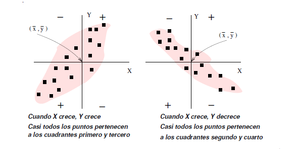
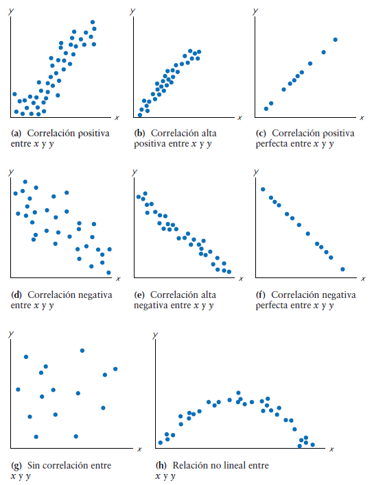
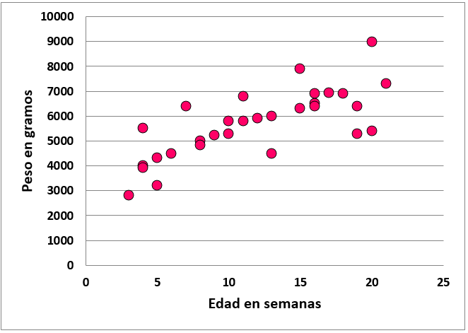
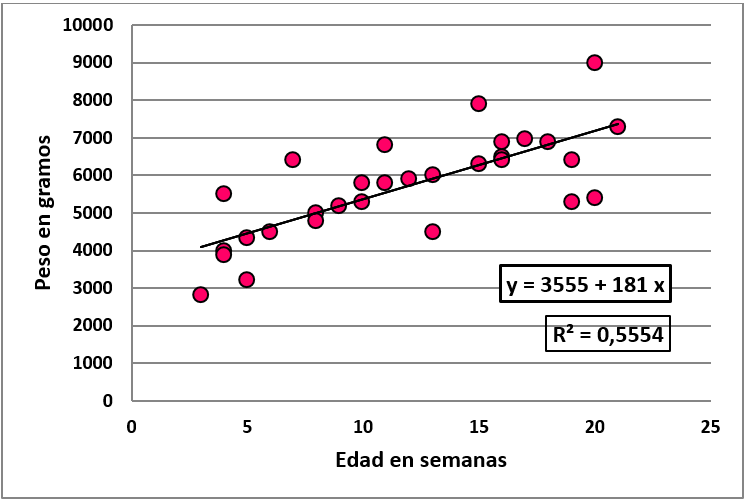
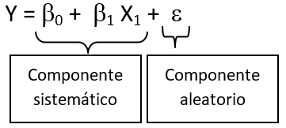
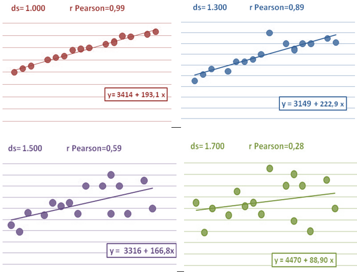
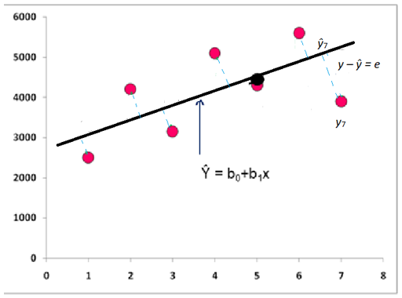

```{r, message=FALSE, echo=F}
knitr::opts_chunk$set(comment=NA, dpi = 300)
```

<br>

<center>

*Este material es parte de la* ***Unidad 3 del Curso de Epidemiología -
Nivel Avanzado del Instituto Nacional de Epidemiología "Dr. Juan H.
Jara" - ANLIS***

</center>

<br>

<center>

<p xmlns:cc="http://creativecommons.org/ns#" xmlns:dct="http://purl.org/dc/terms/">

<a property="dct:title" rel="cc:attributionURL" href="https://cballejo.github.io/R_Epi_Avanzada/Unidad3/Ecologico/">Estudios
ecológicos</a> by
<a rel="cc:attributionURL dct:creator" property="cc:attributionName" href="http://www.ine.gov.ar">Andrea
Silva</a> is licensed under
<a href="http://creativecommons.org/licenses/by-nc/4.0/?ref=chooser-v1" target="_blank" rel="license noopener noreferrer" style="display:inline-block;">CC
BY-NC
4.0</a>

</p>

</center>

<br>

## Introducción

Por definición, un estudio ecológico es aquel en el cual las unidades de
análisis son poblaciones o agrupamientos de individuos, no los
individuos propiamente dichos. Estos conglomerados pueden estar
definidos en un contexto espacial (ciudad, provincia, país, región,
etc), institucional (hospitales, escuelas, etc), social, temporal, etc.
La característica principal de este tipo de diseños es que se cuenta con
información sobre la exposición y el evento para el conglomerado en su
totalidad, pero se desconoce la información a escala individual. En este
tipo de estudios se asigna la misma exposición (generalmente una
exposición promedio) a todo el conglomerado. Algo similar ocurre con el
evento considerado, tenemos un número de eventos correspondiente al
conglomerado, pero no se sabe si los individuos expuestos son los que
tienen el evento.

Recordemos las principales ventajas y desventajas de este diseño:

Repasemos las ventajas y desventajas de este diseño

```{=html}
<style type="text/css">
.tg  {border-collapse:collapse;border-color:#93a1a1;border-spacing:0;}
.tg td{background-color:#fdf6e3;border-color:#93a1a1;border-style:solid;border-width:1px;color:#002b36;
  font-family:Arial, sans-serif;font-size:14px;overflow:hidden;padding:10px 5px;word-break:normal;}
.tg th{background-color:#657b83;border-color:#93a1a1;border-style:solid;border-width:1px;color:#fdf6e3;
  font-family:Arial, sans-serif;font-size:14px;font-weight:normal;overflow:hidden;padding:10px 5px;word-break:normal;}
.tg .tg-6sgx{background-color:#ffffff;text-align:left;vertical-align:top}
.tg .tg-4b3j{background-color:#006666;color:#ffffff;font-weight:bold;text-align:center;vertical-align:top}
</style>
```
+----------------------------------+----------------------------------+
| Ventajas                         | Desventajas                      |
+==================================+==================================+
| Se pueden estudiar grandes       | No se tiene información del      |
| grupos poblacionales\            | individuo, \                     |
| \                                | por lo que no se puede ajustar   |
| Relativamente fáciles de         | por diferencias a nivel          |
| realizar\                        | individual \                     |
| \                                | (no se puede saber quién sí está |
| Aumenta el poder estadístico\    | expuesto o quién sí desarrolló   |
| \                                | el evento de interés).\          |
| Aumenta la variabilidad en       | \                                |
| exposición\                      | No se tiene información sobre    |
| \                                | factores de confusión y no se    |
| Se puede utilizar información de | puede corregir por esto.         |
| estadísticas vitales             |                                  |
+----------------------------------+----------------------------------+

<br> Recordemos también que puede incurrirse en la llamada *falacia
ecológica*.

::: {.b--gray .ba .bw2 .ma2 .pa4 .shadow-1}
**Falacia ecológica** (*Ecological fallacy*): Sesgo que puede aparecer
al observar una asociación a partir de un estudio ecológico pero que no
representa una asociación causal a nivel individual.
:::

En un estudio ecológico, existen distintos **niveles de medición** de
las variables de grupo:

-   Medidas agregadas. Se trata de resumir las observaciones sobre
    individuos en cada grupo, expresándolas como medias o proporciones
    (ejemplo la proporción de usuarios de cinturón de seguridad)

-   Mediciones ambientales. Son características generalmente del lugar
    en el que los miembros del grupo viven o trabajan (ejemplo: niveles
    de contaminación ambiental). Cada medición ambiental tiene su
    análogo a nivel individual y la exposición individual puede variar
    dentro del grupo.

-   Mediciones globales. Son características de grupos, organizaciones o
    áreas para las que no existe una analogía con el nivel individual
    (ejemplo: densidad de población)

Esta distinción es importante, porque para las dos primeras siempre
existe el recurso de la medición individual, en tanto que en las
mediciones globales, el diseño ecológico es la única alternativa viable.

**Clasificación de estudios ecológicos**

-   Exploratorios.

-   De grupos múltiples

-   De series de tiempo

-   Mixtos

**Exploratorios**: En los estudios exploratorios se comparan las tasas
de enfermedad entre muchas regiones durante un mismo periodo, o se
compara la frecuencia de la enfermedad a través del tiempo en una misma
región. Se podría decir que se buscan patrones regionales o temporales,
que pudieran dar origen a alguna hipótesis.

Ejemplo: [Geographical and Temporal Variations in Female Breast Cancer
Mortality in the Municipalities of Andalusia (Southern
Spain)](https://www.ncbi.nlm.nih.gov/pmc/articles/PMC5129372/)

**Estudios de grupos múltiples**: Este es el tipo de estudio ecológico
más común. Se evalúa la asociación entre los niveles de exposición
promedio y la frecuencia de la enfermedad entre varios grupos. La fuente
de datos suele ser las estadísticas de morbilidad y mortalidad
rutinarias.

Ejemplo: [An Ecologic Analysis of County-Level PM2.5 Concentrations and
Lung Cancer Incidence and
Mortality](https://www.ncbi.nlm.nih.gov/pmc/articles/PMC3138001/)

**Estudios de series temporales**: Se comparan las variaciones
temporales de los niveles de exposición con otra serie de tiempo que
refleja los cambios en la frecuencia de la enfermedad en la población de
un área geográfica determinada.

Ejemplo: [Air pollution and emergency hospital admissions for
cardiovascular diseases in Valencia,
Spain](https://jech.bmj.com/content/55/1/57.long)

**Estudios mixtos**: En esta categoría se incluyen los estudios de
series de tiempo combinadas con la evaluación de grupos múltiples.

Algunos autores presentan la perspectiva que mostramos en la tabla 2,
para una comprensión más rápida de las distintas posibilidades de los
diseños ecológicos

```{=html}
<style type="text/css">
.tg  {border-collapse:collapse;border-color:#93a1a1;border-spacing:0;border-style:solid;border-width:1px;}
.tg td{background-color:#fdf6e3;border-color:#93a1a1;border-style:solid;border-width:0px;color:#002b36;
  font-family:Arial, sans-serif;font-size:14px;overflow:hidden;padding:10px 5px;word-break:normal;}
.tg th{background-color:#657b83;border-color:#93a1a1;border-style:solid;border-width:0px;color:#fdf6e3;
  font-family:Arial, sans-serif;font-size:14px;font-weight:normal;overflow:hidden;padding:10px 5px;word-break:normal;}
.tg .tg-7gt5{background-color:#bbe4e1;text-align:left;vertical-align:top}
.tg .tg-opdn{background-color:#368a8a;font-weight:bold;text-align:center;vertical-align:middle}
.tg .tg-tb1x{background-color:#006666;font-weight:bold;text-align:center;vertical-align:middle}
.tg .tg-l2y7{background-color:#b7edea;text-align:left;vertical-align:top}
</style>
```
+---------------------+
| Estudios ecológicos |
+=====================+
| Tipo de estudio     |
+---------------------+
| Transversal         |
+---------------------+
| Series temporales   |
+---------------------+
| Descriptivo         |
+---------------------+

## Análisis de estudios ecológicos

Antes de entrar en este campo, tenemos que señalar que existen distintos
niveles de análisis en estos estudios.

En un **análisis ecológico completo**, todas las variables son medidas
ecológicas (exposición o exposiciones, enfermedad u otras variables
incluidas), ya que la unidad de análisis es el grupo. Ello implica que
desconocemos la distribución conjunta de cualquier combinación de
variables a nivel individual. En un **análisis ecológico parcial** de
tres o más variables puede tenerse información de la distribución
conjunta de alguna de las variables en cada grupo. Por ejemplo, en el
estudio de incidencia de cáncer se conocen la edad y el sexo de los
casos (información individual) pero la exposición derivada de la
residencia en un área concreta (municipio) es información ecológica. El
**análisis multinivel** es un tipo especial de modelización que combina
el análisis efectuado a dos o más niveles. Ejemplo: la modelización de
la incidencia de cáncer incluyendo el sexo y la edad como variables
explicativas, además de variables socio-demográficas.

Como podemos apreciar, tenemos muchas posibilidades para contemplar. En
este capítulo, nos centraremos en aquellos estudios ecológicos
(completo) donde el objetivo principal sea encontrar una relación entre
la exposición y la enfermedad, es decir un ***estudio de grupos
múltiples***.

La manera usual de evaluación de la asociación en estudios de grupos
múltiples es mediante modelos lineales de regresión, de hecho algunos
autores se refieren a estos estudios como "Estudios de correlación".
Dependiendo del diseño y la distribución de los datos se pueden emplear
otros modelos no lineales o no aditivos. Como las tasas de morbilidad y
mortalidad en las regiones geográficas que se comparan comúnmente son
eventos raros o que ocurren a bajas frecuencias, éstos semejan una
distribución Poisson; así que la regresión de Poisson también puede ser
usada.

En este capítulo abordaremos la regresión lineal simple, a modo de
introducción, para luego entender los modelos de regresión lineal
múltiple, ampliamente usados en el análisis de los estudios ecológicos,
aunque no exclusivos de ellos.

Antes de encarar la regresión lineal múltiple, repasaremos los
fundamentos de la correlación y de la regresión lineal simple.

## Regresión lineal simple (RLS)

Nuestra pregunta ahora es: ¿cómo podemos estudiar la relación de dos
variables cuantitativas que varían simultáneamente (co-varían), una en
función de la otra?

AI analizar los datos en las disciplinas que conforman las ciencias de
la salud, con frecuencia es conveniente obtener algún conocimiento
acerca de la relación entre dos variables. Por ejemplo, es posible que
se tenga interés en analizar la relación entre presión sanguínea y edad,
estatura y peso, la concentración de un medicamento inyectable y la
frecuencia cardíaca, etc (observar que se trata de variables
cuantitativas)

La **covarianza** $S_{XY}$, es una medida que nos hablará de la
variabilidad conjunta de dos variables numéricas (cuantitativas). Se
define como:

$$S_{XY} = \frac{1}{n} \sum_{i=1}^{n} (x_i - \bar{x})(y_i - \bar{y})  $$

¿Cómo se interpreta geométricamente la covarianza?

Consideremos la nube de puntos formadas por las $n$ parejas de datos
($x_i$, $y_i$). El centro de gravedad de esta nube de puntos es
($\bar{x}$ , $\bar{y}$). Trasladamos los ejes XY al nuevo centro de
coordenadas. Los puntos que se encuentran en el primer y tercer
cuadrante contribuyen positivamente al valor de $S_{XY}$ , y los que se
encuentran en el segundo y el cuarto lo hacen negativamente.

```{r,echo=F,  fig.align='center', out.width = "90%"}

```

::: {.b--gray .ba .bw2 .ma2 .pa4 .shadow-1}
Si la mayoría de puntos se ubican en el tercer y primer cuadrante:
$S_{XY}$ \>0

Si la mayoría de puntos se ubican en el segundo y cuarto cuadrante:
$S_{XY}$ \< 0

Cuando los puntos se reparte de modo más o menos homogéneo entre los
cuadrantes primero y tercero, y segundo y cuarto, se tiene que $S_{XY}$
\~ 0.
:::

La covarianza es una medida de la variabilidad común de dos variables
(crecimiento de ambas al mismo tiempo o crecimiento de una y
decrecimiento de la otra), pero está afectada por las unidades en las
que cada variable se mide. Así pues, es necesario definir una medida de
la relación entre dos variables, y que no esté afectada por los cambios
de unidad de medida. Una forma de conseguir este objetivo es dividir la
covarianza por el producto de las desviaciones típicas de cada variable,
ya que así se obtiene un coeficiente adimensional, $r$, que se denomina
coeficiente de **correlación lineal de Pearson**.

$$r = \frac{S_{XY}}{S_xS_y} $$ Cuando hacemos un análisis bivariado de
nuestros datos, queremos determinar si parece haber una relación entre
las dos variables. Con frecuencia encontraremos una relación entre dos
variables al construir una gráfica: **diagrama de dispersión**.

Cuando examinamos un diagrama de dispersión, es necesario estudiar el
patrón general de los puntos graficados. Si existe un patrón, debemos
señalar su dirección. Es decir, mientras una variable se incrementa, ¿la
otra parece aumentar o disminuir? Tenemos que observar si hay datos
distantes, que son puntos que se ubican muy lejos de todos los demás.

La correlación trata de establecer la relación o dependencia que existe
entre las dos variables que intervienen en una distribución
bidimensional. Es decir, determinar si los cambios en una de las
variables influyen en los cambios de la otra. En caso de que suceda,
diremos que las variables están correlacionadas o que hay correlación
entre ellas.

La correlación, como cuantificación del grado de relación que hay entre
dos variables, es un valor entre -1 y +1, pasando, por el cero. Hay, por
lo tanto, correlaciones positivas y negativas. El signo es, pues, el
primer elemento básico a tener en cuenta.

Correlación positiva significa que las variables tienen una relación
directa: En este caso, valores pequeños de una variable van asociados a
valores también pequeños de la otra; y, paralelamente, valores grandes
de una van asociados a valores grandes de la otra.

La correlación negativa la tienen, por el contrario, variables con una
relación inversa. En este caso, valores pequeños de una variable van
asociados, ahora, a valores grandes de la otra; y, equivalentemente,
valores grandes de una van asociados a valores pequeños de la otra.

Lo segundo a tener en cuenta en la correlación es la magnitud. Y esto lo
marca el valor absoluto de la correlación. En la magnitud se valora se
valora la correlación sin el signo, valorando la magnitud del número
puro. Esto significa que cuanto más cerca estemos de los extremos del
intervalo de valores posibles: -1 y +1, más correlación tenemos.

¿A partir de qué valores de $r$ se considera que hay *"buena
correlación"*? La respuesta no es simple. Hay que tener en cuenta la
presencia de observaciones anómalas y si la varianza se mantiene
homogénea. En reglas generales se acepta que a partir de 0,7 hay una
buena relación lineal y que a partir de 0,4 podría existir cierta
relación

En resumen, el $r$ de **Pearson**:

::: {.b--gray .ba .bw2 .ma2 .pa4 .shadow-1}
-   Es adimensional (y su valor no depende de la unidad de medida de X e
    Y)

-   Sólo toma valores entre (-1 y +1)

-   Si $r$ = 0 no existe asociación lineal entre $x$ e $y$ (pero
    cuidado: puede existir una asociación no-lineal). Cuando las
    variables son incorrelacionadas (hay independencia entre ellas)

-   Cuanto más cerca esté $r$ de 1 o -1 mejor correlación
:::

La primera manera de explorar la relación entre 2 variables, es mediante
un gráfico o diagrama de dispersión que nos permite observar cómo se
comportan ambas variables. Luego se puede calcular el coeficiente de
correlación que nos dice si la relación es lineal y cuál es la fuerza de
esta correlación.

```{r,echo=F,  fig.align='center', out.width = "80%"}

```

La correlación más usada para variables cuantitativas es la
**correlación de Pearson**. Es especialmente apropiada cuando la
distribución de las variables es la normal.

Si no se cumple la normalidad o si las variables son ordinales es más
apropiado usar la **correlación de Spearman** o la **correlación de
Kendall**.

Para explicar la forma de esta correlación e incluso predecir los
valores que puede alcanzar una variable (dependiente) en función de la
otra (independiente) podemos utilizar la regresión lineal. Cuando el
análisis lo realizamos con 2 variables (una dependiente y otra
independiente) utilizamos la regresión lineal simple. Cuando el problema
es más complejo y queremos incorporar al análisis más de una variable
independiente utilizamos la regresión lineal múltiple, que veremos más
adelante.

Veamos un ejemplo:

A partir de los datos de peso (medido en gramos) y edad (medida en
semanas luego del nacimiento) de 30 niñas menores de 6 meses[^1] se
realizó un diagrama de dispersión (*"scatter plot"*).

[^1]: Estos datos fueron extraídos de las curvas de peso para niños
    argentinos publicadas por la Sociedad Argentina de Pediatría en el
    año 2008. La construcción de la base y elección de los casos se
    realizó con fines pedagógicos.

```{r,echo=F,  fig.align='center', out.width = "80%"}

```

Como puede observarse existe una fuerte relación lineal positiva, donde
a medida que aumenta la edad aumenta el peso, si bien se observan
algunos casos que lo hacen con cierta variación.

En la segunda figura trazamos una recta para describir y cuantificar
esta asociación lineal que observamos.

Como recordarán la ecuación de la recta es la siguiente:

$$Y = a + bx$$

Donde a es el punto de intersección de la recta con el eje $Y$ y $b$ la
pendiente de la recta.

Gráfico 2: Función lineal. Edad y peso en 30 lactantes de sexo femenino

```{r,echo=F,  fig.align='center', out.width = "80%"}

```

La pendiente de la recta nos está indicando la magnitud y sentido de la
variación del peso en función de su edad para este grupo de lactantes.
En la ecuación, tanto la pendiente como el origen de la recta, se ponen
de manifiesto mediante los coeficientes. Un poco más adelante veremos
cómo se calculan y cómo se interpretan.

> El coeficiente de correlación (r de Pearson) nos señala la fuerza y el
> sentido (según su signo sea + o -) de esta relación lineal.

## Modelos de Regresión

Uno de los propósitos de los modelos en estadística es intentar explicar
la realidad de la manera más "simple" posible (lo cual no es sinónimo de
fácil!), desde su esencia, dejando de lado los elementos que podrían
cambiar en distintos momentos (o sea la variabilidad del fenómeno, que
algunos autores lo comparan con "el ruido"). Existen algunos eventos en
la naturaleza que podemos explicar con total exactitud si conocemos
algunos datos, por ejemplo el volumen de un cubo. Con respecto a la
caída de un objeto, podríamos predecir con un margen de error casi nulo
su velocidad y su trayecto. Los modelos que explican estos fenómenos se
llaman "modelos deterministas". Sin embargo cuando queremos entender la
realidad que nos rodea la situación se complica, debido a que aparecen
otros factores que provocan que el valor de la variable dependiente no
pueda ser explicado o predicho completamente por la/s otra/s variable/s.
Los modelos que incorporan el concepto de "error" se denominan "modelos
probabilísticos" y constituyen la mayoría de los modelos que se abordan
desde la estadística, que también se denominan *"modelos de regresión"*.

::: {.b--gray .ba .bw2 .ma2 .pa4 .shadow-1}
Nota: la principal fuente del "error" se debe a la variabilidad entre
individuos propia de la naturaleza (por eso se denomina error
aleatorio). Puede haber otras fuentes de error, incluso no detectadas (y
que deben ser tenidas en cuenta), como pueden ser errores en la
medición, calibración o incluso por mala elección del método.
:::

Un modelo de regresión contiene una función que "une" a la variable $Y$
(independiente) con $X$ (dependiente) y el *"error aleatorio"* (también
llamado residuo o error residual). Esta función puede ser lineal o no
lineal según la naturaleza y distribución de la variable independiente.
El componente sistemático de la regresión es esta función que deseamos
"modelar".

El componente aleatorio es esa parte de la variación de $Y$ que no puede
ser totalmente explicada por la variación de la/s variable/s
independiente/s. En algunos casos el error tendrá valor positivo y en
otros tendrá valor negativo. El promedio del error es igual a 0.

```{r,echo=F,  fig.align='center', out.width = "35%"}

```

Una vez que logremos establecer esta función estaremos en condiciones
de:

-   Saber cómo se comporta la variable respuesta $Y$ en función de la/s
    variable/s independientes.

-   Estimar o predecir el valor de $Y$ para determinados valores de $X$

-   Calcular el intervalo de confianza para estas predicciones

Vamos a volver al ejemplo del Peso en niñas menores de 6 meses, donde
habíamos trazado una recta que nos ilustraba la relación lineal del peso
en función de la edad.

Según el modelo estadístico para la función lineal de $Y$ según $X$:

$$Y(X) =  \beta_0 + \beta_1 + X_1$$

Hemos ajustado un modelo cuyos parámetros son:

$$\hat{y} = b_0 + b_1X_1$$ $b_1$ nos está indicando cuánto se modifica
$\hat{y}$ por **cada unidad** de aumento de $X_1$.

$$\hat{y} = 3,55 + 181 \: edad \: (en \: semanas) $$ Se interpreta que
por cada semana este grupo de lactantes ha aumentado en promedio 181
grs.

Cada 1 mes (4 semanas) aumentan una media de 724 grs.

Podemos observar que hay una relación lineal y que esta relación no es
perfecta. Existe cierta dispersión entre los puntos sugiriendo que
alguna variación en el peso no se asocia con un incremento de la edad
(por ejemplo dos lactantes de 15 semanas. Tienen la misma edad y 1.600
grs de diferencia. Cabría preguntarse si esas niñas que se "alejan"
tanto de la recta de regresión no tienen algún antecedente distinto del
resto). Más adelante veremos cómo se interpretan esas diferentes
distancias entre las observaciones y la recta de regresión.

Ahora vamos a concentrarnos en la relación entre la varianza de la
muestra, a través del desvío estándar ($ds = \sqrt{varianza}$) y la
magnitud de la asociación. Se muestran 4 ejemplos en los cuáles se fue
aumentando progresivamente el desvío estándar de los datos. Observen
cómo a medida que aumenta la variabilidad entre los individuos va
disminuyendo el coeficiente de correlación y el coeficiente $b_1$
(pendiente de la recta)

```{r,echo=F,  fig.align='center', out.width = "80%"}

```

Podemos observar que cuanto mayor es la varianza en una muestra:

-   Mayor es la variabilidad de $y$ en torno a la recta de regresión

-   Mayor es la imprecisión asociada a la estimativa de los parámetros
    de regresión

## Modelo de Regresión: Presupuestos

Cuando planeamos realizar un análisis de regresión con un conjunto de
datos es necesario saber que para que podamos plantearlo adecuadamente
deben cumplirse ciertas condiciones, que llamaremos Presupuestos del
modelo:

1.  Independencia: los valores de $y$ deben ser independientes unos de
    otros
2.  Linealidad: la relación entre $x$ e $y$ debe ser una función lineal
3.  Homocedasticidad: la varianza de $y$ debe mantenerse constante para
    los distintos valores de $x$
4.  Normalidad: $y$ debe tener una distribución normal

**¿Cómo se obtiene la recta de regresión? ¿Cómo se calculan los
coeficientes de la regresión?**

Volviendo al ejemplo del peso según edad en niñas menores de 6 meses la
idea es encontrar una función lineal (que gráficamente es una recta) que
aplicada a los valores de $x$ nos permita aproximar los valores de $y$.
La ecuación de la recta que describe la relación entre $x$ e $y$:

$$\hat{y} = b_0 + b_1x$$

Por muy bueno que sea el modelo de regresión $y$ e $\hat{y}$ rara vez
coincidirán.

Entonces podríamos pensar que la mejor recta que permita predecir (o
aproximar) los valores de $y$ en función de $x$ es aquella que minimice
estos errores residuales (que algunos serán en más y otros serán en
menos).

Gráficamente:

```{r,echo=F,  fig.align='center', out.width = "60%"}

```

Donde:

$\hat{y}$: es la ecuación de la "mejor" recta que puede trazarse entre
estos puntos

$b_0$: ordenada al origen o constante, también llamada alfa. Es el punto
donde la recta de regresión corta al eje de ordenadas.

$b_1$: pendiente de la recta (Un poco más adelante veremos cuál es la
interpretación de estos coeficientes)

Consideremos qué pasa en el caso de la niña 7. Veamos las distancias
para este punto.

$y_7$: es el valor "real" del peso de la niña 7

$\hat{y}_7$: es el valor estimado de $y$ que obtendremos a través de la
regresión

$y – \hat{y} = e$ (residuo o error residual) es el desvío de $y$ del
valor ajustado $\hat{y}$ en la ecuación de la regresión estimada

Para poder operar con el valor de estos errores (ya que algunos tendrán
valor positivo y otros valor negativo) se los eleva al cuadrado. Esta
técnica se denomina **"método de los mínimos cuadrados"** y consiste en
adoptar como estimativas de los parámetros de la regresión (o sea los
coeficientes $b_0$ y $b_1$ y por ende la recta de regresión) los valores
que minimizan la suma de los cuadrados de los residuos o error (**SCE**)
para todas las observaciones de $y$. Lo podemos expresar así:

$$SCE = \sum{\hat{e}^2} = \sum{(y-\hat{y})^2} $$ Para visualizar
simulaciones al respecto pueden visitar [Viendo la teoría. Una
introducción visual a probabilidad y
estadística](https://seeing-theory.brown.edu/regression-analysis/es.html#section1)

## Ejemplo práctico en lenguaje R

Para llevar a cabo el análisis en R y presentar las funciones y paquetes
que nos pueden ayudar en la tarea vamos a trabajar con un set de datos
ficticio llamado **cardio**.

El conjunto de datos contiene datos agregados sobre el porcentaje de
personas que van en bicicleta al trabajo cada día, y el porcentaje de
personas con cardiopatías en una muestra imaginaria de 200 ciudades de un país determinado.

```{r, echo=F, message=F, warning=F}
library(tidyverse)
cardio <- read_csv2("cardio.csv")
```

La estructura de la tabla es:

```{r}
glimpse(cardio)
```

La variable dependiente es el porcentaje de **cardiopatías** y la
independiente **ciclistas**.

### Diagrama de dispersión

Para dibujar gráficos de dispersión podemos utilizar funciones de R base
o de ggplot2.

En R base la función `plot()` permite ejecutarlos, tanto con argumentos
en sintaxis clásica como en sintaxis formula.

```{r, out.width="60%", fig.align="center"}
plot(cardio$ciclistas, cardio$cardiopatias)
```

Los puntos se dibujan en la intersección de los valores que toma cada
variable ubicada en su correspondiente eje. La estructura de argumentos
básica coloca una variable detrás de la otra separadas por una coma y
siempre la primera variable será definida como X y la segunda como Y.

En cambio, las fórmulas tienen una estructura predefinida
`variable dependiente ~ variable independiente`, por lo que debemos
tener definida que variable ocupa cada rol previo a utilizarlas.

```{r, eval=F}
plot(cardiopatias ~ ciclistas, data = cardio)
```

Las dos sintaxis para declarar las variables como argumentos posibilitan
configurar el tipo de puntos y su color. Los argumentos opcionales para
esta tarea son:

pch = símbolo utilizado como punto (cada símbolo se encuentra asociado a
un número entero).

col = colores en distintos formatos gráficos permitidos (el modo más
común es asociado a un número entero).

```{r, out.width="60%", fig.align="center"}
plot(cardiopatias ~ ciclistas, 
     data = cardio, 
     pch = 16,   # punto sólido pequeño
     col = 2)   # color rojo
```

Si nos interesa una estética mejorada podemos recurrir a *ggplot*, de la
siguiente manera:

```{r, out.width="60%", fig.align="center"}
cardio %>% 
  ggplot(aes(x = ciclistas, y = cardiopatias)) +
  geom_point(color = "red")
```

En todos los casos, lo que observamos en el gráfico es una clara
relación inversa entre las variables, dado que las ciudades que tienen
altos valores en porcentajes de ciclistas tiene bajos valores en
porcentajes de cardiopatías y viceversa.

### Correlación

La función `cor()` estima la correlación entre dos variables. El método
predeterminado devuelve la correlación de Pearson, pero puede
modificarse el argumento **method** para obtener la correlación de Kendall o Spearman.

```{r}
cor(cardio$ciclistas, cardio$cardiopatias, method = "pearson")
```

El valor es elevado y negativo, lo que confirma lo observado en la nube
de puntos anterior.

**Significación de la correlación**

Hasta ahora obtuvimos dos elementos de la correlación, la magnitud y el
signo.

Para poder descartar que esta **correlación negativa de valor 0,93** se
debe al azar, debemos calcular su significancia.

La función `cor.test()` determina si la prueba de correlación de Pearson
calculada es significativa y lo realiza mediante el estadístico *$t$ de
Student*. 

```{r}
cor.test(cardio$ciclistas, cardio$cardiopatias) 
```

Los resultados de la función son:

-   El valor del estadístico $t$
-   El valor de $p$ para el estadístico
-   El valor de la correlación de Pearson
-   Los intervalos de confianza para la correlación

Los argumentos predeterminados para la función `cor.test()` son:

**alternative** = "two.sided" - indica la hipotesis alternativa, también
puede ser "greater" para asociación positiva, "less" para asociación
negativa.

**conf.level** = 0.95 - determina el nivel de confianza (se puede modificar)

**method** = "pearson" - especifíca el tipo de test de correlación. También
permite "kendall" o "spearman"

El p-valor de la correlación para este ejemplo es menor a 0,05 (p-value:
2.2e-16), por lo tanto significativa.

### Presupuestos

Anteriormente mencionamos que para dar por válidos, los modelos lineales debían cumplir con cuatro presupuestos: independencia, linealidad, homocedasticidad y normalidad.

Habitualmente la comprobación precisa de estos criterios se realiza con los residuos del modelo al finalizar el proceso, pero también nos podemos adelantar efectuando un análisis previo de los datos de forma similar a lo realizado en ANOVA.

La independencia, también conocida como no autocorrelación, pueden afirmarse de forma general, a partir del conocimiento previo de la fuente de los datos y su forma de recolección, aunque siempre conviene verificarla en los residuos. 

La linealidad es producto de la relación entre las variables cardiopatias y ciclistas, que confirmamos mediante el diagrama de dispersión y la $r$ de Pearson significativa.

La homocedasticidad es conveniente definirla a partir del modelo realizado,
donde buscamos que la varianza de la gráfica de los residuos sea
aproximadamente constante a lo largo del eje x. También se puede probar
mediante contraste de hipótesis (test de Breusch-Pagan)

Finalmente para la normalidad utilizamos el mismo análisis previo visto en la
unidad anterior (ver [ANOVA - Unidad
2](https://cballejo.github.io/R_Epi_Avanzada/Unidad2/Anova/))

```{r, message=F, warning=F, out.width="60%", fig.align="center"}
library(nortest)

lillie.test(cardio$cardiopatias)

lillie.test(cardio$ciclistas)

DataExplorer::plot_qq(data = cardio$cardiopatias)

DataExplorer::plot_qq(data = cardio$ciclistas)
```

Tanto el test de hipótesis como los gráficos de cuantiles nos informan que las distribuciones de las variables cumplen con el criterio de "normalidad".

### Modelo lineal simple

Para construir modelos de regresión utilizamos en los argumentos el formato fórmula. Esto significa especificar primero el nombre de la variable dependiente y luego la variable independiente.

La estructura sintáctica es:

> variable_dependiente \~ variable_independiente

La función que recibe esta estructura tipo fórmula es `lm()` cuyas
letras vienen de "linear models" (modelos lineales).

```{r}
lm(cardiopatias ~ ciclistas, data = cardio)
```

La función muestra resultados básicos, tales como la relación entre las variables que son parte del modelo y los coeficientes. 

**Intercept** es el valor de *ciclistas* cuando *cardiopatias* vale cero (Ordenada en el origen) y el coeficiente de **ciclistas** representa la pendiente de la recta.

Estos resultados obtenidos y aplicados en la fórmula del modelo simple
quedarían así:

$$\operatorname{cardiopatias} = \alpha + \beta_{1}(\operatorname{ciclistas}) + \epsilon $$
$$\operatorname{cardiopatias} = 44.0776 + -0.8974*\operatorname{ciclistas} + \epsilon$$

Habitualmente `lm()` suele asignarse a un objeto de regresión para que contenga todos los resultados producto del ajuste.

```{r}
modelo <- lm(cardiopatias ~ ciclistas, data = cardio)
```

Los resultados se almacenan en forma de lista y sus componentes pueden ser llamados en resúmenes más completos, mediante `summary()` o por separado, por ejemplo para evaluar los residuos.

```{r}
summary(modelo)
```

Con `summary()` observamos que los resultados son numerosos y comprenden a:

**Call**: formula del modelo

**Residuals**: distribución de los residuos (mediana, mínimo, máximo y
percentilos 25-75)

**Coefficients**: valores del intercepto y de la pendiente. Además se agregan los errores estandar y el estadístico $t$ con el p-valor de probabilidad dada la hipótesis nula que los coeficientes sean iguales a cero. (Lo que se pretende mediante estos contrastes es determinar si los efectos de la constante intercepto y de la variable independiente son
realmente importantes para explicar la variable dependiente o si, por el contario, pueden considerarse nulos.)

**Residual standard error**: Error estándar de los residuos con sus grados de libertad

**Multiple R-squared**: Coeficiente de determinación $R^2$

**Adjusted R-squared**: Coeficiente $R^2$ ajustado

**F-statistic**: estadístico $F$ sobre la hipótesis nula que el cociente entre la varianza de la ecuación de regresión y la varianza de los residuos es igual a 1.

**p-value**: p-valor del estadistico $F$.

Como elemento extra, notese que la salida en R tiene unos códigos que ayudan a realizar la lectura de la significación de los coeficientes.
Funciona mediante el uso de asteriscos (\*) al extremo derecho de cada parámetro calculado.

Debajo de la tabla de coeficientes se encuentra la referencia del significado de los códigos, que van desde el 0 hasta el 1 como posible resultado del valor de probabilidad, y donde:

| Código |    Rango     |
|:------:|:------------:|
| \*\*\* |  0 a 0,001   |
|  \*\*  | 0,001 a 0,01 |
|   \*   | 0,01 a 0,05  |
|   .    |  0,05 a 0,1  |
|        |   0,1 a 1    |

#### Estructura del objeto resultado de regresión

Todos los ajustes de modelos lineales que produce la función `lm()` tienen la forma de una lista de 12 componentes.

La manera de conocer su clase es `class()` y su estructura mediante
`str()`

```{r}
class(modelo)
str(modelo)
```

La clase de este tipo (clase base = lista) es "lm" y de todos estos
componentes, los más relevantes son:

**coefficients**

Es un vector con dos valores. El intercepto y la pendiente de la recta.

Lo podemos llamar desde el objeto:

```{r}
modelo$coefficients
```

O bien utilizar la función `coef()`

```{r}
coef(modelo)
```

**residuals**

Los residuos para cada valor que surgen de la diferencia entre los valores predictivos calculados por el modelo y los valores reales.

Se visualizan desde el objeto resultado de la regresión:

```{r, eval=F}
modelo$residuals
```

O usando la función `resid()`

```{r, eval=F}
resid(modelo)
```

**fitted.values**

Los valores calculados por el modelo en base a los datos existentes en la variable independiente.

Los encontramos en:

```{r, eval=F}
modelo$fitted.values
```

También pueden ser vistos por medio de la función `fitted()`

```{r, eval=F}
fitted(modelo)
```

Otra función interesante para el análisis del objeto de regresión es `confint()` que calcula los intervalos de confianza de los coeficientes o parámetros del modelo de regresión.

Para este modelo la línea de ejecución de la función es:

```{r}
confint(modelo)
```

Si agregamos la función `round()` podemos redondear los valores con la cantidad de decimales que necesitemos.

```{r}
round(confint(modelo),2)  ## redondeo con 2 decimales
```

En forma predeterminada los IC se calculan al 95%, pero mediante el argumento `level` podemos modificarlo, por ejemplo al 99%:

```{r}
confint(modelo, level = 0.99)
```

### Agregar la recta de regresión al diagrama de dispersión

Retomando la cuestión gráfica, podemos dibujar la recta de regresión lineal sobre el diagrama de dispersión hecho con `plot()` incorporando la función `abline()`. De este modo, podemos visualizar la distancia existente entre los valores observados y los valores que el modelo pronostica.

```{r, out.width="60%", fig.align="center"}
plot(cardiopatias ~ ciclistas, 
     data = cardio, 
     pch = 16,   
     col = 2)

abline(modelo,lwd = 2) # recta de regresión
```

El argumento **lwd** determina el grosor de la línea dibujada. También se puede agregar el argumento **col** para definir color de línea.

Con ggplot es similar pero se puede hacer directamente adicionando una capa más al gráfico mediante `geom_smooth()` e indicando "lm" como método. Además de la recta se puede ver el IC (zona gris alrededor de ella)

```{r, out.width="60%", fig.align="center"}
cardio %>% 
  ggplot(aes(x = ciclistas, y = cardiopatias)) +
  geom_point(color = "red") + 
  geom_smooth(method = "lm")  # capa con recta de regresión lm
```

### Residuos

El residuo de una estimación se define como la diferencia entre el valor observado y el valor esperado acorde al modelo.

A la hora de resumir el conjunto de residuos hay dos posibilidades:

-   La sumatoria del valor absoluto de cada residuo.

-   La sumatoria del cuadrado de cada residuo (RSS). Esta es la aproximación más empleada (mínimos cuadrados) ya que magnifica las desviaciones extremas.

En R vimos que estos residuos quedan almacenados dentro del objeto de regresión y pueden ser llamados mediante la expresión *nombre_del_objeto_de_regresion*`$residuals`

Cuanto mayor es la sumatoria del cuadrado de los residuos menor la precisión con la que el modelo puede predecir el valor de la variable dependiente a partir de la variable predictora. Los residuos son muy importantes puesto que en ellos se basan las diferentes medidas de la bondad de ajuste del modelo y con ellos se determina el cumplimiento de los supuestos de los modelos lineales.

Un análisis visual de estos residuos se puede obtener fácilmente aplicando la función `plot()` al objeto de regresión modelado. La salida presentará 4 gráficas automáticas.

```{r, out.width="60%", fig.align="center"}
plot(modelo)
```

El gráfico **Residuals vs Fitted** (Residuos vs valores ajustados) sirve
para probar linealidad.

Se examina evaluando que la linea roja sea lo mas horizontal posible y sin curvatura pronunciada. Si tuviera curvatura indicaría que el modelo puede necesitar un termino de ajuste no lineal (por ejemplo: cuadrático, logarítmico, etc) o que hay una variable importante no incluida en el modelo.

El siguiente gráfico **Normal Q-Q**, es el típico diagrama de cuantiles para evaluar normalidad, donde los valores (puntos) deben estar lo más cercanos de la linea diagonal. Las desviaciones pronunciadas indican desajuste.

**Scale-Location** es útil para ver si los residuos se distribuyen por igual a lo largo del rango de los predictores. Así es como se puede verificar la suposición de igual varianza
(homocedasticidad).

Es bueno si vemos una línea aproximadamente horizontal con puntos de distribución igualmente aleatorios.

Finalmente el cuarto diagrama **Residuals vs Leverage** nos ayuda a encontrar valores influyentes.

Aunque los datos tengan valores extremos, es posible que no sean influyentes para determinar una línea de regresión. Eso significa que los resultados no serían muy diferentes si los incluyéramos o los excluyéramos del análisis.

Pero existen otros valores que si pueden influir y en el gráfico aparecen en las esquinas, fuera de unas líneas rojas entrecortadas que determinan altas puntuaciones de distancia de Cook (medida muy utilizada que combina, en un único valor, la magnitud del residuo y el grado de leverage).

Además del análisis gráfico/visual de residuos se pueden aplicar test analíticos.

**Linealidad**

El paquete `lmtest` implementa el *Ramsey's RESET* bajo la función `resettest()`

```{r, message=F}
library(lmtest)
resettest(modelo)
```

La hipótesis nula de este test es que las variables se relacionan de modo lineal. Por lo que si el p-valor es menor a 0,05 se rechaza la hipótesis nula, lo que indicaría algún tipo de relación no lineal.

Aplicado a nuestro modelo da un valor p de 0,2875 con lo cual podemos asumir que hay linealidad.

**Normalidad**:

Otra premisa exige que los residuos se tienen que distribuir de forma normal, con media igual a 0. Como prueba analítica complementaria de los qq-plot ejecutamos el *test de lilliefors*.

```{r}
lillie.test(modelo$residuals)
```

Los resultados del test nos confirman lo que se intuía en los gráficos anteriores, el valor $p$ es de 0,249 y no podemos descartar normalidad.

**Homocedasticidad**:

Desde el punto de vista analítico podemos ejecutar el **test de Breush-Pagan** del paquete *lmtest*. Parte de la hipótesis nula de homocedasticidad o varianza constante en las perturbaciones y la enfrenta a la alternativa de varianza variable, por lo que es válido
decir que cumple con el supuesto de homocedasticidad si el valor $p$ es mayor a 0,05

```{r}
bptest(modelo)
```

**Valores atípicos y de alta influencia**:

Además de los elementos relevantes recién vistos del análisis de residuos, debemos tener en cuenta la influencia que valores atípicos y/o extremos causan en los modelos de regresión lineal.

Generalmente los outliers son observaciones que no se ajustan bien al modelo. El valor real de la variable respuesta se aleja mucho del valor predicho, por lo que su residuo es excesivamente grande.

Por otra parte pueden existir observaciones con alto *leverage*, es decir que poseen un valor extremo para alguno de los predictores y son potencialmente puntos influyentes.

Independientemente que el modelo se haya podido aceptar, siempre es conveniente identificar si hay algún posible outlier, observación con alto leverage u observación altamente influyente, puesto que podría estar condicionando en gran medida el modelo. La eliminación de este tipo de observaciones debe de analizarse con detalle.

Para detectar estos posibles outliers podemos utilizar los residuos. Si la variable respuesta real de una observación está muy alejada del valor esperado acorde al modelo, su residuo será grande.

Asumiendo que los residuos de un modelo se distribuyen de forma normal, se pueden estandarizar/normalizar (mediante el cociente con su desvío estándar), e identificar aquellos cuyo valor exceda $\pm$ 3 como atípicos. Esta aproximación, aunque útil, tiene una limitación importante. Si la observación es un outlier tal que influye sobre el
modelo lo suficiente para aproximarlo hacia ella, el residuo será pequeño y pasará desapercibido en la estandarización.

Una forma de evitar pasar por alto este tipo de outliers es emplear los residuos estudentizados (studentized residuals).

Se trata de un proceso iterativo en el que se va excluyendo cada vez una observación $i$ distinta y se reajusta el modelo con las $n-1$ restantes. En cada proceso de exclusión y reajuste se calcula la diferencia ($d_i$) entre el valor predicho para $i$ habiendo y sin haber excluido esa observación. Finalmente, se normalizan las diferencias $d_i$ y se detectan aquellas cuyo valor absoluto es mayor que 3. El estudio de outliers mediante *studentized residuals* es el más adecuado, dado que nos permiten localizar los outliers de la relación lineal.

Estos dos procesos sobre los residuos se pueden calcular en R mediante las funciones `rstandar()` y `rstudent()`.

Hagamos una comparación de boxplot´s de residuos, residuos estandarizados y residuos estudentizados:

```{r}
par(mfrow=c(1,3))
boxplot(residuals(modelo), col="seagreen",main="Residuos")
boxplot(rstandard(modelo), col="turquoise",main="Residuos normalizados")
boxplot(rstudent(modelo), col="salmon",main="Residuos studentizados")
```

Observamos que existe un residuo atípico extremo que se repite en las tres gráficas y otro menor a 3 desvíos en el boxplot de los residuos estudentizados.

Si pretendiésemos conocer que valores tienen las variables de la observación con residuo mayor a 3 desvíos estándar, basta con hacer lo siguiente:

```{r}
rstudent(modelo)[rstudent(modelo) > 3]  # detectamos la observación mayor a 3 ds

cardio[138,] # filtramos utilizando el número de la observación
```


El hecho de que un valor sea atípico o con alto grado de leverage no implica que sea influyente en el conjunto del modelo. Sin embargo, si un valor es influyente, suele ser o atípico o de alto leverage. Existen diferentes formas de evaluar la influencia de las observaciones:

- La **distancia de Cook** es una medida muy utilizada que combina, en un único valor, la magnitud del residuo y el grado de leverage. Valores de Cook mayores a 1 suelen considerarse como influyentes.

- Evaluar el cambio en los coeficientes de regresión tras excluir la observación: Se trata de un proceso iterativo en el que cada vez se excluye una observación distinta y se reajusta el modelo para comparar.

Esto lo podemos visualizar en el siguiente gráfico (*Cook's distance*) incluído en salida completa de `plot(modelo)`

```{r, out.width="70%", fig.align="center"}
plot(modelo, which = 5)
```

Al observar este gráfico, estaremos atentos a valores periféricos en la esquina superior e inferior. Esos lugares, fuera de las líneas punteadas rojas, son los lugares donde los puntos pueden ser influyentes contra una línea de regresión.

Los casos que encontremos tienen altas puntuaciones de distancia de Cook y por lo tanto influyen en los resultados de la regresión.

En caso de detectarse algún punto fuera de esos límites que establecen las líneas discontinuas debe estudiarse este punto de forma aislada para detectar, por ejemplo, si la elevada influencia de esa observación se debe a un error.

En el ejemplo visualizado no encontramos evidentes valores influyentes.

En el caso de detectar algún valor de este tipo, sobre todo si es severo, es importante investigarlo. Puede tratarse de un dato mal registrado, o que fue mal transcripto a la base de datos. En tal caso podremos eliminar la observación (o corregirla) y analizar los casos
restantes. Pero si el dato es correcto, quizás sea diferente de las otras observaciones y encontrar las causas de este fenómeno puede llegar a ser la parte más interesante del análisis. Por supuesto que todo esto dependerá del contexto del problema que uno esta estudiando.

### Bondad de ajuste del modelo

Una vez que se ha ajustado un modelo es necesario verificar su eficiencia, ya que aun siendo la línea que mejor se ajusta a las observaciones de entre todas las posibles, el modelo puede ser malo. Las medidas más utilizadas para medir la calidad del ajuste son: error estándar de los residuos, el test $F$ y el coeficiente de determinación $R^2$.

Estos valores se encuentran en la parte final de la salida del `summary(modelo)`, donde leemos RSE - error estandar de los residuos (**Residual standar error**), coeficiente de determinación $R^2$ (**Multiple R-squared**) y $R^2$ ajustado (**Adjusted R-squared**).

$R^2$ oscila entre 0 y 1, de manera que, valores de $R^2$ próximos a 1 indican un buen ajuste del modelo lineal a los datos. Por otro lado, $R^2$ ajustado es similar a $R^2$, pero penaliza la introducción en el modelo de variables independientes poco relevantes a la hora de explicar la variable dependiente (se utiliza en modelos lineales múltiples). Por
tanto, $R^2$ ajustado < = $R^2$.

En nuestro ejemplo, $R^2$ = 0.8748 y $R^2$ ajustado = 0.8741; por lo que podemos concluir que el modelo lineal se ajusta muy bien a nuestros datos.

Esto indica que aproximadamente el 87,4 % de la variación en la proporción de cardiopatías se puede explicar por el modelo que solo contiene las proporciones de ciclistas como variable explicativa. Es alto, por lo que las predicciones de la ecuación de regresión son bastante confiables, pero también significa que hay otro 13 % de la variación que aún no se
explica, por lo que quizás agregar otras variables independientes podría mejorar el ajuste del modelo.

La última línea de la salida incluye un estadístico de distribución continua $F$ *de Snedecor* (Test F) y el *valor* $p$ correspondiente que se utilizan para resolver lo que se conoce habitualmente como contraste ómnibus. Mediante este contraste se comprueba si, de forma global, el modelo lineal es apropiado para modelizar los datos.

En nuestro ejemplo, el p-valor asociado a este contraste es inferior a 0,05 por lo que, al 95% de confianza podemos rechazar la hipótesis nula y afirmar que, efectivamente, el modelo lineal es adecuado para nuestro conjunto de datos.

Cuando el modelo de regresión tiene una única variable explicativa, el contraste de la regresión es equivalente al contraste del parámetro $\beta_1$ (ciclistas).

Otra manera de verificar, en forma independiente, la significación del modelo de regresión es por medio de la función `anova()` que plantea el contraste de la regresión mediante el análisis de la varianza.

```{r}
anova(modelo)
```

La tabla de analisis de varianza muestra el mismo resultado que el bloque final de `summary(modelo)` con un valor F de 1383 y un valor $p$ significativo de 2.2e-16.

#### Resumen del resultado del ejemplo

Se llevó a cabo una regresión lineal simple para analizar la relación entre la proporción de ciclistas (que utilizan la bicicleta para ir a trabajar) y la proporción de cardiopatías de 200 ciudades. 

El diagrama de dispersión mostró una fuerte relación lineal negativa entre los dos, que se confirmó con un coeficiente de correlación de Pearson de -0,93. La regresión lineal simple mostró una relación significativa entre las variables (t = 48,27  p < 0,001). 

El coeficiente de pendiente de la recta para la proporción de ciclistas fue de -0,89 por lo que la proporción de cardiopatías disminuye casi 0,9 % por cada 1 % que sube la proporción de ciclistas. 

El valor $R^2$ mostró que el 87,4 % de la variación en la proporción de cardiopatías se puede explicar por el modelo que solo contiene proporción de ciclistas. 

La gráfica de dispersión de los valores pronosticados estandarizados frente a los residuos estandarizados, mostró que los datos cumplían los supuestos de homogeneidad de varianza y linealidad y que los residuos se distribuían aproximadamente de forma normal.

Se cumplieron todos los presupuestos necesarios para validar la regresión y no se encontraron valores atípicos influyentes.

## Bibliografía

Rodriguez M, Mendivelso F. Diseño de investigación de corte transversal.
Rev.Medica.Sanitas 21 (3): 141-146, 2018

Epidemiología. Diseño y análisis de estudios. Mauricio Hernández Ávila.
2007, Editorial Médica Panamericana

Muestreo y tamaño de muestra. Una guía práctica para personal de salud
que realiza investigación. Víctor Manuel Velasco R. (ed.), Verónica
Araceli Martínez O., José Roiz Hernández,Francisco Huazano G., Armando
Nieves R. 2003

Ríus Díaz F, Barón Lopez F., Sánchez Font E; Parras Guijosa L.
Bioestadística: Métodos y aplicaciones. Editorial: Universidad de
Málaga. Publicaciones

Daniel W. Bioestadística: Base para el análisis de las ciencias de la
salud. 4° Edición. Ed. Limusa Wiley, 2002.

Álvarez Cáceres R. Estadística aplicada a las ciencias de la salud.
Ediciones Díaz de Santos. Madrid. 2007

Triola, M. Estadística. 10° Edición. Pearson Educación. México. 2009.

Norman G y Streiner D. Bioestadística. Mosby/Doyma Libros. Madrid.1996.

Glantz S. Bioestadística. 6° Edición. McGraw Hill. México, 2006.

Epidat: Material de ayuda programa para análisis epidemiológico de
datos. Versión 4.2, julio 2016. Consellería de Sanidade, Xunta de
Galicia, España; Organización Panamericana de la salud (OPS-OMS);
Universidad CES, Colombia.

R Core Team (2021). R: A language and environment for statistical
computing. R Foundation for Statistical Computing, Vienna, Austria. URL
<https://www.R-project.org/>.

Juliane Manitz, contributions by Mark Hempelmann, Goeran Kauermann,
Helmut Kuechenhoff, Shuai Shao, Cornelia Oberhauser, Nina Westerheide
and Manuel Wiesenfarth (2017). samplingbook: Survey Sampling Procedures.
R package version 1.2.2.
<https://CRAN.R-project.org/package=samplingbook>

Greg Snow (2020). TeachingDemos: Demonstrations for Teaching and
Learning. R package version 2.12.
<https://CRAN.R-project.org/package=TeachingDemos>

Boxuan Cui (2020). DataExplorer: Automate Data Exploration and
Treatment. R package version 0.8.2.
<https://CRAN.R-project.org/package=DataExplorer>

Stephane Champely (2020). pwr: Basic Functions for Power Analysis. R
package version 1.3-0. <https://CRAN.R-project.org/package=pwr>
