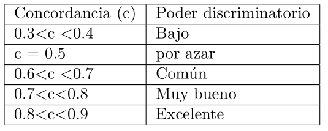

```{r, message=FALSE, echo=F}
knitr::opts_chunk$set(comment=NA, dpi = 300)
```

<br>

<center>

*Este material es parte de la* ***Unidad 6 del Curso de Epidemiología -
Nivel Avanzado del Instituto Nacional de Epidemiología "Dr. Juan H.
Jara" - ANLIS***

</center>

<br>

<center>

<p xmlns:cc="http://creativecommons.org/ns#" xmlns:dct="http://purl.org/dc/terms/">

<a property="dct:title" rel="cc:attributionURL" href="https://cballejo.github.io/R_Epi_Avanzada/Unidad6/Cox/">Regresión de Cox</a> by
<a rel="cc:attributionURL dct:creator" property="cc:attributionName" href="http://www.ine.gov.ar">Andrea
Silva</a> is licensed under
<a href="http://creativecommons.org/licenses/by-nc/4.0/?ref=chooser-v1" target="_blank" rel="license noopener noreferrer" style="display:inline-block;">CC
BY-NC
4.0</a>

</p>

</center>

<br>

## Introducción

Hasta el momento hemos visto cómo efectuar estimaciones paramétricas y no paramétricas de la función de supervivencia y de la función de riesgo, que permiten describir la evolución de la "supervivencia" de una población. También hemos visto cómo comparar curvas de supervivencia, al estratificar por las distintas categorías de una variable categórica.  

El análisis de supervivencia dispone también de modelos de regresión, que permiten identificar y evaluar la relación entre un conjunto de variables explicativas y el tiempo de supervivencia (variable respuesta), por lo que se la considera parte de los modelos lineales generalizados. A continuación, presentaremos uno de los modelos más usados en salud: el modelo de __regresión de Cox__, llamado así en honor a su creador (Cox, 1972).

La regresión de Cox, también llamada modelo de riesgos proporcionales (proportional hazards model) es una técnica muy difundida. Está indicado su uso cuando la variable dependiente esté relacionada con la supervivencia de un grupo de sujetos o, en general, con el tiempo que trascurre hasta que se produce en ellos un suceso o evento. Como ya dijimos, el evento de interés no tiene porqué ser la muerte, puede ser otro tipo de suceso, por ejemplo, el fallo de una prótesis, la incidencia de una enfermedad o la ocurrencia de una complicación en quien ya tiene una patología de base. Se usa para valorar simultáneamente el efecto independiente de una serie de variables explicativas o factores pronósticos sobre esta supervivencia (es decir, sobre la tasa de mortalidad) o sobre la tasa de ocurrencia de otro fenómeno que vaya ocurriendo tras un periodo de tiempo variable en cada sujeto. Como en cualquier modelo de regresión, las variables explicativas pueden ser tanto cuantitativas como categóricas.

La __regresión de Cox __ es la extensión multivariada del análisis de supervivencia para evaluar de manera general variables dependientes del tipo "tiempo hasta un suceso o evento", y usa modelos de regresión, próximos al modelo de regresión logística. Es una técnica que permite identificar y evaluar la relación entre un conjunto de variables explicativas y la tasa de ocurrencia del suceso de interés. 

La mayor utilidad del modelo de regresión de Cox radica en que permite predecir las probabilidades de supervivencia (o, en general de permanencia libre del evento) para un determinado sujeto a partir del patrón de valores que presenten sus variables pronósticas.

Al igual que en la regresión logística, en la regresión de Cox también es necesaria una función matemática que transforme el desenlace y permita entender la relación entre las variables por medio de un modelo similar al de la línea recta. Y en esto nos concentraremos a continuación. 

## Modelo de Cox

El modelo de Cox es un modelo semi-paramétrico que postula que:

$$h(t,x) = h_o(t) exp (x_1\beta_1+x_2\beta_2+\dots+x_n\beta_n)$$

$h (t,x)$ : representa el riesgo de morir al tiempo t de un sujeto que tiene un patrón  determinado de las variables $x$.

$h_0(t)$: representa el riesgo basal dependiente del $t$

En este caso, como podemos ver, la función que es "transformada" es la función denominada  Hazard, que puede simplificarse en términos prácticos como una medida del riesgo instantáneo de ocurrencia de dicho evento.

Este modelo  asume un presupuesto importante como podemos ver: que las covariables tienen un efecto multiplicativo sobre la función de riesgo.

¿Qué significa esto? Esto significa que la razón entre el riesgo de ocurrencia del evento para dos individuos: individuo i e individuo j, por ejemplo, con covariables: 

$xi= (xi_1, xi_2, xi_3,\dots,xi_n)$ (es el conjunto de covariables del individuo i)

$xj= (xj_1, xj_2, xj_3,\dots,xj_n)$ (es el conjunto de covariables del individuo j)

será:

$$\frac {hi(t/xi)} {hj(t/xj)}= \frac{ho(t)exp(xi_1\beta_1+xi_2\beta_2+\dots xi_n \beta_n)}{ho(t)exp(xj_1\beta_1+xj_2 \beta_2+\dots xj_n \beta_n)}$$

Entonces:

$$
\require{cancel}
\frac {hi(t/xi)} {hj(t/xj)}= \frac{\cancel{ho(t)} exp(xi_1\beta_1+xi_2\beta_2+\dots xi_n \beta_n)}{\cancel{ho(t)}exp(xj_1\beta_1+xj_2 \beta_2+\dots xj_n \beta_n)}$$


O sea que este cociente  de riesgos, como podemos ver, es independiente del tiempo. Por este motivo, el modelo de Cox se lo conoce también como __Modelo de Riesgos Proporcionales__. Es un modelo semi-paramétrico, pues no asume ninguna distribución para la función de riesgo basal $ho(t)$, la única asunción es, como ya dijimos antes, que las covariables tienen un efecto multiplicativo sobre la función de riesgo, y esto constituye la parte paramétrica del modelo.
En la regresión de Cox, por lo tanto, el efecto de las variables independientes se presenta como un __Hazard Relativo (HR)__, y expresa la magnitud en la que una variable aumenta o disminuye el riesgo de ocurrencia de un desenlace en el tiempo.

Como en todo modelo, tendremos que estimar los coeficientes ($\beta$) y aprender a interpretarlos. A continuación aprenderemos a construir un modelo de Cox, fijaremos criterios para seleccionar el mejor modelo, evaluaremos el ajuste de dicho modelo y veremos algo de análisis de residuos. Allá vamos!

## Estimación e interpretación de los coeficientes del modelo de Cox

Los coeficientes del modelo de Cox son estimados por el método de verosimilitud parcial, pero su desarrollo lo omitiremos, dado que los paquetes estadísticos, los calcularán por nosotros.
Para comprender su interpretación, consideraremos el modelo más simple, con una única covariable:

$$h(t,x)= ho(t) e^{\beta x} $$
 Si se calcula el cociente entre la tasa de riesgo instantáneo para una variable que toma los valores  x=0 y x=1: 
 
 $$HR= \frac{e^{(\beta*1)}}{e^{(\beta*0)}}= e^\beta$$
 
¿Cómo interpretamos esto? Sé que ya todos tienen mucha experiencia en interpretar correctamente expresiones de este tipo (notarán ciertas similitudes con la regresión logística), pero nunca está de más reforzar.

Si la variable es dicotómica, por ejemplo consideremos sexo, donde x=1 corresponde a masculino y x= 0 a femenino, diremos que los varones ven incrementado su riesgo en $e\beta$ respecto de las mujeres.
Si la variable fuera continua, como por ejemplo la edad, diremos que un incremento de un año en la edad, aumenta el riesgo en $e\beta$.

Si calculamos el cambio en h para n variables explicativas, y observamos el coeficiente para cuando cada xi se incrementa en una unidad, manteniendo constante al resto, observaremos algo similar.
Si aplicamos ln a la expresión del HR, tendremos que:
$$lnHR= \beta$$
Como acabamos de ver, la interpretación del modelo de Cox no se hace directamente a través de su coeficiente estimado $(\beta)$  sino del exponencial del coeficiente estimado, $exp(\beta)$.  

Para variables dicotómicas $exp(\beta)$ es un estimador de la razón de riesgos (Hazard Ratio) y se interpretará en forma análoga al RR: valores mayores que 1 indican sobreriesgo para el grupo “expuesto”, valores menores a 1 indican factor de protección. Para variables continuas, su interpretación es más difícil ya que no es estrictamente un RR, pero lo podemos pensar como algo similar a un RR para un incremento de la variable continua.

Para comprender mejor lo que hemos visto hasta aquí y lo que seguiremos viendo, vamos a recurrir a un ejemplo.

## ¿Cómo construir un Modelo de Cox?  

Retomaremos el ejemplo sobre trasplante de médula ósea (TMO), que vimos cuando abordamos la estimación de Kaplan Meier.

Recordemos que los datos del archivo **tmo.xlsx** provienen de esa cohorte de 96 pacientes sometidos a trasplante de médula ósea. Las covariables registradas para cada paciente se describen en la siguiente tabla:

| __Variable__| __Descripción __                         | 
|-------------|------------------------------------------|
|id           |identificador del paciente                |
|sexo         |M= masculino, F = femenino                |  
|edad         |Edad al momento del trasplante (años)     |
|status       |0 = censura, 1 = óbito                    |
|os           |Fecha de óbito o censura                  |
|deag         |Enfermedad injerto-huésped aguda:  no,si  |
|decr         |Enfermedad injerto-huésped crónica: no,si |
|fase         |Aguda, crónica, cb: crisis blástica       |


Comenzaremos leyendo el archivo (recordar activar los paquetes)

```{r, message=F, warning=F}
library(readxl)
library(survival)
library(tidyverse)
```

```{r}
tmo <- read_excel("tmo.xlsx")

tmo <- tmo %>% mutate(sexo = factor(sexo),
               deag = factor(deag),
               decr = factor(decr),
               fase = factor(fase))
```

En general, no se realiza la regresión de Cox con cada una de las variables para decidir cuál incluir en el modelo (puede hacerse para ver el cambio de los coeficientes), sino que esta decisión se toma en base a las curvas de KM, considerando las variables en las que se observan diferencias. Como el modelo de Cox, en general se usa con fines predictivos, pueden ser incluidas otras variables que clínicamente se consideren relevantes. 

Vamos a considerar un modelo inicial que incluya todas las variables (m1) y luego usaremos un procedimiento “hacia atrás” manual. 

El modelo semiparamétrico de riesgo proporcionales de Cox es realizado con la función _coxph()_ del paquete “survival”.

```{r}
m1 <- coxph(Surv(os, status) ~  fase + decr + deag + sexo + edad, data = tmo)

summary(m1)
```

La columna "coef" indica los valores de $\beta$ .

La columna "exp (coef)" indica los valores de HR.

La columna "se (coef)": desvío estandard de los coeficientes

Z y Pr (<|Z|): estadístico del Test de Wald y su p valor.

lower.95 y upper.95: IC para los HR.

En la parte inferior, destacamos el LR test del modelo. Además de lo señalado, se agregan el valor de Concordancia ; así como los estadísticos de prueba, grados de libertad y p-valores de las pruebas de hipótesis de Razón de Verosimilitud, Prueba de Wald y Prueba de Puntajes (score test).

Repasemos: 

-	El test de Wald : Testea solo un parámetro, por ejemplo la $H_0: \beta_3=0$. El test estadístico es $Z=\frac{\beta}{EE\beta}$ que sigue una distribución aproximadamente N(0,1). LR y Z son aproximadamente iguales en grandes muestras, pero pueden diferir en muestras pequeñas.

-	La Deviance puede ser utilizada tanto para obtener una estadística global de ajuste del modelo, como para comparar modelos.Recordemos que:

$D= 2 (log\ Likelihood\ modelo- log\ Likelihood\ modelo\ nulo)$ donde el Modelo nulo es un modelo teórico sin covariables.

Podemos calcular el __Criterio de Información de Akaike (AIC)__ y también el __Criterio de Información Bayesiano (BIC)__. El criterio de información de Akaike (AIC ) sirve para comparar la plausibilidad relativa de un conjunto de modelos. Es decir, dado un conjunto de modelos construidos con los mismos datos, el AIC los ordena según su verosimilitud dados los datos con que se construyen. Este criterio tiene en cuenta tanto el ajuste del modelo como su complejidad de acuerdo a la fórmula: $-2*log(-Likelihood) + k*npar$ donde el primer término mide el ajuste (es la deviance) y el segundo la complejidad (npar es el número de parámetros y k = 2).

Existen otros criterios parecidos como el BIC (en BIC $k = log(n)$).  AIC mide lo lejos que está el modelo de la realidad (de un 'modelo perfecto'), por lo que __cuanto menor es el valor, más plausible es el modelo__.

AIC no equivale a significación; de hecho este criterio se plantea dentro de una concepción de la estadística distinta –y alternativa– a la fundamentada en testado de hipótesis. El comando es simplemente:

```{r}
AIC(m1)
```
```{r}
BIC(m1)
```
El Likelihood nos da una evaluación cuantitativa de la compatibilidad de los datos con determinado valor del parámetro.

$$Likelihood\ Ratio= \frac {Likelihood\ del\ modelo}{Máximo\ de\ Likelihood}$$

-	El likelihood ratio da una medida más conveniente del soporte de los datos para determinado valor de probabilidades que el likelihood, ya que relativiza los valores de los likelihood al valor del máximo likelihood.

-	Cuanto más cerca de 1 está un likelihood ratio significa que ese valor de p está más “sustentado” por los datos.

-	LR test: compara dos modelos anidados: modelo mayor  vs. modelo reducido 
La H0 es: algunos parámetros en el modelo completo son igual a 0. Este LR tiene aproximadamente una distribución chi-cuadrado bajo la hipótesis nula.

Analicemos nuestro modelo: Solamente los coeficientes que acompañan a las variables _deag_ y _decr_ resultaron significativos según el test de Wald. Esto es lo mismo que observamos en las curvas de KM.

Respecto de la variable fase, que tiene 3 categorías, observemos que fue transformada en una variable dummy: el modelo a tomado como categoría de referencia “aguda” y los valores de HR, son en referencia a esta categoría: “crisis blástica” respecto a “aguda” y “crónica” respecto a “aguda”. La columna “Coefficient” representa los valores de $\beta$ estimados por verosimilitud parcial. Valores positivos de $\beta$ indican variables que contribuyen a un incremento de riesgo, en tanto que valores negativos de $\beta$ indican variables que contribuyen a reducir el riesgo. Si miramos los HR, vemos que _decr_ resultó un factor protector importante. 

Probaremos un m2 con 4 variables: ¿Cuál saco del modelo: edad o sexo? O fase? Probemos distintos modelos: 

-	M2: fase + decr + deag + edad (saqué sexo)

```{r}
m2 <- coxph(formula = Surv(os, status) ~ fase + decr + deag + edad, data = tmo)

summary(m2)  

```
```{r}
AIC(m2)
```

- M3: fase + decr + deag +sexo (sin edad)

```{r}
m3 <- coxph(formula = Surv(os, status) ~ fase + decr + deag + sexo, data = tmo)

summary(m3) 
```
```{r}
AIC(m3)
```

-	M4: sexo + decr + deag + edad (saqué fase)

```{r}
m4 <- coxph(formula = Surv(os, status) ~ decr + deag + sexo + edad, data = tmo)

summary(m4)
```
```{r}
AIC(m4)
```

De acuerdo al criterio AIC, considerando los modelos construidos, el m3 sería un mejor modelo, dado que tiene un menor AIC, pero se observa que existen términos sin significación en m3, según el test de Wald.

Ajustemos ahora un modelo con 3 variables, partiendo del m3, que recordemos era: 

M3: fase + decr + deag +sexo 

En general, el criterio que se utiliza para "sacar" variables del modelo, es sacar aquellas cuyo $\beta$ haya resultado no significativo.En el caso de m3 serìan los $\beta$ correspondientes a las variables _sexo_ y _fase_.

-	M5: fase + decr + deag (saqué sexo)

```{r}
m5 <- coxph(formula = Surv(os, status) ~ fase + decr + deag, data = tmo)

summary(m5)
```
```{r}
AIC(m5)
```
-	M6:  decr + deag +sexo (saqué fase)

```{r}
m6 <- coxph(Surv(os, status) ~ decr + deag + sexo,  data = tmo)

summary(m6)
```
```{r}
AIC(m6)
```
El M5 parece ser un mejor modelo, con un AIC menor (374,8601).

Ensayemos ahora un modelo con 2 variables, a partir entonces de M5 (M5: fase + decr + deag). Saco _fase_, dado que su coeficiente resultó no significativo.

-	M7= deag + decr

```{r}
m7 <- coxph(formula = Surv(os, status) ~ decr + deag, data = tmo)
```


```{r}
summary(m7)
```
```{r}
AIC(m7)
```
Ahora todas las variables tienen significación, si bien no ha habido mejora en el AIC, según los valores del test de Wald, parece un mejor modelo. 

No obstante, podemos comparar los modelos "candidatos".

La comparación entre los modelos se realiza con la función _anova()_, esta función realiza la prueba de Razón de Verosimilitud entre dos modelos. Los argumentos de la función son los dos modelos ajustados a comparar. La salida de la función es una tabla en donde muestra para los dos modelos el log-verosimilitud, el estadísticos Chisq, los grados de libertad Df y el p-valor P(>|Chi|) de la prueba. Ahora, seleccionamos los dos modelos a comparar en nuestro caso: M5 y M7.

```{r}
anova(m5, m7)
```

Recordemos que los modelos deben ser anidados para poder hacer ANOVA. En este caso, lo que hace es comparar los log de Likelihood de ambos modelos. Esa diferencia se distribuye como un Chi cuadrado. El valor de p se encuentra en el límite de significación (considerando 0,05). Si somos estrictos, el valor de p indica que no hay diferencia entre ambos modelos, por lo tanto nos quedaríamos con el de menos variables, de acuerdo al principio de parsimonia. En nuestro caso, podemos decidir quedarnos con el M5, dado que la fase de la enfermedad puede resultar un elemento predictivo importante. Como se indicó anteriormente, la regresión de Cox generalmente tiene fines predictivos, así que podemos ver en la bibliografía, modelos que no siguen todas las “normas” del modelado, porque se hace importante mantener variables como edad o sexo, aún cuando no resulten significativas, a fin de contar con intervalos de predicción por sexo o grupo etario. 

Supongamos entonces que decidimos quedarnos con el M5, aunque rompamos algunas reglas. Interpretemos ahora los parámetros del M5:

-	M5: fase + decr + deag 

```{r}
m5 <- coxph(formula = Surv(os, status) ~ fase + decr + deag, data = tmo)

summary(m5)
```

Para la interpretación, nos centramos en la columna exp(coef), que corresponde a los HR.Partiendo de dichos valores, podemos concluir.

-	El riesgo de muerte de los pacientes que padecen enfermedad injerto contra huésped aguda es aproximadamente el triple de  aquellos que no la han padecido (HR=3.2)

-	Los pacientes que hayan padecido  enfermedad injerto contra huésped crónica tienen 0,34 veces el riesgo de morir post TMO de los que no la tuvieron. Puede decirse también (y quizás quedaría mejor expresado) que tienen un 66% menos riesgo que los que no tuvieron enfermedad injerto contra huésped crónica.(HR=0.34)

-	Los pacientes que reciben trasplante en la fase crónica de la enfermedad, tienen un riesgo 48% menor de morir post TMO que aquellos que son trasplantados en la fase aguda (si consideramos un p< 0,1, este término tendría significación). Se observó un aumento de riesgo en los que reciben trasplante en la crisis blástica respecto de quienes lo reciben en la aguda, pero este término no resultó significativo. 

Recordemos que R permite también hacer una selección automática de los modelos, tanto para supervivencia como para cualquier tipo de modelado. Normalmente la bibliografía no  recomienda los procedimientos automáticos, pero tengamos en claro lo que ocurre en cada caso:

-	"hacia atrás / adelante" (el valor por defecto): la selección comienza con el modelo completo y elimina los predictores uno a la vez, en cada paso, considerando si el criterio será mejorado agregando de nuevo una variable eliminada en un paso anterior

-	"hacia adelante / hacia atrás", la selección comienza con un modelo que incluye sólo una constante, y añade predictores uno a la vez, en cada paso considerando si el criterio se mejorará mediante la eliminación de una variable agregada anteriormente

-	"atrás" y "adelante" son similares sin la reconsideración en cada paso.

### Predicción de curva de supervivencia.

Ahora, estaríamos en condiciones de  obtener la función de supervivencia ajustada mediante el modelo de Cox seleccionado.La función survfit calcula la función de supervivencia pronosticada para un modelo de riesgos proporcionales de Cox. 


Para ello, el código en R es:

```{r}
summary(survfit(m5))
```

Podríamos comparar esto, con lo obtenido en la estimación de Kaplan Meier (ver módulo de KM, pag.4 ). Pero, siempre resulta más claro realizar la comparación en forma gráfica: graficaremos la función de supervivencia obtenida mediante el estimado de Kaplan Meier y la obtenida mediante el modelo de Cox seleccionado, Recordemos que para ello, debemos volver a definir el objeto KM. Todo esto lo podemos hacer mediante los comandos:

```{r, fig.align= "center",out.width= "60%"}
global <- Surv(tmo$os, tmo$status)

KM<-survfit(global~ 1)

plot(survfit(m5),
     conf.int=FALSE,
     main="Comparación del ajuste del modelo de Cox \n y el estimador de KM",
     xlab="días",
     ylab="Supervivencia")
lines(KM,conf.int=FALSE, lty=2)
legend(70,0.35,legend=c("Ajuste por Cox","Estimador de KM"),lty=c(1,2))
```
Podemos observar que el modelo seleccionado, ajusta bastante bien (sobreestima al principio, subestima al final).Sin embargo, en lo que a modelado respecta, para evaluar la calidad de ajuste contamos con parámetros adicionales.

## Calidad de ajuste de un modelo

Hay pocas medidas para evaluar el ajuste de un modelo de supervivencia. Una de las más simples es R2, cuya expresión es:

$$R^2_{LR}= 1- \bigg(\frac{Likelihood(modelo\ nulo)}{Likelihood(modelo\ ajustado)} \bigg )^ \frac{2}{n}$$

Su interpretación es similar a la del $R^2$ de los otros modelos lineales

$R^2$ puede ser interpretado como el poder explicativo de las covariables en el tiempo de ocurrencia del evento en estudio.

$R^2$ tiene valores bajos en los análisis de supervivencia (alrededor de 30% de poder explicativo), por lo que muchos autores no lo consideran apropiado. De hecho, en las salidas de R de los modelos, observamos que no lo muestra actualmente, siendo que antes sí lo ofrecía, atendiendo a estas y otras cuestiones teóricas. En su lugar, ofrece el valor de "Concordancia". Profundizaremos un poco sobre este concepto, ya que no lo hemos visto en otros modelos.

El uso de la estadística de __concordancia__ para los modelos de Cox fue popularizado por Harrell (*Frank E Harrell, Kerry L Lee, and Daniel B Mark. Multivariable prognostic models: issues in developing models, evaluating assumptions and adequacy, and measuring and reducing errors. Stat. in Medicine, 15:361-387, 1996.*), y ahora es la medida más usada como bondad de ajuste en los modelos de supervivencia. Una ventaja de la estadística es que está bien definida, no solo para los modelos de supervivencia, sino también para la regresión lineal logística y ordinaria.

En general, si yi y xi son  los valores observados y predichos por el modelo, respectivamente, la concordancia se define como $P(x_i > x_j|y_i> y_j)$, la probabilidad de que la predicción x vaya en la misma dirección que los datos reales y. Un par de las observaciones i, j se consideran concordantes si la predicción y los datos van en la misma dirección. __La concordancia es la fracción de pares concordantes__.

En general, se acepta la siguiente escala:

```{r,echo=F,  fig.align='center', out.width = "50%"}

```

Si observamos, el valor de concordancia para el modelo m5 = 0.753, lo que indica muy buena concordancia entre lo observado y lo predicho por el modelo.

## Análisis de residuos

Como ustedes recordarán, se denomina residuo a la diferencia entre el valor observado y el valor estimado por la ecuación de regresión, es decir a lo que la ecuación de regresión deja sin explicar para cada observación. La definición de residuo en el análisis de supervivencia no es tan simple y directa como esta definición, dado, que, por ejemplo, un residuo obtenido como respuesta observada menos esperada, no tiene en consideración el tiempo observado de un individuo censurado.
En el análisis de supervivencia, se describen distintos tipos de residuos que sirven para evaluar distintos aspectos del modelo:

| Evaluación                                                                                                | Tipo de residuo |
|-----------------------------------------------------------------------------------------------------------|------------------------|
| Para verificar riesgos proporcionales                                                                     | Residuos de Schoenfeld |
|                                                                                                           |                        |
| Para evaluar si es adecuado incluir las variables en forma lineal en el modelo                            | Residuos Martingale    |
|                                                                                                           |                        |
| Para detectar residuos grandes (outliers)                                                                 | Residuos de Deviance   |
|                                                                                                           |                        |
| Para evaluar el impacto que tiene cada observación en el modelo,  tanto en forma global como por variable | Residuos Score         |

Y ahora algo más: para covariables con pocas categorías,  las curvas de KM estratificadas dan una idea si se cumple el presupuesto de riesgos proporcionales de Cox. Curvas que son razonablemente paralelas a lo largo del tiempo indican proporcionalidad de riesgo entre las categorías y por el contrario, el entrecruzamiento o una variación en las distancias entre las categorías, podría indicar falta de proporcionalidad. Si tienen presentes las curvas de KM que construimos para este ejemplo, en todas las curvas que se muestran, parece razonable suponer que se cumple el supuesto de proporcionalidad, aún en el caso de la variable sexo, dado que ambas categorías están prácticamente superpuestas, separándose recién al final, cuando quedan pocas observaciones.

A continuación, abordaremos el análisis de residuos, al menos de algunos de ellos.

### Residuos de Schoenfeld:

Podríamos preguntarnos si el efecto de cada covariable será el mismo a medida que transcurra el tiempo, porque si no es así, se trataría de covariables tiempo dependientes. Para responder esta cuestión, se calculan los Residuos de Schoenfeld.
Se genera un residuo para cada variable y para cada paciente, es decir que si tenemos un modelo de Cox con tres factores pronóstico se calcularán 3 residuos de Schoenfeld por paciente. Estos residuos valen cero para las observaciones incompletas. Es posible modificar estos residuos con el fin de que no valgan cero para las observaciones incompletas, obteniéndose entonces los denominados residuos Schoenfeld corregidos o escalados. 

En R, la función _cox.zph()_ realiza la prueba de hipótesis de correlación para los residuos de Schoenfeld de cada covariable con alguna transformación del tiempo, los argumentos de la función son:

_fit_: Un objeto coxph resultado de un ajuste del modelo de regresión de Cox.

_transform_: Tipo de transformación del tiempo, posibles valores son “km”, “rank”, “identity” o una función.

_global_: una prueba chi cuadrado global


La salida de la función es una tabla en donde para cada covariable calcula el coeficiente rho, el estadístico de prueba chisq y su respectivo p-valor, además incluye una prueba global. Por ejemplo, para el M5 o para M7, el supuesto de riesgos proporcionales puede ser verificado mediante el contraste de hipótesis generado mediante el comando: 

```{r}
cox.zph(m5, transform="km", global=TRUE, terms = F)
```

**¿Qué significa esta salida?**

La Ho que se testea es Ho: la correlación lineal entre el residuo de Schoenfeld y el tiempo de supervivencia es cero.

Es equivalente a probar H0: pendiente igual a cero o H0: logHR es constante en el tiempo.

De lo expuesto se concluye que existe evidencia significativa al 5% de que se viole el supuesto de riesgos proporcionales, desde el punto de vista global, y para la covariable "decr".

La validación del supuesto de riesgos proporcionales puede realizarse también en forma gráfica

```{r}
residuo.sch <- cox.zph(m5, terms = F)
par(mfrow=c(2,2))
plot(residuo.sch[1], main="Modelo:m5.fase")
abline(h = m5$coef[1], lty = 3)
plot(residuo.sch[2], main="Modelo:m5.fase")
abline(h = m5$coef[2], lty = 3)
plot(residuo.sch[3], main="Modelo:m5.decr")
abline(h = m5$coef[3], lty = 3)
plot(residuo.sch[4], main="Modelo:m5.deag")
abline(h = m5$coef[4], lty = 3)
```
La interpretación se facilita con el agregado de una línea de tendencia "lowess", de esta forma, cuando esta línea se desvía de una línea constante, se sospecha una estructura tiempo dependiente en el efecto de la covariable.Los gráficos confirman lo que hallamos con el test: los residuos tienen un patrón o estructura con el tiempo. En el caso de la variable _decr_, parece visualizarse una relación lineal.

Frente al problema de No proporcionalidad, se deberá evaluar:

- magnitud

- puntos influyentes

¿Cuáles son las posibles soluciones?: estratificar por covariable dependiente del tiempo; dividir el eje del tiempo o utilizar otro tipo de modelo.Continuaremos analizando los residuos de este modelo, y retomaremos el tema cuando lleguemos a modelos estratificados.

### Residuos Martingale: 

El residuo martingale de un sujeto es simplemente:

M = (Nro. de acontecimientos observados) - (Nro. de acontecimientos esperados según el modelo)

Se grafica: Mi vs índice de individuo, permite revelar sujetos mal ajustados por el modelo.

```{r, fig.align= "center",out.width= "60%"}
res.mart <- resid(m5, type="martingale")

mnulo <- coxph(Surv(os, status) ~ 1, data = tmo, x = TRUE)

res.nulo <- resid(mnulo, type = "martingale")

plot(res.mart, main="Residuos Martingale. Modelo:m5",xlab="Indice", ylab="Residuo")
abline(h=0,lty=2)
```


Este gráfico sirve para evidenciar posibles valores aberrantes: individuos que demoraron mucho o demasiado poco en tener el evento (como los que señalan las flechas). Se espera que se distribuyan en torno a la línea punteada del 0, sin ningún patrón remanente. Valores de Mi mayores que 0, indica que el numero de eventos observados es menor que los estimados por el modelo y viceversa.


## Modelo de Cox estratificado 

En algunas situaciones no podemos asumir que el riesgo basal $h_o(t)$ sea el mismo para todos los individuos del estudio. Esto podría ser por la característica propia de la variable (como la edad) o porque el diseño sea estratificado a priori (por ej. estadíos de una enfermedad). En estos casos, los distintos $h_o(t)$ definen los distintos estratos.

Los coeficientes $\beta$ también se estiman por el método de verosimilitud parcial, pero los individuos en riesgo que participan de la estimación son sólo los del estrato.

El modelo de Cox estratificado constituye una de las maneras de corregir el modelo de Cox cuando no se cumple el supuesto de riesgos proporcionales para alguna de las covariables. En este caso suele correrse el modelo estratificando por la covariable que no cumple con el supuesto de riesgo proporcional. Este procedimiento permite corregir el sesgo en la estimación del parámetro, que puede presentarse cuando se viola el supuesto de riesgo proporcional. Sin embargo, presenta una desventaja y es que no existe ningún $\beta$ que permita estimar el efecto de la covariable de estratificación.
Continuando con nuestro ejemplo, vimos que la variable decr violaba el supuesto de proporcionalidad. Deberíamos entonces usar un modelo de Cox estratificado, donde decr sea la variable de estratificación.

```{r}
m5st <- coxph(formula = Surv(os, status) ~ fase + deag + strata(decr), data = tmo)
summary(m5st)
```

Podemos nuevamente chequear la proporcionalidad en este nuevo modelo:

```{r}
cox.zph(m5st, transform="km", global=TRUE)
```
Y vemos que ahora sí se cumplen los presupuestos del modelo.

## Modelo de Cox extendido

El modelo de Cox que vimos inicialmente asume que las covariables no varían en el transcurso del tiempo. Pero sabemos que esto no siempre es así. ¿Cómo analizar la supervivencia cuando las covariables cambian con el  tiempo? Como edad, tratamiento
o hábitos alimentarios.

El modelo de Cox extendido aborda esta situación mediante un proceso de conteo. Tiene las mismas premisas del modelo de Cox

$$h(t|x(t))= h_0(t)exp(x(t)\beta)$$
¿Cuál es la diferencia? La primer diferencia está ya en la base de datos: tendremos más de una fila por individuo, dado que los valores de una variable para el mismo individuo cambian con el correr del tiempo.

## Análisis de supervivencia más complejos

Hasta ahora, vimos modelos de supervivencia adecuados para tratar problemas en los cuales el evento ocurre una única vez. Pero existen situaciones en lo que esto no es así y podríamos estar interesados en eventos que pueden acontecer más de una vez para un mismo individuo: Infarto, gestaciones, fracturas, internaciones, etc 

O en situaciones en las que existen diferentes tipos de eventos derivados de un mismo factor de riesgo en el estudio: efectos adversos x medicamentos, enfermedades oportunistas en SIDA, etc. Este análisis se conoce como Supervivencia de eventos múltiples.

El análisis de eventos múltiples, pretende responder a dos preguntas básicas:

1) ¿Cuáles son los factores de riesgo asociados a los tiempos de diferentes eventos en un mismo individuo?

2) ¿Cómo analizar diferentes eventos como desenlace de una misma situación de riesgo?

Las principales características de este tipo de análisis son:


- más de un tiempo de supervivencia por individuo

- la utilización directa del modelo de Cox no sirve, ya que los intervalos de tiempo no son independientes entre sí. 

- no tener independencia entre las observaciones puede generar error en las estimaciones  

- los individuos pueden mantenerse en el grupo de riesgo aún después de la ocurrencia de algún evento 
	
Las estrategias para resolver estas situaciones son varias:

- Ajustar un modelo de regresión en el que la variable respuesta es el número de eventos por paciente durante el período de estudio: Poisson 

- Utilizar Cox considerando uno de los eventos: tiempo hasta el primer evento

- Utilizar Modelos multinivel

- Utilizar Modelos marginales 

A continuación presentaremos una clasificación de eventos múltiples, la cual no es rígida ni definitiva, dado que la evolución de métodos en esta área es grande y van surgiendo nuevos modelos, que se adecúan mejor a las situaciones analizadas.

- **Eventos Competitivos**: sólo es posible observar tiempo hasta un evento primero que impide que otro tenga lugar. Ej; muerte x diferentes causas y un mismo factor de riesgo

- **Eventos Paralelos**: la ocurrencia de un evento no excluye la aparición de otros eventos y no existe orden preferencial (Enfermedades oportunistas, los efectos secundarios, la pérdida de dientes)

- **Eventos Ordenados**: la sucesión de tiempos sigue obligatoriamente un orden. Ej: IAM El riesgo subyacente cambia a medida que el individuo sufre nuevos eventos, es decir, los eventos, además de ordenarse en el tiempo, se ordenan según el riesgo basal.

Como podrán intuir el análisis se complejiza aún más, por lo cual no los abordaremos en este curso. Solamente hemos presentado los lineamientos, para que ustedes sean capaces de reconocer situaciones donde se deben aplicar estas metodologías, con el fin de que no cometan errores metodológicos importantes en el futuro (al menos referidos a estos temas).

## Consideraciones sobre el tamaño de la muestra

Como ya hemos visto en la primera unidad, para determinar el tamaño de muestra necesario para un estudio, tendremos que tener una idea de la magnitud del efecto que deseamos detectar. En el análisis de supervivencia, el efecto es el HR  por ejemplo a los 5, a los 10 años o al intervalo de tiempo que se desee.

Supongamos que deseamos saber si existen diferencias entre dos terapias diferentes A y B utilizadas habitualmente para tratar un determinado tipo de cáncer. Para ello se planea realizar un estudio de supervivencia. ¿Cuántos pacientes deberán estudiarse con cada tratamiento si se desea calcular el riesgo relativo con una precisión del 50%  de su valor real y una seguridad del 95%? De experiencias previas, se estima que el valor real del riesgo relativo es aproximadamente igual a 3 y la probabilidad de fallecer entre los pacientes tratados con el tratamiento A de un 20%.

En este caso, para conocer si el tratamiento A tiene un efecto beneficioso sobre la evolución de los enfermos, podremos utilizar un modelo de regresión de Cox en el que se  ajuste por la variable tratamiento, y a partir de cuyos coeficientes podremos estimar el HR asociado a la terapia recibida.
Si, con este procedimiento, deseamos calcular el tamaño muestral mínimo necesario para detectar un determinado HR, deberemos conocer:

- Una idea del valor aproximado del riesgo relativo que se desea detectar (HR).

-La proporción de expuestos al factor de estudio (p), es decir, en nuestro caso, la proporción de enfermos habitualmente tratados con  la terapia A.

- El porcentaje de observaciones censuradas que se espera en el total de la muestra(\%C).

- El nivel de confianza o seguridad con el que se desea trabajar $\alpha$. 

- El poder que se quiere para el estudio $(1-\beta)$
    
Con estos datos, el cálculo del tamaño muestral puede abordarse mediante la fórmula:

$$n= \frac{(z_{1-\alpha/2}+z_{1+\beta})^2}{(log(HR))^2*(1-\%C)*(1-p)*p}$$

__Ejemplo__

Supongamos que el  tratamiento (A) suele aplicarse a un 70% de los pacientes que padecen ese tipo de cáncer, mientras que la otra terapia (B) es recibida sólo por un 30% de los enfermos. Si el efecto pronóstico del tratamiento recibido va a analizarse de modo univariado, la ecuación puede aplicarse para calcular el número necesario de pacientes a estudiar. Así, para detectar un riesgo relativo de 3, suponiendo un 20% de censura y trabajando con un $\alpha$= 95% y un poder del 80% se tendría:

$$n= \frac{(1.96+0.842)^2}{(log3)^2*(1-0.2)*(1-0.7)*0.7}= 47$$
Necesitaríamos 47 pacientes para detectar un HR de 3. A menor HR, mayor tamaño de muestra.

Si ahora deseamos usar un modelo de Cox con más variables,  el tratar de ajustar un modelo más complejo con el mismo número de pacientes llevará consigo una pérdida de precisión en la estimación de los coeficientes y, con ello, del HR asociado a cada una de las variables incluidas en el modelo multivariante. En esta situación, es obvio, que se necesita realizar alguna corrección en la ecuación que permita adaptar el tamaño muestral calculado a las variables que se incluirán a posteriori en el modelo.

$$n= \frac{(z_{1-\alpha/2}+z_{1+\beta})^2}{(logHR)^2*(1-\%C)*(1-p)*p}*\frac {1}{1-\rho^2}$$


El término agregado se lo llama “factor de inflación de la varianza”, donde $\rho$ denota al coeficiente de correlación de Pearson entre el factor en estudio y aquella otra variable que incluiremos en el modelo. En el caso en el que se ajuste por más de otro factor en el modelo, lo más sencillo es considerar  como el mayor coeficiente de correlación entre el factor de estudio y todas las variables incluidas. Este coeficiente de correlación, cuanto mayor sea, más incrementará el valor del factor de inflación de la varianza y, por tanto, se incrementará el tamaño de la muestra a estudiar.

Siguiendo con el ejemplo, posiblemente el tratamiento aplicado a cada enfermo dependerá de las características clínicas particulares del mismo, y recibirá una u otra terapia en función, por ejemplo, del estadío del tumor. En términos estadísticos, podrá entonces decirse que el factor tratamiento se encuentra “correlacionado” con esta característica. Supongamos, por ejemplo, que la correlación existente entre el nuevo tratamiento y el estadío del tumor es de 0.25. Este dato lo podremos obtener a partir de un estudio piloto o de otros trabajos sobre el tema. En caso de desconocerse, deberemos asumir una correlación suficientemente alta para así asegurar un poder suficiente.

El cálculo del tamaño muestral, por tanto, permite al investigador precisar el número de pacientes a estudiar para detectar como significativos efectos de una magnitud determinada. El no hacerlo, o el no conocer cuántos pacientes necesitamos para detectar un efecto como significativo podría llevarnos a cometer un error de tipo II, es decir, no encontrar diferencias cuando sí las hay.


## Bibliografía

Hernández Ávila, M. Epidemiología. Diseño y análisis de estudios. Editorial Médica Panamericana, 2007.

Woodward. Texts in Statistical Science . Epidemiology  Study Design  and Data Analysis . Third Edition. CRC Press, 2014

Escuela Nacional de Sanidad (ENS) Instituto de Salud Carlos III - Ministerio de Ciencia e Innovación. Miguel Ángel Royo Bordonada, Javier Damián Moreno, “Método epidemiológico”. Madrid: ENS - Instituto de Salud Carlos III, Octubre de 2009

R Core Team. R: A language and environment for statistical computing. R Foundation
for Statistical Computing, Vienna, Austria. URL https://www.R-project.org/., 2021

Wickham et al.. Welcome to the tidyverse. Journal of Open Source Software, 4(43),
1686, https://doi.org/10.21105/joss.01686, 2019

Therneau T. _A Package for Survival Analysis in R_. R package version 3.2-11, <URL:
https://CRAN.R-project.org/package=survival>., 2021
