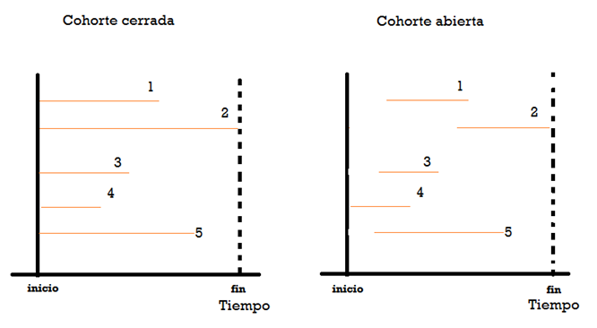
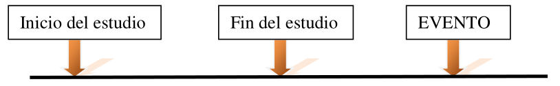
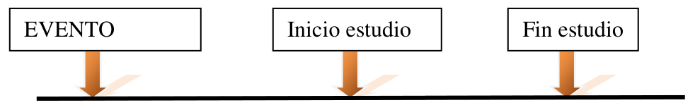
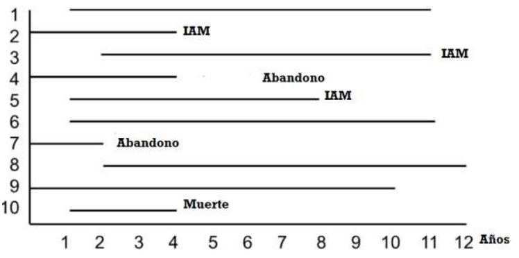
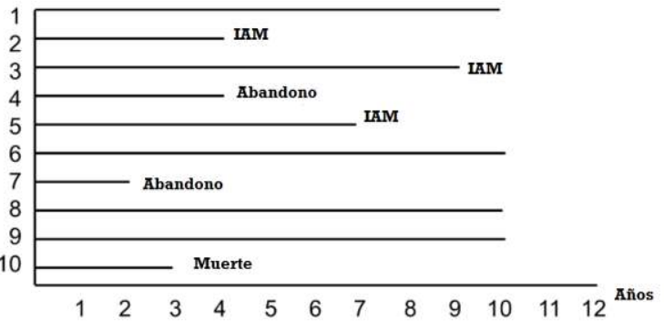

```{r, message=FALSE, echo=F}
knitr::opts_chunk$set(comment=NA, dpi = 300)
```

<br>

<center>

*Este material es parte de la* ***Unidad 6 del Curso de Epidemiología -
Nivel Avanzado del Instituto Nacional de Epidemiología "Dr. Juan H.
Jara" - ANLIS***

</center>

<br>

<center>

<p xmlns:cc="http://creativecommons.org/ns#" xmlns:dct="http://purl.org/dc/terms/">

<a property="dct:title" rel="cc:attributionURL" href="https://cballejo.github.io/R_Epi_Avanzada/Unidad6/experimentales/">Estudios
experimentales</a> by
<a rel="cc:attributionURL dct:creator" property="cc:attributionName" href="http://www.ine.gov.ar">Andrea
Silva</a> is licensed under
<a href="http://creativecommons.org/licenses/by-nc/4.0/?ref=chooser-v1" target="_blank" rel="license noopener noreferrer" style="display:inline-block;">CC
BY-NC
4.0</a>

</p>

</center>

<br>

## Introducción

En esta última unidad abordaremos los diseños experimentales. En
epidemiología, un estudio experimental implica que el investigador
manipula las condiciones del estudio, con el objeto de averiguar el
efecto que tal intervención tiene sobre las observaciones realizadas. La
aleatorización es una etapa clave en estos estudios, dado que el
investigador asigna la exposición en forma intencional y aleatoria. En
cuanto a su característica de temporalidad, los estudios experimentales
son de carácter prospectivo, es decir que se definen como longitudinales
prospectivos.

Los estudios experimentales poseen alta fuerza de causalidad, de hecho
los metanálisis de ensayos clínicos aleatorizados aportan el mayor nivel
de evidencia. Sin embargo, aspectos éticos, legales e incluso
operativos, hacen que su uso no radique en la investigación causal, sino
que su aplicación más común está vinculada a la evaluación de fármacos y
otros tipos de intervenciones sanitarias. Su uso más difundido es en
ensayos clínicos, pero también se utilizan en investigaciones
comunitarias para evaluar la efectividad de un programa.

Aunque el elemento central que define un estudio experimental sea la
introducción de una intervención que altera las condiciones del mismo y
es asignada a los participantes por el investigador, para que podamos
hablar de un experimento válido desde el punto de vista científico, es
preciso que además se cumplan las siguientes condiciones:

-   La única razón por la que los sujetos reciben la intervención bajo
    estudio es el cumplimiento del protocolo del estudio.

-   En el estudio existe una serie de sujetos, denominados grupo
    control, que no reciben la intervención cuyo efecto se desea
    analizar.

-   La asignación de la intervención a una serie de sujetos, grupo de
    intervención, se lleva a cabo por un mecanismo debido al azar

**Tipos de estudios clínicos experimentales (ECE)**. Las clasificaciones
referidas a estudios experimentales, pueden ser diferentes según los
distintos autores, pero en esencia apuntan a lo mismo. Hernández Ávila
en su texto utiliza la siguiente clasificación de ECE:

+-----------------------+-----------------------+-----------------------+
| Tipo de estudio       | Objetivos             | Duración habitual     |
+=======================+=======================+=======================+
| Laboratorio           | Prueba hipótesis      | Horas o días          |
|                       | etiológicas y estima  |                       |
|                       | respuestas biológicas |                       |
|                       | y/o de comportamiento |                       |
|                       | agudas. Sugiere       |                       |
|                       | eficacia de una       |                       |
|                       | intervención para     |                       |
|                       | modificar factores de |                       |
|                       | riesgo en una         |                       |
|                       | población             |                       |
+-----------------------+-----------------------+-----------------------+
| Ensayo clínico        | Prueba hipótesis      | Días hasta años       |
|                       | etiológicas y estima  |                       |
|                       | efectos de salud a    |                       |
|                       | largo plazo. Prueba   |                       |
|                       | eficacia de           |                       |
|                       | intervenciones que    |                       |
|                       | modifican el estado   |                       |
|                       | de salud Sugiere      |                       |
|                       | factibilidad de       |                       |
|                       | intervenciones        |                       |
+-----------------------+-----------------------+-----------------------+
| Intervención          | Identifica personas   | No menos de 6 meses   |
| comunitaria           | de "alto riesgo".     |                       |
|                       | Prueba eficacia y     |                       |
|                       | efectividad de        |                       |
|                       | intervenciones        |                       |
|                       | clínicas/sociales que |                       |
|                       | modifican el estado   |                       |
|                       | de salud dentro de    |                       |
|                       | poblaciones           |                       |
|                       | particulares Sugiere  |                       |
|                       | políticas y programas |                       |
|                       | de salud pública      |                       |
+-----------------------+-----------------------+-----------------------+

\* *Extraída de Hernández Ávila*

Una descripción más amplia, utilizada por otros autores, abarca
situaciones donde no se cumplen en forma estricta las tres condiciones
mencionadas previamente. Dichas condiciones apuntan a descartar que los
efectos observados puedan deberse a factores desconocidos o no
controlados y, de esta forma, poder atribuir con seguridad esos
resultados a la intervención bajo estudio. Es así que podemos hablar
entonces de estudios "cuasi-experimentales", donde el investigador
manipula las condiciones del estudio (es decir, introduce una
intervención) sin que se den las condiciones previamente mencionadas. El
problema con este tipo de estudios es que carecen del grado de validez
interna que se precisa para atribuir el efecto observado a la
intervención bajo estudio. Esta clasificación puede resumirse de la
siguiente forma:

1.  Estudios cuasi-experimentales

    1-1. Estudios no controlados

    1-2. Estudios con controles históricos

    1-3. Estudios controlados no aleatorizados

2.  Estudios controlados y aleatorizados

    2-1. Ensayos de prevención primaria

      -   Ensayo de campo

      -   Ensayo de intervención comunitaria

    2-2. Ensayo clínico

      -   De grupos paralelos

      -   Cruzado

      -   Factorial

En esta unidad, nos centraremos fundamentalmente en los ensayos clínicos controlados, pero pueden consultar la bibliografía del capítulo para profundizar las demás opciones. 
Como sucede con los restantes diseños, es importante tomar precauciones para evitar conclusiones sesgadas. Habitualmente se consideran 5 principios para evitar sesgos:

-	Uso de grupo control
-	Aleatorización
-	Cegamiento
-	Consentimiento antes de aleatorizar
-	Análisis por intención de tratar

**Uso de grupo control**. Al igual que con los estudios de cohortes, los estudios de intervención deben ser comparativos, es decir, se debe investigar un grupo de control junto con un grupo tratado. Generalmente sólo dos grupos están involucrados, pero podrían estar involucrados varios grupos de tratamiento. El grupo de control puede tratarse con un placebo u otro tratamiento activo, como la terapia existente.

**Aleatorización**. El propósito primario de la aleatorización es garantizar que la posible inferencia causal observada al final del estudio no se deba a otros factores. La aleatorización se refiere a la asignación mediante el azar de las unidades de investigación (individuos)  a los distintos tratamientos a evaluar, con la finalidad de compararlos según las variables resultado definidas.

**Cegamiento**. El cegamiento es la política de mantener a alguien sin saber qué tratamiento se ha administrado. Se dice que los estudios son simple ciego si el sujeto no sabe qué tratamiento ha recibido. Los estudios de intervención son doble ciego si el médico, enfermero o quien esté evaluando  los resultados (respuesta del sujeto, mediciones físicas, pruebas de laboratorio, etc.), así como como el sujeto, desconoce el tratamiento recibido. Esto evita el sesgo del observador. Algunas veces la persona que interpreta el conjunto de resultados, posiblemente un estadístico, también se mantiene ciega para razones similares. Entonces, el estudio sería triple ciego. Aunque la ceguera es deseable, no siempre es posible. Un ejemplo obvio es cuando se compara un tratamiento con radiación con un tratamiento quirúrgico para el cáncer de mama. Por otro lado, es fundamental que la asignación del tratamiento esté codificada y que alguien pueda descifrar el código en momentos de problemas médicos durante el estudio y cuando se requieran resultados finales.

**Consentimiento antes de la aleatorización**. Para evitar sesgos en la eventual composición de los grupos de tratamiento, se debe verificar el consentimiento (y la elegibilidad) de los sujetos para cada tratamiento antes de ser asignados al azar a un grupo de tratamiento.

**Análisis por intención de tratar**. Durante el estudio de intervención, los sujetos pueden suspender o modificar su tratamiento asignado por muchas razones, que incluyen enfermedad, toxicidad, migración o simplemente por error. La eficacia del tratamiento se analiza normalmente de acuerdo con el tratamiento asignado en lugar del tratamiento realmente recibido, ignorando cualquier información sobre la adherencia, esto es lo que se denomina el principio del análisis por intención de tratar. Esto protege contra el sesgo porque alguien que interrumpe o incluso pasa al otro tratamiento (por ejemplo, el fármaco de control bien establecido) puede haberlo hecho debido a un efecto adverso del tratamiento. Además, debería reflejar la práctica en el mundo real con bastante más precisión. La desventaja es que esto no medirá la verdadera efectividad relativa de los tratamientos administrados; en general, cabría esperar una subestimación de la diferencia de tratamiento administrado. En algunas circunstancias, un análisis completo por intención de tratar no será posible. 

### Análisis de los estudios experimentales

Primeramente consideremos que en un estudio experimental existe un seguimiento sobre una cohorte. Lo más común es que los ensayos clínicos controlados midan la incidencia de algún evento en los grupos de individuos seguidos en un determinado lapso y que este evento se exprese de manera dicotómica (es decir, la presencia o no del desenlace: infarto al miocardio, recurrencia de una neoplasia, muerte, etc.) como la proporción de sujetos que llegan a presentarlo. Tratándose de una cohorte, es que es posible medir RR o diferencia de riesgos, incluso reducción de RR. Se suele utilizar también el número necesario de pacientes a tratar (NNT) indica el número de pacientes a tratar para evitar un “caso”.

Una de las metodologías más frecuentemente empleadas para analizar los ensayos clínicos es el análisis de supervivencia. Como vimos en la unidad anterior, también los estudios de cohortes pueden analizarse con esta técnica. En ambos casos, la variable tiempo toma un rol central. Avanzaremos ahora en la comprensión de esta metodología.

## Análisis de supervivencia

El estudio de procesos de supervivencia implica el seguimiento de los individuos a lo largo del tiempo, pudiéndose producir una serie de situaciones que complican la caracterización de los mismos. La característica más importante de este tipo de datos (tiempo hasta que ocurre un suceso) es que, muy probablemente, al final del periodo de observación no todos los pacientes habrán presentado el suceso objeto de estudio.

Además puede ocurrir que algunos pacientes se hayan perdido por causas diversas, no habiendo sido posible determinar su estado. También es habitual que los pacientes vayan incorporándose durante todo el periodo de observación, por lo que los últimos en hacerlo serán observados durante un periodo de tiempo menor que los que entraron al principio y por lo tanto la probabilidad de que les ocurra el suceso es menor.

En las enfermedades crónicas, tales como el cáncer, la supervivencia se mide como una
probabilidad de permanecer vivo durante una determinada cantidad de tiempo. La
supervivencia al año o a los 5 años es a menudo expresada como indicadores de la
severidad de una enfermedad y como pronóstico. Típicamente, el pronóstico del cáncer se
valora determinando el porcentaje de pacientes que sobrevive al menos cinco años después del diagnóstico.

El análisis de supervivencia se utiliza cuando el tiempo es el objeto de interés, entendido como tiempo hasta la ocurrencia de un evento o riesgo de ocurrencia de un evento por unidad de tiempo. La supervivencia incorpora el concepto dinámico del tiempo y es por tanto una variable compuesta de dos elementos: respuesta y tiempo. La respuesta o desenlace de interés no es una cantidad numérica, sino que toma la forma de “tiempo transcurrido hasta un suceso”, lo que supone utilizar como desenlace o respuesta (“variable dependiente”) la combinación de ambas cosas (cualidad + variable numérica).

- La cualidad corresponde a si se ha producido o no el suceso y es una variable
dicotómica (muerte, recidiva, aparición de una complicación o un nuevo
síntoma, etc.).

- La variable numérica indica cuánto tiempo ha tardado en llegar a ese desenlace.

El paradigma de diseño de estudio que genera este tipo de información es el estudio de
cohorte o bien el ensayo clínico, dado que ambos presuponen el acompañamiento de un
grupo de individuos a lo largo del tiempo, con lo cual se accede fácilmente a nuestra
variable respuesta: tiempo hasta que un suceso ocurra. Recordemos que, en ambos diseños, podemos tener dos tipos de cohortes: cerradas o abiertas, y según cuál sea el caso, podremos calcular Incidencia acumulada o densidad de incidencia. Tengamos también
presente, que en ambos tipos de cohortes habrá pérdida de información por distintas causas.

```{r,echo=F,  fig.align='center', out.width = "60%"}

```

Esta variable “tiempo hasta un evento”, en el contexto del análisis de supervivencia, se la llama habitualmente “tiempo de supervivencia”, aunque el evento de interés no sea la muerte. Algunos autores se refieren a los tiempos de supervivencia como “tiempos de
fallo”. En general, en el lenguaje de supervivencia, el evento de interés, tiene una
connotación negativa: muerte, recaída, rechazo a un trasplante, insuficiencia renal, etc.

Comenzaremos intentando comprender las diferencias que este tipo de análisis tiene con
otras metodologías, en que se diferencian los datos del resto de los datos y por qué
necesitamos mucho soporte estadístico para comprender esta metodología.

### El lenguaje propio del Análisis de Supervivencia

Hay características únicas de la variable “tiempo hasta un evento”. En primer lugar, los tiempos hasta el evento son siempre positivos y sus distribuciones son a menudo sesgadas.

Por ejemplo, en un estudio que evalúa el tiempo de recaída en pacientes de alto riesgo, la mayoría de los eventos (recaídas) puede ocurrir temprano en el seguimiento con muy pocos casos que se produzcan más tarde. Por otra parte, en un estudio de tiempo hasta la muerte en una muestra basada en la comunidad, la mayoría de los acontecimientos (muertes) puede ocurrir más tarde en el seguimiento. Esto nos hace pensar que los procedimientos estadísticos estándar, que asumen normalidad de las distribuciones, no se aplican a estos casos. Podríamos invocar procedimientos no paramétricos, pero existen problemas adicionales. En concreto, los datos completos no siempre estarán disponibles para cada participante en un estudio. En una cohorte abierta, los participantes que se inscriban después son seguidos por un período más corto que los participantes que se inscriban temprano. Algunos participantes pueden salir del estudio antes del final del período de seguimiento (por ejemplo, alejarse, perder el interés) y otros pueden morir durante el período de seguimiento (suponiendo que el resultado de interés no es la muerte). En cada uno de estos casos, tenemos información de seguimiento incompleta. Es cierto que el tiempo de supervivencia, es decir el tiempo hasta que se produce el evento de interés, puede ser que no se conozca porque el estudio termina o porque un participante se retira del estudio antes de experimentar el evento. Estos tiempos son llamados **tiempos censurados**.

En el lenguaje de supervivencia hablamos de:

- **Censura**: Se refiere a la pérdida de información, debido a no haber observado el
tiempo de un individuo que pertenece al grupo en estudio

- **Truncamiento**: Significa que un individuo que pertenecería a la población
estudiada no fue incluido en el estudio

**Censura**. Se consideran 3 tipos de censura:

**Censura a la derecha**: Ocurre cuando el tiempo entre el inicio del estudio y el evento de interés, es mayor que el tiempo de observación.

```{r,echo=F,  fig.align='center', out.width = "60%"}

```

**Censura a la izquierda**: Ocurre cuando antes de ingresar al estudio, el individuo ha
presentado el evento de interés, por lo que se sabe que su tiempo de supervivencia no
observado es menor que el tiempo de observación.

```{r,echo=F,  fig.align='center', out.width = "60%"}

```

Un ejemplo de esta situación puede darse en el caso en que se tiene el interés de determinar el momento (edad) en que el niño aprende a desarrollar cierta habilidad o tarea. Puede darse que algunos niños incluidos en el estudio ya hayan adquirido dicha habilidad previamente al ingreso al estudio. Estos tiempos son censurados por la izquierda.

**Censura intervalar**: En algunos estudios, la observación de los sujetos no se realiza de manera continua y los períodos de observación pueden ser muy largos entre dos observaciones consecutivas. En esta situación, es común que, respecto al tiempo de falla no observado del sujeto, solo se sabe que ocurrió en el intervalo determinado por estos dos periodos de revisión. Esta observación se dice que presenta censura por intervalo o intervalar

También en el caso de truncamiento, se habla de izquierda y derecha. Un ejemplo típico de **truncamiento por la izquierda** es en estudios de supervivencia de adultos mayores
(supongamos mayores de 60 años). Aquellos individuos cuya edad de muerte sea menor a
los 60 años no se contemplarán en el estudio. Un ejemplo de **truncamiento a la derecha**, es por ejemplo, un estudio sobre tiempos de infección de VIH: sólo los individuos que se han infectado en la ventana de tiempo del estudio, son incluidos en el estudio.

Lo más común en los estudios de supervivencia es que exista censura a la derecha y
truncamiento a la izquierda.

Esta “desinformación” puede traernos problemas técnicos importantes. La mayoría de
los métodos de supervivencia consideran que los individuos censurados están sujetos a
la misma probabilidad del sufrir el evento de interés que aquellos individuos que
permanecieron en el estudio.Si esto es así, decimos que la censura es “no informativa” y es lo deseable. Por ejemplo, si se pierde la información de un individuo por pérdida de contacto (por ej. Mudanza), no hay razón para pensar que eso está vinculado al evento de interés, pero en cambio, si el individuo abandona el estudio por complicaciones médicas, es más probable que esté ligado a nuestro evento de interés. Este último caso, se trata de “censura informativa”, lo cual debe evitarse, porque afectará la validez de las estimaciones.

Intentemos comprender lo que estuvimos desarrollando a través de un ejemplo:

Imaginemos un pequeño estudio prospectivo donde se siguen diez participantes para
evaluar el desarrollo de infarto agudo de miocardio (IAM) durante un período de 10
años. Los participantes son reclutados para el estudio durante un período de dos años y
son seguidos durante un máximo de 10 años. El siguiente gráfico indica cuándo se
inscribieron y posteriormente lo que les sucedió durante el período de observación.

```{r,echo=F,  fig.align='center', out.width = "60%"}

```

Este es un ejemplo de cohorte abierta. Observando el gráfico, podemos decir que, durante el seguimiento:
- 3 pacientes sufrieron el evento de interés: IAM (Pacientes N° 2, 3 y 5)

- 2 pacientes abandonaron el estudio por razones desconocidas (Pacientes N° 4 y
7)

- 1 paciente falleció (Paciente N° 10)

- 4 pacientes completaron los 10 años de seguimiento sin sufrir IAM (Pacientes
N° 1, 6, 8 y 9)

Basados en estos datos: ¿Cuál es la probabilidad de un paciente de sufrir IAM en 10 años?

Tres de diez participantes sufren IAM en el transcurso del seguimiento, es decir que la
probabilidad sería 0,3, o sea un 30%; pero el 30% es probablemente una subestimación del verdadero porcentaje ya que dos participantes abandonaron el estudio y podrían haber sufrido un infarto, que habría sido observado si hubiésemos podido seguirlos los 10 años completos. Sus tiempos observados fueron **censurados**. Además, un participante muere después de 3 años de seguimiento. ¿Debemos incluir estos tres individuos en el análisis?

Y si es así: ¿cómo?

Si excluimos a los tres, la estimación de la probabilidad de que un participante sufra un IAM es 3/7 = 43%, sensiblemente superior a la estimación inicial de 30%. El hecho de que todos los participantes no siempre pueden ser observados durante todo el período de
seguimiento, hace que los datos de supervivencia sean únicos. En este pequeño ejemplo, el participante 4 se observó durante 4 años y durante ese período no tuvo un IAM. El
participante 7 se observó durante 2 años y durante ese periodo no tuvo un IAM. Mientras
que no sufran el evento de interés, los individuos en seguimiento, aportan información
importante. Las técnicas de análisis de supervivencia hacen uso de esta información en la estimación de la probabilidad del evento. Muy pronto veremos cómo, pero antes,
puntualizaremos un supuesto importante que se hace para hacer un uso adecuado de los
datos censurados.

::: {.b--gray .ba .bw2 .ma2 .pa4 .shadow-1}
Específicamente, se supone que la censura es independiente o no relacionada con la
probabilidad de desarrollar el evento de interés. Dicho de otra forma, la **censura debe ser no informativa** y asume esencialmente que los participantes cuyos datos son censurados, tendrían la misma distribución de tiempos de supervivencia que si fueran realmente observados.
:::

Consideremos ahora el mismo ejemplo en una cohorte cerrada:

```{r,echo=F,  fig.align='center', out.width = "60%"}

```

Nótese aquí que, una vez más, tres participantes sufren IAM, uno muere, dos abandonan el estudio, y cuatro completan los 10 años de seguimiento sin sufrir infarto de miocardio. Sin embargo, los eventos de interés (IAM) se producen mucho antes, y los abandonos y la muerte se presentan más adelante en el curso de seguimiento. 

¿Pueden estas diferencias en las experiencias de los participantes afectar a la estimación de la probabilidad de que un participante sufra un infarto de miocardio en un período de 10 años? En breve contestaremos también esta pregunta.

**En el análisis de supervivencia se analiza no sólo el número de participantes que sufren el evento de interés (un indicador dicotómico de estado del evento), sino también los momentos en que se producen los acontecimientos (tiempo de supervivencia).** 

Si todos los pacientes estudiados experimentan el suceso durante el periodo de observación, es fácil calcular la proporción de pacientes que transcurrido un tiempo determinado desde que comenzó su observación, no han llegado a sufrir el suceso ("sobrevivientes").

Podríamos representar gráficamente la proporción de pacientes sin el evento en función del tiempo desde que entraron en el estudio y tendríamos así, la función de supervivencia: **S(t)**.

Pero las cosas no son tan sencillas si no todos los pacientes presentan el suceso. Un
paciente puede haber entrado a mitad del estudio, siendo observado durante 2 años, y al
finalizar éste, no presentar el evento en cuestión.

Dijimos que en análisis de supervivencia estamos interesados en el tiempo hasta que un
evento ocurre. Este tiempo se lo llama "tiempo de supervivencia" (aunque el evento no sea muerte). El tiempo es una **variable aleatoria continua** que no puede asumir valores negativos y que rara vez se distribuye normalmente. Ya hemos visto que toda variable aleatoria posee una distribución de probabilidad que describe su comportamiento. Así que, para estimar probabilidades de que el evento ocurra, necesitaremos conocer la distribución de estos tiempos de supervivencia.

(Nota: Como probablemente estarán advirtiendo, estamos utilizando el lenguaje de la
probabilidad, así que si no recuerdan los conceptos de función de densidad y función de
probabilidad acumulada para una variable aleatoria continua, es un buen momento para
reverlos.)

### Función de Supervivencia S(t)

Como dijimos, los tiempos de supervivencia tiene una **función de densidad de
probabilidad $f(t)$**: probabilidad que un evento se produce en el tiempo $t$. Debido a que $f(t)$ es continua, para obtener la probabilidad, tendría que encontrar el área bajo la curva de densidad de probabilidad para un intervalo infinitamente pequeño de $t$.

Esta $f(t)$ tiene su Función de distribución acumulada $F(t)$ que es la probabilidad de que un evento ocurra al tiempo $t$, cuya forma de calcularla corresponde a la integral de la $f(t)$.

$$F(t)=P[T\leq t]= \int_0^t f(t)dt $$

Es decir que, si en nuestro estudio estamos interesados en evaluar la supervivencia de un grupo de pacientes post trasplante hepático, necesitaríamos conocer la distribución de esos tiempos de supervivencia. Hay que notar que en este ejemplo: el evento sería “muerte post trasplante”. Después, si estamos interesados en conocer la probabilidad de muerte, a los dos, 3 o 5 años, deberíamos realizar la integral señalada al tiempo deseado.

Si existe una $F(t)$, que nos da la probabilidad de morir a determinado tiempo $t$, entonces, existirá la función de supervivencia $S(t)$, que mide la probabilidad de sobrevivir más de un tiempo $t$.

$S(t)=Pr(T>t)$

$F(t)=Pr(T\leq t)$

$S(t)=1-F(t)$

Cumple con: $S(0)=1$ (en el primer momento, todos los pacientes están vivos)

Para $t \rightarrow \infty$; $S(t) \rightarrow 0$ (en algún momento, lejano, todos moriremos!!!).

Si considero un período de tiempo, entre $t_1$ y $t_2$:

Si $t_1 < t_2$ ; entonces $S(t_1) > S(t_2)$

Al considerar la posibilidad de adoptar una distribución teórica para los tiempos de
supervivencia, estamos haciendo un *abordaje paramétrico*. Las funciones densidad de
probabilidad más utilizadas son: la exponencial, Weibull y lognormal. No profundizaremos en detalles sobre estas aproximaciones, porque no son tan aplicadas en
el ámbito del análisis de supervivencia aplicado a salud.

Nos centraremos en los *abordajes no paramétricos*, que parten de la construcción de las llamadas **Tablas de supervivencia**, y tienen como objetivo central la estimación de dos medidas: la probabilidad de morir en un momento dado y la probabilidad de sobrevivir hasta un determinado tiempo. Existen dos métodos: el método actuarial y el método de Kaplan Meier, que describiremos en el siguiente capítulo.


## Bibliografía

Hernández Ávila, M. Epidemiología. Diseño y análisis de estudios. Editorial Médica Panamericana, 2007.

Woodward. Texts in Statistical Science . Epidemiology  Study Design  and Data Analysis . Third Edition. CRC Press, 2014

Escuela Nacional de Sanidad (ENS) Instituto de Salud Carlos III - Ministerio de Ciencia e Innovación. Miguel Ángel Royo Bordonada, Javier Damián Moreno, “Método epidemiológico”. Madrid: ENS - Instituto de Salud Carlos III, Octubre de 2009
