```{r, message=FALSE, echo=F}
knitr::opts_chunk$set(comment=NA, dpi = 300)
```

<br>

<center>

*Este material es parte de la* ***Unidad 6 del Curso de Epidemiología -
Nivel Avanzado del Instituto Nacional de Epidemiología "Dr. Juan H.
Jara" - ANLIS***

</center>

<br>

<center>

<p xmlns:cc="http://creativecommons.org/ns#" xmlns:dct="http://purl.org/dc/terms/">

<a property="dct:title" rel="cc:attributionURL" href="https://cballejo.github.io/R_Epi_Avanzada/Unidad6/supervivencia/">Análisis de supervivencia</a> by
<a rel="cc:attributionURL dct:creator" property="cc:attributionName" href="http://www.ine.gov.ar">Andrea
Silva</a> is licensed under
<a href="http://creativecommons.org/licenses/by-nc/4.0/?ref=chooser-v1" target="_blank" rel="license noopener noreferrer" style="display:inline-block;">CC
BY-NC
4.0</a>

</p>

</center>

<br>

## Funciones Básicas del Análisis de Supervivencia

Recordemos que en el contexto del Análisis de supervivencia se intenta modelar una variable aleatoria T no negativa, que representa el “tiempo hasta un evento determinado” de los individuos en el estudio. Para analizar esta variable se cuenta con cuatro funciones básicas:

- **Función densidad de probabilidad**: Esta variable tiempo hasta que ocurre un evento ($T$), como toda variable aleatoria continua tiene una función de densidad de probabilidad $f(t)$, como vimos en la primera parte. Esta función puede ser interpretada como la probabilidad de un individuo de sufrir un evento en un intervalo instantáneo de tiempo.Existirá también una función de probabilidad
acumulada $F(t)$, que da la probabilidad de morir en un intervalo concreto de tiempo: [$t_1$, $t_2$].


- La **función de supervivencia $S(t)$**, que presentamos en la primera parte.

Esta función representa la probabilidad de que un individuo sobreviva (no experimente el evento) a un tiempo determinado $t$.


- La **función de riesgo o hazard**: En el lenguaje de supervivencia suele mantenerse el término en inglés hazard que puede traducirse como “riesgo”, pero que asume ciertas particularidades. Una función de riesgo permite analizar el riego de un individuo de sufrir un evento en un determinado momento, dado que él ha sobrevivido hasta dicho momento. Por ejemplo, para responder a
preguntas como: ¿cuál es el riesgo de un paciente de fallecer después de una cirugía a corazón abierto?, deberemos conocer esta función de riesgo. Por Hazard entenderemos a la tasa instantánea de un evento a tiempo $t$. Matemáticamente, la función Hazard es definida como el riesgo instantáneo de un individuo de sufrir un evento entre el tiempo $t$ y $t+\varepsilon$, dado que sobrevivió hasta el tiempo $t$.

Se simboliza como $h(t)$ o $\lambda(t)$ y la expresión es:

$$h(t) = \lim_{n\rightarrow \infty}((t<T<t+\varepsilon)|T>t)/\varepsilon  $$
que puede interpretarse, aproximadamente, como la probabilidad de morir (en el caso que el evento sea muerte) en el intervalo ($t$, $t + \Delta t$], dado que se está vivo al tiempo $t$, o bien de forma general como la probabilidad de presentar el evento en dicho intervalo. Podemos interpretarla como una medida de intensidad de muerte al tiempo $t$, o una medida de muerte potencial al tiempo $t$, o en forma general, como una medida de intensidad de eventos a dicho tiempo.

La función de riesgo recibe otros nombres como: tasa de fallo, función o tasa de incidencia, fuerza de mortalidad condicional o simplemente fuerza de mortalidad. Es importante resaltar que a pesar de llevar el nombre de riesgo; $h(t)$ es una tasa y no una probabilidad, es por eso que a veces se prefiere usar el término *hazard*. Su unidad es $tiempo^{-1}$ y puede asumir cualquier valor real mayor que cero.

Una característica importante de esta función, es que puede servir de guía para proponer un modelo paramétrico para el tiempo de supervivencia. Lo común en muchas áreas, es que el investigador tenga alguna idea de cómo se comporta el riesgo de falla en la población bajo estudio. Este conocimiento se puede intentar asociar con la forma de alguna función de riesgo paramétrica. Para entender un poco mejor esto último observemos detenidamente la figura 1 con diferentes formas de la función de riesgo:

```{r,echo=F,  fig.align='center', out.width = "70%"}
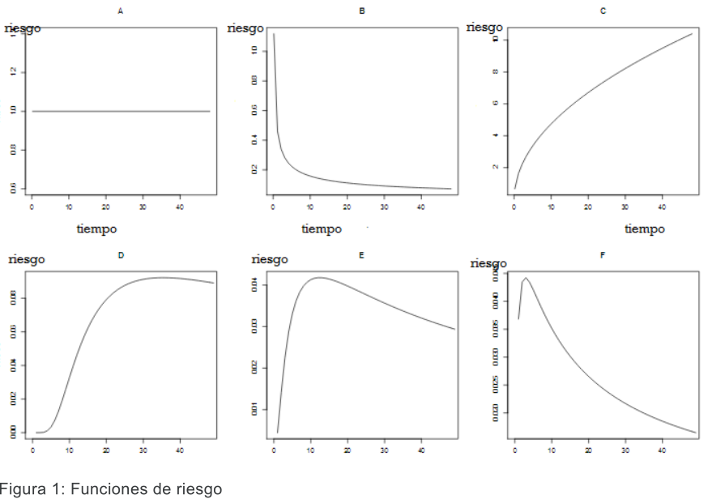
```

El gráfico **A** muestra una función de riesgo constante en el tiempo. Podemos imaginar situaciones de salud que tengan este comportamiento: por ejemplo riesgo de fracturas de escolares de 5to grado durante un año. El gráfico **B**, muestra una función de riesgo que decrece en el tiempo. Este patrón podría ejemplificar el riesgo post-quirúrgico, que es mayor en los primeros días post cirugía y luego cae con el tiempo. El gráfico **C** muestra una función de riesgo que se incrementa con el tiempo. Un ejemplo de esta situación podría encontrarse en un estudio sobre "tiempo hasta la solidificación de una fractura ósea". En un primer momento el "riesgo de solidificación" de la fractura es nulo, y a medida que transcurre el tiempo se incrementa. El resto de los gráficos presentan patrones más complejos de riesgo. Quizás puedan encontrar situaciones que sean representadas por esas curvas.

Para cerrar diremos que la función de riesgo marca la dinámica del proceso estudiado, al dar sus valores una adecuada aproximación a la tasa de incidencia del evento de interés.

- **Función de riesgo acumulado**:

A partir de la función de riesgo es posible calcular un riesgo acumulado que se simboliza como $\Lambda(t)$ o $H(t)$. La función de riesgo acumulado mide el riesgo de ocurrencia de un evento hasta un determinado tiempo $t$. Matemáticamente implica la suma de todos los riesgos en todos los tiempos hasta el tiempo $t$. La expresión es:

$$H(t)=\int_0^t h(u)du $$
Esta función permite responder preguntas como: ¿Cuál es el riesgo de un paciente con SIDA de morir en el primer año después del diagnóstico? Y en los primeros dos años?

Las funciones básicas descriptas hasta aquí son matemáticamente equivalentes y representan distintas formas de describir el mismo fenómeno. Todas están relacionadas entre sí y dichas relaciones son deducibles a partir de sus expresiones. Omitiremos aquí dichas deducciones, pero hagan un acto de fe y crean en las siguientes equivalencias:

$S(t)=1-F(t)$

$h(t)=-\frac{dln(S(t))}{dt}$

$h(t)=\frac{f(t)}{S(t)}$

$h(t)=\frac{f(t)}{1-F(t)}$

$H(t)=-ln(S(t))$

$S(t)=exp(-H(t))$

Una vez que estimamos una de ellas, será posible obtener cualquiera de las demás.

## Modelos Paramétricos para el tiempo de Supervivencia

En esencia, cualquier distribución de una variable positiva con soporte en los reales no negativos, puede ser un modelo para el tiempo de supervivencia. No obstante, existen un número reducido de distribuciones de uso común para este fin. Las funciones de densidad de probabilidad más usadas son: **exponencial**, **Weibull** y **lognormal**.

**Distribución exponencial:**

Al asumir que la variable aleatoria T posee una distribución exponencial, su $f(t)$ será:

$$f(t) = \alpha e^{-\alpha t} \quad (\alpha>0) $$

Utilizando las relaciones entre las funciones básicas de supervivencia:

$S(t)=e^{-\alpha t}$

$h(t)=\frac{f(t)}{S(t)}=\frac{\alpha e^{-\alpha t}}{e^{-\alpha t}}$

$H(t) = -lnS(t)=\alpha t$

Como podemos ver, al asumir una distribución exponencial para la variable "tiempo hasta que el evento se produzca", el riesgo es constante en el tiempo y el riesgo acumulado es una función lineal del tiempo (Figura 2)

```{r,echo=F,  fig.align='center', out.width = "100%"}
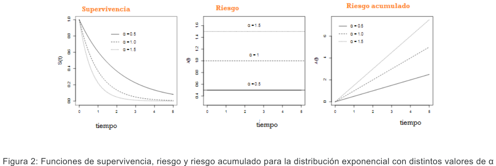
```


Asumir una función exponencial para los tiempos de sobrevida podría ser equivalente a otras asunciones que hemos hecho, como suponer una distribución normal para una variable: es una distribución que facilita el modelaje. En la práctica es una situación muy rara, recuerden que anteriormente imaginamos una situación de salud que tenía este comportamiento: el riesgo de fracturas de escolares de 5to grado durante un año. Pero no existen demasiadas situaciones en salud donde el riesgo sea constante, la mayoría de las situaciones reflejan un incremento del riesgo que básicamente está vinculado al envejecimiento del individuo.

Uno de los parámetros que se calculan en el análisis de supervivencia, es la mediana de los tiempos de supervivencia, que es equivalente a responder: ¿en qué tiempo mueren (o sobreviven) la mitad de los pacientes? Para el caso de la distribución exponencial:

$S(t)=e^{-\alpha t}=0,5$

$-\alpha t=ln(0,5)$

$\alpha t=ln2$

$T_{mediano}=\frac{ln2}{\alpha}$


A pesar de la simplicidad del modelo exponencial, la suposición de riesgo constante en el tiempo, lo hace poco plausible para su aplicación en salud.

**Distribución Weibull:**

Esta distribución es una generalización de la distribución exponencial, más utilizada en el área biomédica. La distribución Weibull es:

$$f(t)=\gamma\alpha^\gamma t^{\gamma-1}exp(-(\alpha t)^\gamma) $$

Siendo $\alpha$ > 0 y $\gamma$ > 0. A partir de esta expresión, se deducen:

$S(t)=exp(-(\alpha t)^\gamma)$

$h(t) = \gamma\alpha^\gamma t^{\gamma-1}$

$H(t)=-lnS(t)=(\alpha t)^{\gamma-1}$

Como vemos, la distribución Weibull tiene dos parámetros: $\alpha$ y $\gamma$. El parámetro $\gamma$ determina la forma de la función de riesgo (ver figura 3)

Si $\gamma$ < 1, la función de riesgo es decreciente.
Si $\gamma$ > 1, la función de riesgo es creciente.
Si $\gamma$ = 1, la función de riesgo es constante, siendo equivalente a la distribución exponencial.

```{r,echo=F,  fig.align='center', out.width = "100%"}
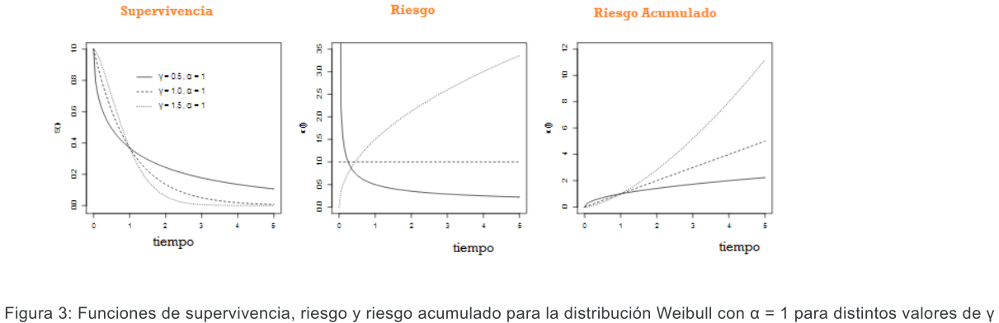
```

Para encontrar el tiempo mediano de supervivencia, procedemos en forma análoga que en la distribución exponencial.

$S(t)=exp(-(\alpha t)^\gamma)=0,5$

$-(\alpha t)^\gamma=ln(0,5)$

$T_{mediano}=\frac{ln(2)^{1/\gamma}}{\alpha}$

Dejaremos de lado la distribución lognormal, para pasar ahora a los métodos no paramétricos de estimación.


## Métodos no paramétricos para el Análisis de Supervivencia

A continuación veremos dos métodos no paramétricos de estimar las funciones básicas de supervivencia. Los mismos parten de las llamadas "tablas de vida". En esencia, la tabla de vida describe el proceso de mortalidad de una cohorte hasta la desaparición del último de sus individuos bajo la experiencia de mortalidad observada en un período dado. Se caracterizan por finalizar con la muerte de todos los sujetos y la diferencia fundamental entre tablas la constituye la velocidad con que se alcanza ese final. La tabla de vida se utiliza básicamente en salud pública para medir la mortalidad y la supervivencia, pero también en estudios demográficos, actuariales u otros, para estudiar la longevidad, la fertilidad, las migraciones, el crecimiento de la población y calcular proyecciones de
población y los años de vida sin discapacidad. En resumen, es una presentación tabular del progreso de una cohorte a través del tiempo que transcurre.

Las curvas de supervivencia se originan usando uno de los dos métodos siguientes: el método de Kaplan-Meier o el análisis actuarial de Cutler-Ederer, que permiten estimar la supervivencia en presencia de censura. Existe también un método no paramétrico vinculado al análisis de supervivencia que permite la estimación de la función de riesgo acumulado: el estimador de Nelson-Aalen, que no
abordaremos en este curso.

En el **método actuarial**, los tiempos de supervivencia se agrupan en intervalos. La longitud del intervalo depende de la frecuencia con que ocurre el evento de interés y puede no ser de la misma longitud. La desventaja principal de este método es que da estimaciones poco precisas cuando el número de sujetos es pequeño. En muestras grandes, tiene una importancia fundamental porque influye poco sobre las estimaciones y además permite obtener una función de riesgo. Se asume que observaciones censuradas se distribuyen homogéneamente en el intervalo.

En el **método de Kaplan Meier** la probabilidad de supervivencia al tiempo t se estima considerando que es independiente de la supervivencia a otros tiempos, entonces la probabilidad de alcanzar el tiempo $t$ es el producto de alcanzar los tiempos anteriores. La característica distintiva es que la proporción acumulada que sobrevive se calcula para el tiempo de supervivencia individual de cada
paciente y no se agrupan los tiempos de supervivencia en intervalos. Debido a ello, es especialmente útil en estudios con número pequeño de pacientes.

Vamos a intentar comprender ambos métodos a partir de ejemplos. Para ello podrán acceder a los videos explicativos correspondientes:

[Video Método Actuarial](https://www.youtube.com/watch?v=PZaWezVTgO4)

[Video Kaplan Meier](https://www.youtube.com/watch?v=kb5q1OC0OgI)

A continuación, para que puedan contar con una versión escrita de ambos videos, se resumen los contenidos de ambos. La sugerencia es que vean primero los videos porque de esa forma les resultará más fácil seguir los cálculos.

**Método actuarial:**

Consideremos el ejemplo de estudiar la supervivencia pos trasplante hepático de un grupo de 300 pacientes durante cinco años. El estudio inició en el 2009 y terminó en el 2014. La información se muestra en la Tabla 1

```{r,echo=F,  fig.align='center', out.width = "60%"}
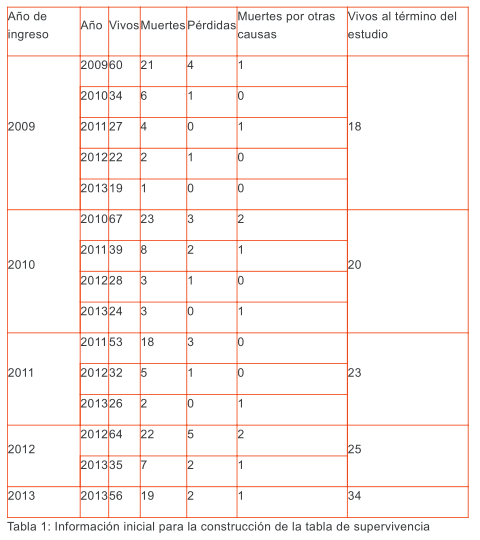
```

Para interpretar la información de la tabla, es necesario considerar que la misma presenta la evolución anual de los pacientes que fueron admitidos en el estudio año a año. Durante el año 2009 fueron admitidos 60 pacientes, 21 de los cuales murieron ese mismo año, se registraron 4 pérdidas en el seguimiento (por lo tanto se ignora si sobreviven o han fallecido) y 1 paciente falleció por causa
ajena al trasplante. Estos últimos 4 pacientes y 1 paciente, corresponden a observaciones *censuradas*. Para el año 2010, 34 quedaron vivos e iniciaron su segundo año de seguimiento. En paralelo, en el año 2010, ingresaron 67 personas al estudio.

Todos los pacientes que ingresaron durante cada uno de los años contribuyen con información a lo que ocurre el primer año de supervivencia. Hay un total de 300 pacientes que ingresaron vivos al estudio (60+67+53+64+56=300). Durante el primer año de seguimiento, murieron 103 pacientes (21+23+18+22+19= 103).

¿Cómo calculamos la probabilidad de morir en cada período? Podríamos dividir el número de muertes en cada período sobre el número de individuos vivos al comienzo del periodo o individuos en riesgo de sufrir el evento al comienzo del periodo de observación.

Pero; ¿qué hacemos con los sujetos que se perdieron, es decir los individuos censurados? Al clasificar los datos en intervalos de tiempo discretos (como hemos hecho en nuestra tabla), no podremos decir en qué momento se han perdido exactamente: ¿diremos que han sido individuos en riesgo durante todo el año (o período? Lo que el método actuarial asume es una solución "salomónica": lo
contaremos como mitad de persona-año.

$$P(morir)=\frac{muertes\; en \; el \; período}{indiv.en\;riesgo\;al\;comienzo\;del\;período-\frac{indiv.censurados}{2}}$$

Recordemos que los individuos censurados serán quienes están vivos al final del periodo, los que se han perdido y quienes han muerto por causas ajenas al estudio. En nuestra nueva tabla (Tabla 2), esta probabilidad se notará como $q_i$

Por lo tanto, para el primer periodo

$$q_i = \frac{103}{300-\frac{23+34}{2}}=0,379$$

Calcularemos también $p_i$ que denota la probabilidad de sobrevivir a un determinado periodo, dado que se ha ingresado vivo al mismo.

Es una probabilidad condicionada de supervivencia, y es igual a $1 - q$.

Y luego calcularemos $S(t)$, que muestra la probabilidad acumulada de sobrevivir, es decir la probabilidad que tiene una persona de sobrevivir hasta un tiempo determinado, considerando que ha sobrevivido a los tiempos anteriores. Esta probabilidad se obtiene multiplicando las probabilidades de haber sobrevivido a los tiempos anteriores. Es decir que la probabilidad de sobrevivir al tercer año a partir del trasplante será

$S(3)=0,621*0,789*0,868= 0,425$, es decir el 42,5%

```{r,echo=F,  fig.align='center', out.width = "80%"}
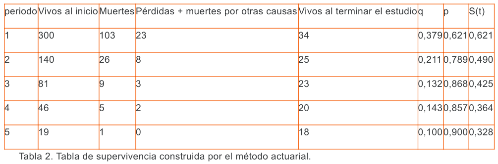
```
Puede luego graficarse $S(t)$ vs periodo (ver Figura 4). Sobre el gráfico se pueden ubicar los cuartiles y en particular, la mediana de los tiempos de supervivencia, que indica el momento donde la supervivencia es del 50%.

```{r,echo=F,  fig.align='center', out.width = "70%"}
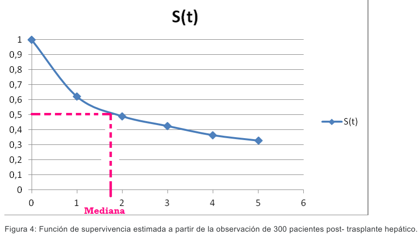
```

**Método de Kaplan Meier**

El Método de Kaplan Meier (KM) utiliza esencialmente la misma estrategia que el actuarial, pero permite trabajar con menos observaciones e incluso en periodos más cortos. Para ello toma la información de cada sujeto de observación, en vez de agruparla por periodos. Similarmente a lo que vimos en el método actuarial, la probabilidad de supervivencia al tiempo $t$ se estima considerando
que es independiente de la supervivencia a otros tiempos, entonces la probabilidad de alcanzar el tiempo $t$ es el producto de alcanzar los tiempos anteriores

$$S_{KM}(t)=\prod_{i:ti<t}(1-d_i/n_1) $$
$d_i$: Número de eventos en el tiempo $t_i$

$n_i$: Número de personas expuestas en el tiempo $t_i$

Aclaremos el método de KM con un ejemplo. Para hacerlo más simple, consideremos ahora una cohorte cerrada de 10 pacientes (Figura 5). El estudio está planteado a dos años de seguimiento. El evento a observar es muerte por enfermedad cardiovascular (ECV). En el gráfico, C significa censurado y M muerte por ECV.

```{r,echo=F,  fig.align='center', out.width = "60%"}
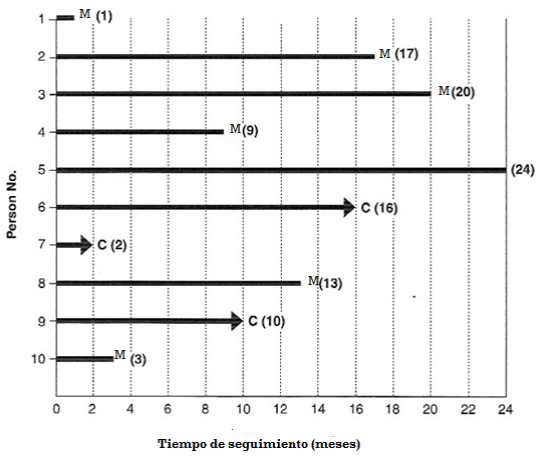
```
*Figura 5: Cohorte cerrada de 10 pacientes en seguimiento.*

La información de la Figura 5 se transcribió en la Tabla 3. En este punto, es importante señalar que una base de datos para análisis de supervivencia, debe tener esa estructura: cada fila es un individuo en seguimiento, debe consignarse el tiempo inicial y el tiempo final del seguimiento (en este caso, el tiempo inicial es el mismo para todos porque se trata de una cohorte cerrada, pero esto no es lo más frecuente), el $t$ corresponde a tiempo de seguimiento (se obtiene de la diferencia tiempo final y tiempo inicial) y la variable status, que indica si el paciente sufrió el evento o es un paciente censurado (evento=1, censurado=0).

```{r,echo=F,  fig.align='center', out.width = "55%"}
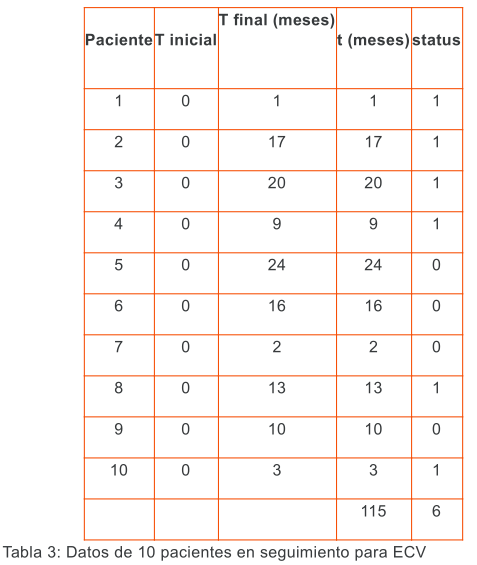
```

Para la construcción de la tabla de supervivencia, lo primero que debemos hacer es ordenar los pacientes de acuerdo a su tiempo.

Entonces, la tabla 3, se transforma en la Tabla 4:

```{r,echo=F,  fig.align='center', out.width = "55%"}
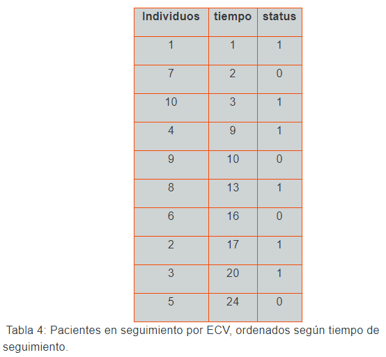
```

Comencemos con la construcción de la tabla de supervivencia (Tabla 5), teniendo en cuenta que aquí conocemos exactamente el tiempo en el que un individuo estuvo en riesgo de morir por ECV. Esta tabla se construye a partir de los individuos que tuvieron el evento.

```{r,echo=F,  fig.align='center', out.width = "65%"}
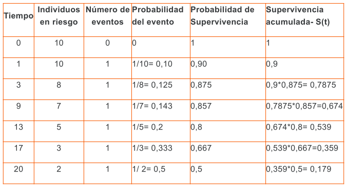
```
*Tabla 5: Tabla de supervivencia según KM para pacientes con ECV*

Una vez obtenida la $S(t)$, se grafica(Figura 6).

```{r,echo=F,  fig.align='center', out.width = "65%"}
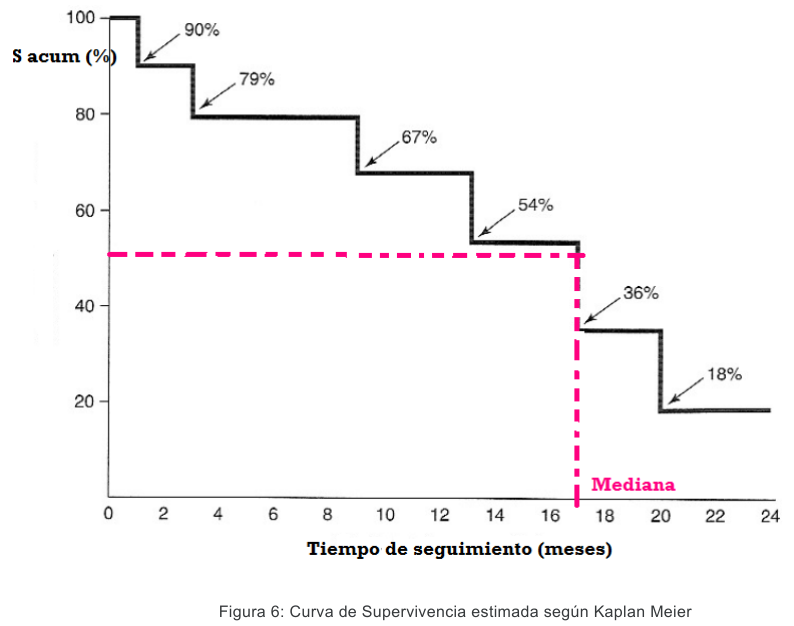
```

Las curvas de supervivencia de Kaplan-Meier son curvas escalonadas. Los escalones se forman a medida que transcurre el tiempo, de modo que cada vez que ocurre el evento de estudio se genera un escalón hacia abajo, lo cual conlleva una reducción de la supervivencia acumulada hasta ese instante.

Resumiendo, para construir una curva de supervivencia se deben dar los siguientes pasos:

a. Ordenar ascendentemente los tiempos de supervivencia (o tiempos de observación).

b. Hacer una cuadro donde una columna ($t_i$) corresponda a los tiempos de observación para cada participante y otra al estado de los individuos al finalizar su periodo de seguimiento (status)

c. Calcular para cada periodo de tiempo el cociente entre los que sobreviven y los que están a riesgo de sufrir el evento ($s_i$/$n_i$: probabilidad de supervivencia). Se crea otra columna para estos cocientes entre quienes sobreviven ($s_i$) y los que están en riesgo ($n_i$) de fallecer (son los que entran vivos en ese tiempo). En esta columna sólo hay datos para cuando alguien fallece. Es importante hacer notar que entre los que entran a riesgo de morir ($n_i$) se incluyen también el individuo o individuos que van a morir en ese periodo, aunque mueran justamente en el inicio del periodo.

d. Multiplicar en cada periodo de tiempo los cocientes ($s_i$/$n_i$) por los de los tiempos anteriores. La supervivencia en ese momento será precisamente este producto (supervivencia acumulada)

e. Finalmente, siempre es recomendable representarlo gráficamente. Se debe empezar con una supervivencia de 1, que se mantiene hasta que se produce el primer fallecimiento. En ese momento la gráfica da un salto correspondiente al descenso de la supervivencia a partir de ese momento (en el ejemplo pasa a 0,90). Y así sucesivamente.

Algunos investigadores prefieren generar **curvas de incidencia acumulada**, que muestran las probabilidades acumuladas de experimentar el evento de interés. La incidencia acumulada o probabilidad de fallo acumulativo, pueden calcularse y graficarse fácilmente a partir de la tabla de vida utilizando el método de Kaplan-Meier. En nuestro ejemplo (Tabla 5), lo haríamos a partir de la
columna "Probabilidad del evento", y luego haríamos la probabilidad acumulada, multiplicando las probabilidades a distintos tiempos.

Hasta aquí aprendimos a calcular la $S(t)$ a partir de nuestros datos, ya sea por el método actuarial o por el de KM. Todo esto que hicimos "a mano" aquí, las funciones del lenguaje R lo hacen y nos facilitan el trabajo.

Ahora podríamos plantearnos distintos interrogantes, según el estudio, como por ejemplo:

¿La curva será una buena estimación tanto para hombres como para mujeres? Es decir: ¿la variable sexo afecta al tiempo de supervivencia?

O también: ¿el tratamiento afecta el tiempo de supervivencia? Para ello será necesario comparar curvas de supervivencia.


## Comparación de Curvas de Supervivencia

¿Como podemos responder estas preguntas? La estrategia de KM es estratificar según la variable de interés (sexo en el primer ejemplo, tratamiento en el segundo) y estimar la S(t) para cada estrato. De esta forma podemos comparar las curvas gráficamente.

Por ejemplo, la figura 7, nos muestra las curvas de supervivencia para dos grupos de pacientes que recibieron distintos tratamientos (A y B). Si observamos las medianas de los tiempos de supervivencia (líneas punteadas), podemos ver que los pacientes que siguieron el tratamiento $B$ tienen mayores tiempos de supervivencia que los que recibieron el tratamiento $A$ (Mediana tiempos de supervivencia $A \approx 7 \;meses$; Mediana tiempos de supervivencia $B \approx 20 \;meses$)

```{r,echo=F,  fig.align='center', out.width = "60%"}
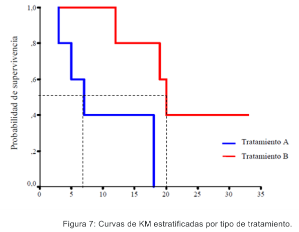
```

Si bien gráficamente podemos tener una idea, lo correcto es hacer una comparación en términos estadísticos. Por lo tanto, existen varios test que nos permiten comparar curvas de supervivencia. Uno de los más usados por los paquetes estadísticos es el log-rank test.


**Log-rank test**

- Hipótesis nula ($H_0$): las supervivencias de los grupos que se comparan (2 o más) es la misma.

- Hipótesis alternativa ($H_1$): al menos uno de los grupos tiene una supervivencia diferente

Estadístico utilizado: $\chi^2$ con $k-1$ grados de libertad, siendo $k$ el número de grupos (nº de curvas que se comparan). Equivale a testear si la incidencia de eventos es semejante en cada estrato.

La interpretación es similar a los demás test de contraste de hipótesis. En general, se asume un *p= 0,05* para hablar de diferencias "estadísticamente significativas".

Muchas veces, en el ámbito de la medicina, para comparar dos tratamientos o dos series, se tiende a usar como medida de resultado cuál es la supervivencia de los pacientes a los 5 años. Pero esto es básicamente incorrecto. Dos situaciones muy distintas pueden dar lugar a los mismos resultados de supervivencia a 5 años, como la que se muestra en la Figura 8.

```{r,echo=F,  fig.align='center', out.width = "80%"}
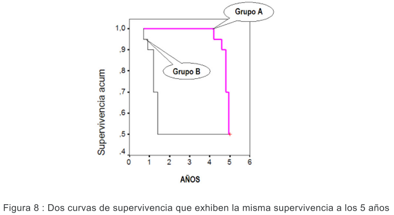
```

En la Figura8, los grupos A y B tienen exactamente una supervivencia del 50% a los 5 años. Sin embargo, se observa claramente que los pacientes del grupo B tienen una peor supervivencia desde el principio del estudio.

Los tests específicamente diseñados para comparar curvas de supervivencia, tienen en cuenta toda la historia de seguimiento de los pacientes en vez de considerar sólo un punto en el tiempo, es decir detectan diferencias persistentes a lo largo del tiempo en la supervivencia.

Cuando el evento de resultado es poco frecuente o si las curvas son aproximadamente paralelas (no se cruzan) el log-rank es el método más indicado. También se le conoce como test de Mantel y Haenszel. Cuando las curvas se cruzan (al principio hay mejor supervivencia en un grupo y luego en el otro), entonces puede estar indicado el uso de otro test de comparación de curvas de supervivencia que se llama de Wilcoxon (o también de Breslow). Un tercer test que se emplea con menos frecuencia es el de Tarone–Ware. En estos tests se hace una ponderación y se le da distinto peso a las diferencias según ocurran más precoz o más tardíamente a lo largo del seguimiento.

## Hazard y Riesgo acumulado

Ya hemos estimado $S(t)$, ahora nos falta abordar las otras funciones básicas de supervivencia

La expresión compleja de $h(t)$, a los efectos de las Tablas de Supervivencia, puede reemplazarse por:

$$\lambda(t)=\frac{Número \; de \; \;eventos\;observados\;en\;cada\;intervalo}{personas\;en\;riesgo\;al\;inicio*amplitud\;intervalo}$$
De la misma forma que construimos $S(t)$, podemos estimar $h(t)$ ( o un software puede hacerlo por nosotros). La Tabla 6, nos muestra las estimaciones para el ejemplo utilizado para KM.


```{r,echo=F,  fig.align='center', out.width = "70%"}
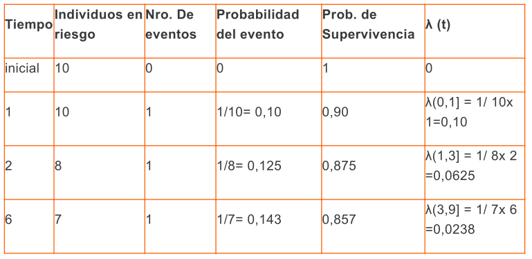
```

¿Qué expresa $h(t)$ o $\lambda(t)$?

Observemos que la función de riesgo $h(t)$ o $\lambda(t)$ es una medida de la probabilidad de que se produzca el suceso estudiado entre los que quedan sin haber sufrido todavía tal suceso.

Es realmente una función que evalúa, puntualmente, en un período de tiempo determinado, la probabilidad de que un individuo de los que todavía no han sufrido tal suceso lo sufra precisamente en ese período de tiempo. Es, por lo tanto, realmente, una función que mide el riesgo en un período de tiempo concreto.

De forma similar, la expresión para el riesgo acumulado:

$$H(t)=\int_0^t h(u)du $$

puede aproximarse como:

$$\Lambda(t)=\sum\lambda(t)*intervalo$$
No mostramos aquí los cálculos correspondientes para no agobiarlos más, pero pueden intentarlo si están motivados.

## Intervalos de confianza y EE para la supervivencia

Si se desea calcular un intervalo de confianza para la estimación de la supervivencia a un determinado tiempo se puede realizar a partir del **error estándar** de cada estimación de la supervivencia acumulada. Este error estándar para cada tiempo (EE ) es el producto de la supervivencia estimada para ese tiempo por la raíz de la suma de los cocientes entre el número de fallecidos en cada momento y el producto de supervivientes y pacientes en riesgo en ese tiempo.

$$EE_{S_t}=S_t\sqrt{\sum\frac{n_i-s_i}{n_is_i}} $$

Para calcular el IC95%, podríamos pensar en usar la fórmula que vimos inicialmente:

**IC 95% $S_t$ = Superv $t$ ± 1,96 EE** (1,96 es el valor z de la normal para un error alfa bilateral del 5%)

Esta fórmula proporciona intervalos de confianza que son negativos y otros que exceden de 1,0, lo cual es absurdo. Por eso se utiliza una expresión más adecuada, calculando un error estándar transformado.


$$EE_t=\sqrt{\frac{1}{(ln[S])^2}\times\sum\frac{n_i-s_i}{n_is_i}} $$

Y a partir de este EEt, calcular el IC 95%, según la expresión:

**IC 95% $S_t$ = $S_t$ exp ($\pm$ 1, 96$EE_t$)**

Como ya hemos dicho, las funciones del lenguaje R harán estos cálculos, aquí estamos mostrando cuál es el fundamento de lo que hacen.

## Algunas otras medidas de supervivencia

En la literatura científica, muchas veces nos encontramos con otras medidas de supervivencia, que puntualizaremos a continuación:

- Supervivencia a 5 años: es el número de personas aún vivas después de 5 años del diagnóstico.

- Supervivencia media: tener en cuenta sólo aquellos individuos de los que se tienen datos completos y se conoce con exactitud su situación clínica. Esta se calcula por:

$$S \;media=\frac{\sum tiempo\;hasta\;alcanzar\;el\;evento}{numero\;total\;de\;individuos\;que\;tuvieron\;el\;evento} $$

- Tasa de supervivencia: Se obtiene según la fórmula

$$Tasa\;de\;supervivencia= \frac{nro.\;de\;individuos\;que\;sobreviven\;hasta\;un\;tiempo\;t}{nro.\;total\;de\;individuos}  $$
- Tasa de Incidencia: Puede calcularse también una tasa de incidencia del evento de interés

$$Tasa\;de\;incidencia=\frac{numero\; de\; eventos}{\sum tiempo-persona \; en\;seguimiento}  $$

## Análisis de supervivencia en R con KM

A continuación veremos un ejemplo aplicado a una cohorte para aprender a realizar un análisis de supervivencia en R. 

Hasta hace pocos años, el trasplante de médula ósea (TMO) de donante compatible era el único tratamiento para la Leucemia Mieloide Crónica (LMC). Una de las causas de fracaso de este procedimiento es la enfermedad injerto contra huésped, que ocurre en 25-30 % de los pacientes sometidos a trasplante. Existen complicaciones derivadas de tratamientos quimioterapéuticos o radioterapéuticos. Además, el pronóstico de los pacientes se asocia a la fase de la enfermedad al momento del trasplante: los pacientes trasplantados en la primera fase crónica tienden a tener una mayor sobrevida.

El Centro de Trasplante de Médula Ósea del Instituto Nacional del Cáncer  de Brasil, realizó entre 1986 y 1998, 96 trasplantes de médula ósea para tratamiento de LMC. El análisis de los datos de esa cohorte buscaba identificar factores susceptibles de intervenciones profilácticas o terapéuticas que pudiesen mejorar el pronóstico de pacientes con LMC candidatos a TMO o contraindicar la realización del procedimiento en subgrupos de mayor riesgo, evaluando la posibilidad de conductas terapéuticas alternativas.

Los datos del archivo **tmo.xlsx**  provienen de esa cohorte de 96 pacientes sometidos a trasplante de médula ósea. Las covariables registradas para cada paciente se describen en la siguiente tabla:

| __Variable__| __Descripción __                         | 
|-------------|------------------------------------------|
|  id         |identificador del paciente                |
|  sexo       |M= masculino, F = femenino                |  
|edad         |Edad al momento del trasplante (años)     |
|status       |0 = censura, 1 = óbito                    |
|os           |Fecha de óbito o censura                  |
|deag         |Enfermedad injerto-huésped aguda:  no,si  |
|decr         |Enfermedad injerto-huésped crónica: no,si |
|fase         |Aguda, crónica, cb: crisis blástica       |


Existen varios paquetes para supervivencia, nosotros aquí usaremos principalmente el paquete **survival**. Otros paquetes conocidos son: OIsurv, Survminer, etc. Por lo tanto,  antes de comenzar, deberán instalar el paquete "survival" como ya han aprendido.

Comenzaremos leyendo el archivo (recordar activar los paquetes)
```{r, message=F, warning=F}
library(readxl)
library(survival)
```

```{r,eval=F}
tmo <- read_excel("tmo.xlsx")
```

```{r,echo=F}
tmo <- read_excel("tmo.xlsx")
```

El evento a considerar es “muerte pos-trasplante”.

Comenzamos aplicando  directamente la función `Surv()` y luego pasamos a la función `survfit()`. 

La función `Surv()` tomará los parámetros de tiempo y estado y creará un objeto de supervivencia. 

La función `survfit()` toma un objeto de supervivencia (el que produce `Surv()`) y crea las curvas de supervivencia.

Nos centraremos en la construcción de objetos de supervivencia provenientes de datos con censura derecha, como es el caso del ejemplo, dado que son los más habituales.  Pero pueden construirse diferentes objetos. Quien desee explorar estas posibilidades, consulte la documentación propia del paquete survival.

Para datos censurados a la derecha, solo se necesitan dos argumentos en la función `Surv()`: un vector que indica qué tiempos se observan y censuran mientras que el segundo argumento  indica si se observó el evento (1) o no (0).

```{r}
global <- Surv(tmo$os, tmo$status)

global

```
Vemos que "global" es un objeto de supervivencia. El signo + identifica aquellas observaciones con censura a la derecha. 

```{r}
KM <- survfit(global ~ 1)
KM
```

Si llamamos al objeto KM, nos devuelve la información que vemos: el número de observaciones, de eventos, la mediana del tiempo de supervivencia y su IC.

La función `survfit()` crea curvas de supervivencia a partir de una fórmula (por ejemplo, Kaplan-Meier). Tiene varios argumentos opcionales.

El nivel de confianza puede cambiarse usando el segundo argumento, _conf.int_ (por ejemplo, conf.int = 0.90 para límites de confianza del 90%).

El argumento _conf.type_ describe el tipo de intervalo de confianza. Más específicamente, describe la transformación para construir el intervalo de confianza. El valor predeterminado es "log", que equivale a la función de transformación g (t) = log (t). La opción "log-log" usa g (t) = log (-log (t)). 

Se crea un intervalo de confianza lineal utilizando el argumento _conf.type_ = "plain". 

Al igual que muchas funciones en R, la función `survfit()` devuelve información oculta a la que se puede acceder con los comandos adecuados. A continuación consideramos varios elementos de esta información oculta, que se almacena en una lista, dado que como podrán verificar el objeto KM es una lista.

```{r}
summary(KM)$surv # devuelve las estimaciones de Kaplan-Meier a cada t_i

summary(KM)$time # {t_i}

summary(KM)$n.risk # {Y_i}

summary(KM)$n.event # {d_i}

summary(KM)$std.err #  error standard de las estimaciones de  K-M a {t_i}

summary(KM)$lower # estimaciones puntuales inferiores (alternativamente, $upper)
```

O bien usar directamente

```{r}
summary(KM)
```

Podemos también graficar la función de supervivencia:
```{r, fig.align= "center",out.width= "60%"}
plot(KM, 
     main="Estimación de Kaplan-Meier(IC 95%)",
     xlab="tiempo", 
     ylab=" función Supervivencia")
```
Como se esperaba, la gráfica nos muestra las probabilidades decrecientes de supervivencia a medida que pasa el tiempo. Las líneas discontinuas son los intervalos de confianza superior e inferior. 

### Comparación de curvas de supervivencia

Intentaremos ahora verificar los factores pronósticos para el tiempo de supervivencia post-trasplante. Recordemos que el evento a considerar es “muerte pos-trasplante”.

Como herramienta exploratoria, utilizaremos las curvas de supervivencia estimadas por el método de  Kaplan Meier según las covariables: Sexo, Enfermedad injerto crónica (decr), Enfermedad injerto aguda (deag), Fase. Esta parte es equivalente al análisis bivariado que realizamos en regresión lineal y logística. Recordemos que la variable que representa los tiempos de supervivencia es “os” y la que representa el evento o la censura es “status”. 

Comenzaremos evaluando las curvas de Kaplan Meier en forma visual, y las completaremos con la información del logrank test.

```{r, fig.align= "center",out.width= "60%"}
kmsex <- survfit(Surv(os, status) ~ factor(sexo), data = tmo)

plot(kmsex,
     lty=1:2, 
     col=1:2, 
     ylab="S(t)",
     xlab="dias", 
     conf.int=F)
title("Sexo-TMO")
legend(0,0.4, c("F","M"), lty=1:2, col=1:2)
```

Para comparar ambas funciones de supervivencia se debe ejecutar el comando survdiff():

```{r}
logrank <- survdiff(Surv(os, status) ~ sexo, data = tmo)
logrank
```

```{r, fig.align= "center",out.width= "60%"}
kmdeag <- survfit(Surv(os, status) ~ factor(deag), data = tmo)

plot(kmdeag,
     lty=1:2, 
     col=1:2, 
     ylab="S(t)",
     xlab="dias", 
     conf.int=F)
title("deag-TMO")
legend(0,0.4, c("no","si"), lty=1:2, col=1:2)
```

```{r}
logrank <- survdiff(Surv(os, status) ~ deag, data = tmo)
logrank
```


```{r, fig.align= "center",out.width= "60%"}
kmdecr <- survfit(Surv(os, status) ~ factor(decr), data = tmo)

plot(kmdecr,
     lty=1:2, 
     col=1:2, 
     ylab="S(t)",
     xlab="dias", 
     conf.int=F)
title("decr-TMO")
legend(0,0.4, c("no","si"), lty=1:2, col=1:2)
```

```{r}
logrank <- survdiff(Surv(os, status) ~ decr, data = tmo)
logrank
```

```{r, fig.align= "center",out.width= "60%"}
kmfase <- survfit(Surv(os, status) ~ factor(fase), data = tmo)

plot(kmfase,
     lty=1:2, 
     col=1:3, 
     ylab="S(t)",
     xlab="dias", 
     conf.int=F)
title("fase-TMO")
legend(0,0.4, c("aguda","cb", "crónica"), lty=1:2, col=1:3)
```

```{r}
logrank <- survdiff(Surv(os, status) ~ fase, data = tmo)
logrank
```


¿Qué podemos concluir a partir de las curvas de KM?
Observando cada gráfico detenidamente, vemos que:

-	Para la variable sexo, las curvas se superponen bastante. Es decir que parece razonable suponer que no existe diferencia en la supervivencia post-trasplante de hombres y mujeres. Dado la forma de las curvas, parecería más correcto emplear el test de Wilcoxon. De todas formas, el valor de ambos test indica lo que ya habíamos predicho observando el gráfico: que no hay diferencia en las curvas de supervivencia entre hombres y mujeres. 

-	Se observa diferencia en las curvas de supervivencia de los pacientes según hayan padecido o no enfermedad injerto contra huésped aguda: menor supervivencia para quienes padecieron (deag=si)

-	Se observa diferencia en las curvas de supervivencia de los pacientes según hayan padecido o no enfermedad injerto contra huésped crónica:menor supervivencia para quienes no padecieron (decr=no)

-	Se observa diferencia en las curvas de supervivencia de los pacientes según la fase de la enfermedad en la que se encontraban al momento del trasplante. 

Observen que la variable fase tiene 3 categorías. El valor del log Rank test nos indica que hay diferencia en la supervivencia de las categorías, pero no nos dice si las 3 son distintas o si sólo una difiere de las otras dos.De la observación del gráfico podemos concluir que los pacientes que sufren crisis blástica (cb) tienen una supervivencia menor, de hecho aproximadamente a los 200 días fallecen todos.

Recordamos que KM estratifica por variables cualitativas, por lo tanto edad no puede ser evaluada de esta forma. Podría recodificarse si,  para el evento en cuestión, el marco teórico señalara alguna edad de corte. 

Volveremos sobre este ejemplo cuando abordemos el modelo de Cox.


## Bibliografía

Hernández Ávila, M. Epidemiología. Diseño y análisis de estudios. Editorial Médica Panamericana, 2007.

Woodward. Texts in Statistical Science . Epidemiology  Study Design  and Data Analysis . Third Edition. CRC Press, 2014

Escuela Nacional de Sanidad (ENS) Instituto de Salud Carlos III - Ministerio de Ciencia e Innovación. Miguel Ángel Royo Bordonada, Javier Damián Moreno, “Método epidemiológico”. Madrid: ENS - Instituto de Salud Carlos III, Octubre de 2009

R Core Team. R: A language and environment for statistical computing. R Foundation
for Statistical Computing, Vienna, Austria. URL https://www.R-project.org/., 2021

Therneau T. _A Package for Survival Analysis in R_. R package version 3.2-11, <URL:
https://CRAN.R-project.org/package=survival>., 2021
